# Exercise 1: Build and Prepare the On-Prem SQL Environment

Jessie, a Business Intelligence Analyst at Zava Retail, is preparing for a leadership review meeting. Leadership wants a complete picture of sales performance, customer behavior, and marketing campaign effectiveness. However, Jessie quickly discovers that critical retail transaction data is still stored in an on-premises SQL Server environment, while customer and campaign data already reside in the cloud.

Without a standard data foundation, unified business insights are difficult to generate and time-consuming.

To address this challenge, Mark, Zava's Database Administrator, begins preparing the organization's on-premises SQL Server environment for modernization. Before data can be migrated and unified, a reliable source system must first be established and validated.

In this exercise, you will install and configure SQL Server and SQL Server Management Studio (SSMS), create a sample retail business database, and populate it with operational data that will be used throughout the migration journey.

## ✅ Outcome

- SQL Server successfully installed and configured
- SQL Server Management Studio (SSMS) connected to the database environment
- Sample retail business database created
- Business data loaded and validated
- On-premises source system prepared for migration

### Task 1.1: Connect to the Provided Azure VM

### Task 1.2: Install and Configure SQL Server and SSMS

1. Click on the **Windows** button on the taskbar, search for **"SSMS"**, and click on **SSMS** to launch SQL Server Management Studio.

    

2. In the **Connect to Server** dialog, enter the following details:

    - In the **Server name** field, enter:

        ```text
        localhost
        ```

    - For **Authentication**, choose **Windows Authentication** from the dropdown.

    - Check the **"Trust server certificate"** checkbox.

    - Click **"Connect"**.

        

3. Once connected, the **Object Explorer** panel will display the server node. Right-click on **localhost (SQL Server 17.0.1...)** and click on **Properties**.

    

4. In the **Server Properties** dialog, click on **Security** in the left panel. Under **Server authentication**, select **SQL Server and Windows Authentication mode**, then click **OK**.

    

5. If you get a popup dialog, click **OK**.

    

6. In the **Object Explorer**, right-click on **localhost (SQL Server 17.0.1000.7...)** again and click on **Restart**.

    

7. If you get a confirmation popup asking to restart the MSSQLSERVER service, click **Yes**.

    

8. In the **Object Explorer**, right-click on **localhost (SQL Server 17.0.1000.7...)** and click on **New Query**.

    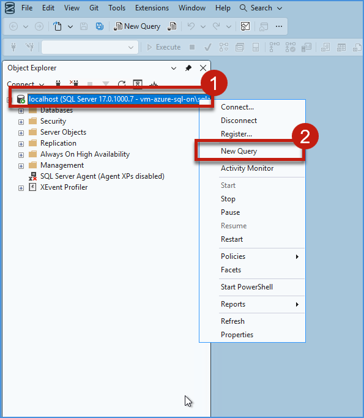

9. A new query window will open. Paste the following SQL query into the query editor:

    ```sql
    CREATE LOGIN pocadmin WITH PASSWORD = 'YourPassword @123';
    ALTER SERVER ROLE sysadmin ADD MEMBER pocadmin;
    ```

    Then click **Execute** on the toolbar.

    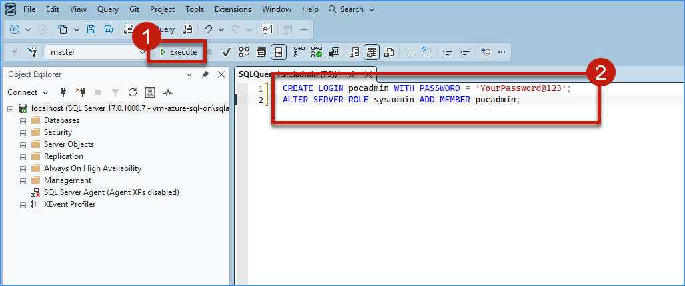

10. Validate that the message **"Commands completed successfully"** appears in the **Messages** tab at the bottom of the query window, confirming the query ran successfully.

    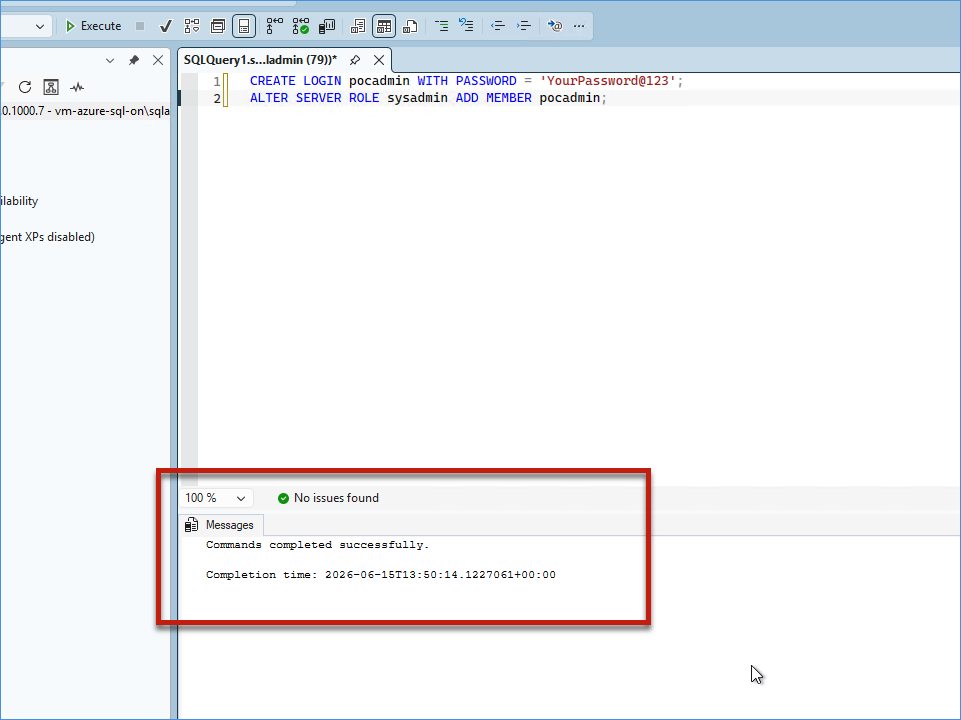


### Task 1.3: Create and Populate the Source Database

1. Click on **New Query** at the top toolbar. When the new query window opens, paste the following SQL query and click **Execute**.

    ```sql
    USE [master];
    GO

    -- Drop database if it already exists
    IF EXISTS (SELECT 1 FROM sys.databases WHERE name = N'Retail_Ontology')
    BEGIN
        ALTER DATABASE [Retail_Ontology] SET SINGLE_USER WITH ROLLBACK IMMEDIATE;
        DROP DATABASE [Retail_Ontology];
    END
    GO

    -- Create database (uses default file locations)
    CREATE DATABASE [Retail_Ontology];
    GO

    USE [Retail_Ontology];
    GO

    SET ANSI_NULLS ON;
    GO
    SET QUOTED_IDENTIFIER ON;
    GO

    -- ============================================================
    -- TABLES (ordered by dependency - parent tables first)
    -- ============================================================

    CREATE TABLE [dbo].[regions](
        [reg_id] [varchar](20) NOT NULL,
        [reg_name] [varchar](50) NULL,
        [coun_code] [varchar](10) NULL,
        [time_name] [varchar](50) NULL,
        [is_cold_chain_requ] [bit] NULL,
        CONSTRAINT [PK_regions] PRIMARY KEY CLUSTERED ([reg_id] ASC)
    );
    GO

    CREATE TABLE [dbo].[product_categories](
        [prod_cat_id] [varchar](20) NOT NULL,
        [cat_name] [varchar](100) NULL,
        [depa_name] [varchar](100) NULL,
        [is_peri] [bit] NULL,
        [shelf_life_days] [int] NULL,
        CONSTRAINT [PK_product_categories] PRIMARY KEY CLUSTERED ([prod_cat_id] ASC)
    );
    GO

    CREATE TABLE [dbo].[carriers](
        [car_id] [varchar](20) NOT NULL,
        [car_name] [varchar](100) NULL,
        [serv_level] [varchar](50) NULL,
        [has_cold_chain_capa] [bit] NULL,
        [supp_ph] [varchar](30) NULL,
        CONSTRAINT [PK_carriers] PRIMARY KEY CLUSTERED ([car_id] ASC)
    );
    GO

    CREATE TABLE [dbo].[customers](
        [cust_id] [varchar](20) NOT NULL,
        [reg_id] [varchar](20) NULL,
        [cust_email] [varchar](100) NULL,
        [loya_tier] [varchar](20) NULL,
        [is_active_cust] [bit] NULL,
        [sign_up_dt] [datetime2](7) NULL,
        [life_val_amt] [decimal](10, 2) NULL,
        [cust_profile_image] [varbinary](max) NULL,
        [profile_image_url] [nvarchar](500) NULL,
        [identity_document] [varbinary](max) NULL,
        [preferences_json] [nvarchar](max) NULL,
        [customer_settings] [xml] NULL,
        [digital_signature] [varbinary](max) NULL,
        [linkedin_url] [nvarchar](300) NULL,
        [website_url] [nvarchar](300) NULL,
        CONSTRAINT [PK_customers] PRIMARY KEY CLUSTERED ([cust_id] ASC),
        CONSTRAINT [FK_customers_regions] FOREIGN KEY ([reg_id]) REFERENCES [dbo].[regions] ([reg_id]),
        CONSTRAINT [CK_customers_life_val] CHECK ([life_val_amt] >= 0)
    );
    GO

    CREATE TABLE [dbo].[products](
        [prod_id] [varchar](20) NOT NULL,
        [prod_cat_id] [varchar](20) NULL,
        [sku] [varchar](20) NULL,
        [prod_name] [varchar](255) NULL,
        [brand_name] [varchar](100) NULL,
        [is_disc] [bit] NULL,
        [launch_dt] [datetime2](7) NULL,
        [unit_cost_amt] [decimal](10, 2) NULL,
        CONSTRAINT [PK_products] PRIMARY KEY CLUSTERED ([prod_id] ASC),
        CONSTRAINT [FK_products_categories] FOREIGN KEY ([prod_cat_id]) REFERENCES [dbo].[product_categories] ([prod_cat_id]),
        CONSTRAINT [CK_products_unit_cost] CHECK ([unit_cost_amt] >= 0)
    );
    GO

    CREATE TABLE [dbo].[warehouses](
        [wh_id] [varchar](20) NOT NULL,
        [reg_id] [varchar](20) NULL,
        [wh_name] [varchar](50) NULL,
        [addr_line1] [varchar](100) NULL,
        [city_name] [varchar](50) NULL,
        [state_or_prov] [varchar](50) NULL,
        [postal_code] [varchar](50) NULL,
        [is_cross_dock] [bit] NULL,
        CONSTRAINT [PK_warehouses] PRIMARY KEY CLUSTERED ([wh_id] ASC),
        CONSTRAINT [FK_warehouses_regions] FOREIGN KEY ([reg_id]) REFERENCES [dbo].[regions] ([reg_id])
    );
    GO

    CREATE TABLE [dbo].[stores](
        [str_id] [varchar](20) NOT NULL,
        [reg_id] [varchar](20) NULL,
        [str_name] [varchar](50) NULL,
        [str_type] [varchar](50) NULL,
        [open_dt] [datetime2](7) NULL,
        CONSTRAINT [PK_stores] PRIMARY KEY CLUSTERED ([str_id] ASC),
        CONSTRAINT [FK_stores_regions] FOREIGN KEY ([reg_id]) REFERENCES [dbo].[regions] ([reg_id])
    );
    GO

    CREATE TABLE [dbo].[orders](
        [ord_id] [varchar](20) NOT NULL,
        [cust_id] [varchar](20) NULL,
        [reg_id] [varchar](20) NULL,
        [ord_dt] [datetime2](7) NULL,
        [ord_status] [varchar](20) NULL,
        [is_expe] [bit] NULL,
        [ord_total_amt] [decimal](10, 2) NULL,
        [paym_method_type] [varchar](20) NULL,
        CONSTRAINT [PK_orders] PRIMARY KEY CLUSTERED ([ord_id] ASC),
        CONSTRAINT [FK_orders_customers] FOREIGN KEY ([cust_id]) REFERENCES [dbo].[customers] ([cust_id]),
        CONSTRAINT [FK_orders_regions] FOREIGN KEY ([reg_id]) REFERENCES [dbo].[regions] ([reg_id]),
        CONSTRAINT [CK_orders_total] CHECK ([ord_total_amt] >= 0)
    );
    GO

    CREATE TABLE [dbo].[order_lines](
        [ord_ln_id] [varchar](20) NOT NULL,
        [ord_id] [varchar](20) NULL,
        [prod_id] [varchar](20) NULL,
        [qty] [int] NULL,
        [unit_price_amt] [decimal](10, 2) NULL,
        [ln_total_amt] [decimal](10, 2) NULL,
        CONSTRAINT [PK_order_lines] PRIMARY KEY CLUSTERED ([ord_ln_id] ASC),
        CONSTRAINT [FK_order_lines_orders] FOREIGN KEY ([ord_id]) REFERENCES [dbo].[orders] ([ord_id]),
        CONSTRAINT [FK_order_lines_products] FOREIGN KEY ([prod_id]) REFERENCES [dbo].[products] ([prod_id]),
        CONSTRAINT [CK_order_lines_qty] CHECK ([qty] >= 0),
        CONSTRAINT [CK_order_lines_unit_price] CHECK ([unit_price_amt] >= 0),
        CONSTRAINT [CK_order_lines_total] CHECK ([ln_total_amt] >= 0)
    );
    GO

    CREATE TABLE [dbo].[returns](
        [rtn_id] [varchar](20) NOT NULL,
        [ord_id] [varchar](20) NULL,
        [prod_id] [varchar](20) NULL,
        [rtn_dt] [datetime2](7) NULL,
        [rtn_rsn] [varchar](50) NULL,
        [rfnd_amt] [decimal](10, 2) NULL,
        CONSTRAINT [PK_returns] PRIMARY KEY CLUSTERED ([rtn_id] ASC),
        CONSTRAINT [FK_returns_orders] FOREIGN KEY ([ord_id]) REFERENCES [dbo].[orders] ([ord_id]),
        CONSTRAINT [FK_returns_products] FOREIGN KEY ([prod_id]) REFERENCES [dbo].[products] ([prod_id]),
        CONSTRAINT [CK_returns_rfnd] CHECK ([rfnd_amt] >= 0)
    );
    GO

    CREATE TABLE [dbo].[shipments](
        [shp_id] [varchar](20) NOT NULL,
        [ord_id] [varchar](20) NULL,
        [car_id] [varchar](20) NULL,
        [wh_id] [varchar](20) NULL,
        [reg_id] [varchar](20) NULL,
        [trac_num] [varchar](20) NULL,
        [shp_status] [varchar](20) NULL,
        [ship_dt] [datetime2](7) NULL,
        [est_deli_dt] [datetime2](7) NULL,
        [act_deli_dt] [datetime2](7) NULL,
        CONSTRAINT [PK_shipments] PRIMARY KEY CLUSTERED ([shp_id] ASC),
        CONSTRAINT [FK_shipments_orders] FOREIGN KEY ([ord_id]) REFERENCES [dbo].[orders] ([ord_id]),
        CONSTRAINT [FK_shipments_carriers] FOREIGN KEY ([car_id]) REFERENCES [dbo].[carriers] ([car_id]),
        CONSTRAINT [FK_shipments_warehouses] FOREIGN KEY ([wh_id]) REFERENCES [dbo].[warehouses] ([wh_id]),
        CONSTRAINT [FK_shipments_regions] FOREIGN KEY ([reg_id]) REFERENCES [dbo].[regions] ([reg_id])
    );
    GO

    CREATE TABLE [dbo].[inventories](
        [inv_id] [varchar](20) NOT NULL,
        [prod_id] [varchar](20) NULL,
        [wh_id] [varchar](20) NULL,
        [reg_id] [varchar](20) NULL,
        [sfty_stock_qty] [int] NULL,
        [reord_pt_qty] [int] NULL,
        [lead_t_days] [int] NULL,
        CONSTRAINT [PK_inventories] PRIMARY KEY CLUSTERED ([inv_id] ASC),
        CONSTRAINT [FK_inventories_products] FOREIGN KEY ([prod_id]) REFERENCES [dbo].[products] ([prod_id]),
        CONSTRAINT [FK_inventories_warehouses] FOREIGN KEY ([wh_id]) REFERENCES [dbo].[warehouses] ([wh_id]),
        CONSTRAINT [FK_inventories_regions] FOREIGN KEY ([reg_id]) REFERENCES [dbo].[regions] ([reg_id]),
        CONSTRAINT [CK_inventories_sfty_stock] CHECK ([sfty_stock_qty] >= 0),
        CONSTRAINT [CK_inventories_reord_pt] CHECK ([reord_pt_qty] >= 0)
    );
    GO

    CREATE TABLE [dbo].[demand_signals](
        [dem_signal_id] [varchar](20) NOT NULL,
        [prod_id] [varchar](20) NULL,
        [reg_id] [varchar](20) NULL,
        [dem_chn] [varchar](20) NULL,
        [signal_src_sys] [varchar](50) NULL,
        CONSTRAINT [PK_demand_signals] PRIMARY KEY CLUSTERED ([dem_signal_id] ASC),
        CONSTRAINT [FK_demand_signals_products] FOREIGN KEY ([prod_id]) REFERENCES [dbo].[products] ([prod_id]),
        CONSTRAINT [FK_demand_signals_regions] FOREIGN KEY ([reg_id]) REFERENCES [dbo].[regions] ([reg_id])
    );
    GO

    CREATE TABLE [dbo].[forecasts](
        [fcst_id] [varchar](20) NOT NULL,
        [prod_id] [varchar](20) NULL,
        [reg_id] [varchar](20) NULL,
        [dem_signal_id] [varchar](20) NULL,
        [fcst_hor_days] [int] NULL,
        [fcst_mdl_name] [varchar](30) NULL,
        CONSTRAINT [PK_forecasts] PRIMARY KEY CLUSTERED ([fcst_id] ASC),
        CONSTRAINT [FK_forecasts_products] FOREIGN KEY ([prod_id]) REFERENCES [dbo].[products] ([prod_id]),
        CONSTRAINT [FK_forecasts_regions] FOREIGN KEY ([reg_id]) REFERENCES [dbo].[regions] ([reg_id]),
        CONSTRAINT [FK_forecasts_demand_signals] FOREIGN KEY ([dem_signal_id]) REFERENCES [dbo].[demand_signals] ([dem_signal_id])
    );
    GO

    CREATE TABLE [dbo].[Promotions](
        [promo_id] [varchar](12) NOT NULL,
        [prod_id] [varchar](20) NULL,
        [reg_id] [varchar](20) NULL,
        [promo_name] [varchar](50) NULL,
        [start_dt] [datetime2](7) NULL,
        [end_dt] [datetime2](7) NULL,
        [disc_pct] [decimal](5, 4) NULL,
        [is_active_promo] [bit] NULL,
        CONSTRAINT [PK_Promotions] PRIMARY KEY CLUSTERED ([promo_id] ASC),
        CONSTRAINT [FK_Promotions_products] FOREIGN KEY ([prod_id]) REFERENCES [dbo].[products] ([prod_id]),
        CONSTRAINT [FK_Promotions_regions] FOREIGN KEY ([reg_id]) REFERENCES [dbo].[regions] ([reg_id])
    );
    GO

    -- ============================================================
    -- FUNCTIONS
    -- ============================================================

    CREATE FUNCTION [dbo].[fn_customer_tier]
    (
        @LifeValue DECIMAL(10,2)
    )
    RETURNS VARCHAR(20)
    AS
    BEGIN
        DECLARE @Tier VARCHAR(20);

        SET @Tier =
        CASE
            WHEN @LifeValue >= 100000 THEN 'Platinum'
            WHEN @LifeValue >= 50000 THEN 'Gold'
            WHEN @LifeValue >= 10000 THEN 'Silver'
            ELSE 'Bronze'
        END;

        RETURN @Tier;
    END;
    GO

    CREATE FUNCTION [dbo].[fn_delivery_delay_days]
    (
        @EstimatedDate DATETIME2,
        @ActualDate DATETIME2
    )
    RETURNS INT
    AS
    BEGIN
        RETURN DATEDIFF(DAY, @EstimatedDate, @ActualDate);
    END;
    GO

    CREATE FUNCTION [dbo].[fn_return_percentage]
    (
        @TotalOrders INT,
        @ReturnedOrders INT
    )
    RETURNS DECIMAL(10,2)
    AS
    BEGIN
        IF @TotalOrders = 0
            RETURN 0;

        RETURN CAST(@ReturnedOrders * 100.0 / @TotalOrders AS DECIMAL(10,2));
    END;
    GO

    CREATE FUNCTION [dbo].[fn_get_customer_orders]
    (
        @CustomerId VARCHAR(20)
    )
    RETURNS TABLE
    AS
    RETURN
    (
        SELECT
            ord_id,
            ord_dt,
            ord_status,
            ord_total_amt
        FROM orders
        WHERE cust_id = @CustomerId
    );
    GO

    -- ============================================================
    -- VIEWS
    -- ============================================================

    CREATE VIEW [dbo].[vw_order_details] AS
    SELECT
        o.ord_id,
        o.ord_dt,
        o.ord_status,
        o.ord_total_amt,
        c.cust_id,
        c.cust_email,
        c.loya_tier,
        r.reg_name,
        p.prod_id,
        p.prod_name,
        ol.qty,
        ol.unit_price_amt,
        ol.ln_total_amt
    FROM orders o
    INNER JOIN customers c ON o.cust_id = c.cust_id
    INNER JOIN regions r ON o.reg_id = r.reg_id
    INNER JOIN order_lines ol ON o.ord_id = ol.ord_id
    INNER JOIN products p ON ol.prod_id = p.prod_id;
    GO

    CREATE VIEW [dbo].[vw_shipment_performance] AS
    SELECT
        s.shp_id,
        s.ord_id,
        c.car_name,
        s.ship_dt,
        s.est_deli_dt,
        s.act_deli_dt,
        DATEDIFF(DAY, s.est_deli_dt, s.act_deli_dt) AS delay_days,
        CASE
            WHEN s.act_deli_dt <= s.est_deli_dt THEN 'On Time'
            ELSE 'Delayed'
        END AS delivery_status
    FROM shipments s
    INNER JOIN carriers c ON s.car_id = c.car_id;
    GO

    CREATE VIEW [dbo].[vw_inventory_health] AS
    SELECT
        i.inv_id,
        p.prod_name,
        w.wh_name,
        r.reg_name,
        i.sfty_stock_qty,
        i.reord_pt_qty,
        i.lead_t_days,
        CASE
            WHEN i.sfty_stock_qty <= i.reord_pt_qty THEN 'Reorder Required'
            ELSE 'Healthy'
        END AS inventory_status
    FROM inventories i
    INNER JOIN products p ON i.prod_id = p.prod_id
    INNER JOIN warehouses w ON i.wh_id = w.wh_id
    INNER JOIN regions r ON i.reg_id = r.reg_id;
    GO

    CREATE VIEW [dbo].[vw_customer_summary] AS
    SELECT
        cust_id,
        cust_email,
        loya_tier,
        life_val_amt,
        sign_up_dt,
        is_active_cust
    FROM customers;
    GO

    CREATE VIEW [dbo].[vw_product_returns] AS
    SELECT
        p.prod_id,
        p.prod_name,
        COUNT(r.rtn_id) AS total_returns,
        SUM(r.rfnd_amt) AS total_refund_amount
    FROM products p
    LEFT JOIN returns r ON p.prod_id = r.prod_id
    GROUP BY p.prod_id, p.prod_name;
    GO

    -- ============================================================
    -- STORED PROCEDURES
    -- ============================================================

    CREATE PROCEDURE [dbo].[usp_customer_order_history]
    (
        @CustomerId VARCHAR(20)
    )
    AS
    BEGIN
        SET NOCOUNT ON;

        SELECT
            o.ord_id,
            o.ord_dt,
            o.ord_status,
            o.ord_total_amt
        FROM orders o
        WHERE o.cust_id = @CustomerId
        ORDER BY o.ord_dt DESC;
    END;
    GO
 
    ```

    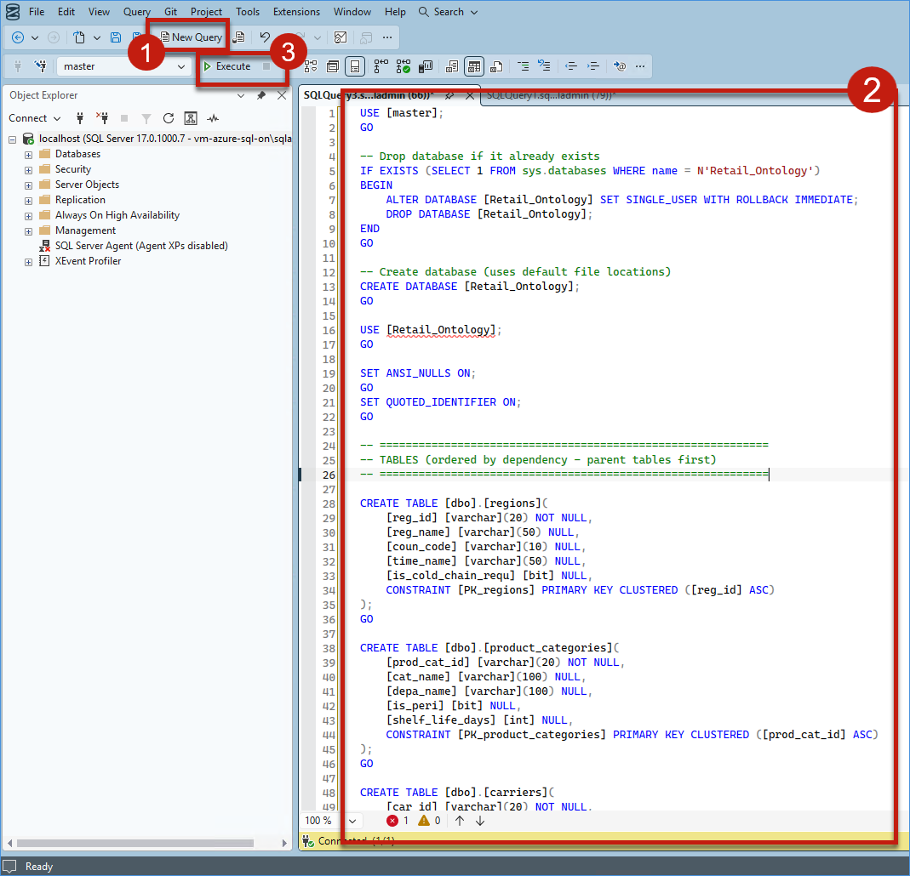

2. Validate that the message **"Commands completed successfully"** and **"Query executed successfully"** appears at the bottom, confirming the query ran successfully.

    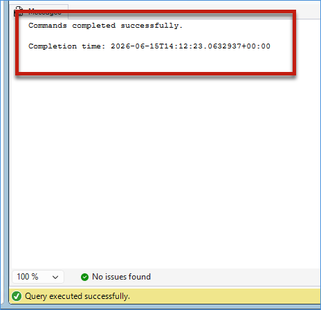

3. In the **Object Explorer** on the left panel, click the **Refresh** icon. Then expand **Databases** by clicking the **+** button next to it. You can see the **Retail_Ontology** database has been created successfully.

    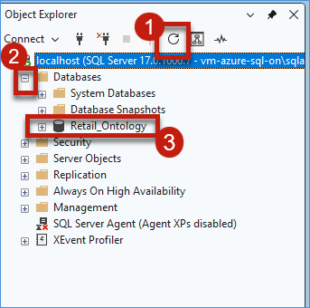

4. Expand **Retail_Ontology** by clicking the **+** sign. You can see various objects inside. Expand **Tables** to view the created tables, expand **Views** to see the views, and expand **Programmability** to find **Stored Procedures** and **Functions** by clicking the **+** sign next to each.

    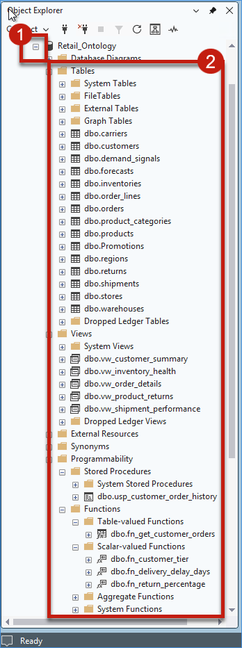

5. Click on **New Query** at the top toolbar. Paste the following SQL script into the new query window and click **Execute**.

    ```sql
    ​USE [Retail_Ontology];
    GO

    INSERT INTO carriers (car_id, car_name, serv_level, has_cold_chain_capa, supp_ph) VALUES 
    ('CAR000001','fabrikam_freight','overnight',0,-3852), 
    ('CAR000002','northwind_express','ground',1,-4230), 
    ('CAR000003','contoso_logistics','ground',1,-7189), 
    ('CAR000004','tailspin_ship','2day',0,-7036), 
    ('CAR000005','tailspin_ship','ground',1,-5207), 
    ('CAR000006','fabrikam_freight','2day',0,-7322), 
    ('CAR000007','fabrikam_freight','ground',1,-2907); 

    INSERT INTO regions 
    (reg_id, reg_name, coun_code, time_name, is_cold_chain_requ) VALUES 
    ('REG000001','northeast','US','America/Los_Angeles',1), 
    ('REG000002','northeast','US','America/New_York',1), 
    ('REG000003','midwest','US','America/Los_Angeles',0), 
    ('REG000004','pacific_nw','US','America/New_York',0), 
    ('REG000005','southwest','US','America/New_York',1), 
    ('REG000006','southeast','US','America/Denver',1), 
    ('REG000007','southeast','US','America/Los_Angeles',1), 
    ('REG000008','southeast','US','America/New_York',0); 

    INSERT INTO product_categories 
    (prod_cat_id, cat_name, depa_name, is_peri, shelf_life_days) VALUES 
    ('CAT000001','paint_interior','home_improvement',1,3650), 
    ('CAT000002','paint_exterior','home_improvement',0,3650), 
    ('CAT000003','spray_paint','home_improvement',1,3650), 
    ('CAT000004','primer_sealer','home_improvement',0,3650), 
    ('CAT000005','stain_varnish','home_improvement',0,3650), 
    ('CAT000006','paint_accessories_brushes','home_improvement',0,3650), 
    ('CAT000007','paint_accessories_rollers','home_improvement',0,3650), 
    ('CAT000008','paint_accessories_tape','home_improvement',1,3650), 
    ('CAT000009','paint_accessories_trays','home_improvement',0,3650), 
    ('CAT000010','wine_red','beverages',1,3650), 
    ('CAT000011','wine_white','beverages',1,3650), 
    ('CAT000012','wine_sparkling','beverages',0,3650), 
    ('CAT000013','wine_rose','beverages',0,3650), 
    ('CAT000014','wine_accessories','beverages',0,3650), 
    ('CAT000015','snacks','grocery',0,365), 
    ('CAT000016','personal_care','health_beauty',1,730), 
    ('CAT000017','household_cleaning','household',1,1095), 
    ('CAT000018','electronics_accessories','electronics',0,1825);

    INSERT INTO warehouses 
    (wh_id, reg_id, wh_name, addr_line1, city_name, state_or_prov, postal_code, is_cross_dock) VALUES 
    ('WH000001','REG000004','wh_82_sea','warehouse_addressline1_00001','wh_20_dal','warehouse_stateorprovince_00001','warehouse_postalcode_00001',1), 
    ('WH000002','REG000002','wh_78_phx','warehouse_addressline1_00002','wh_26_den','warehouse_stateorprovince_00002','warehouse_postalcode_00002',0), 
    ('WH000003','REG000003','wh_43_nyc','warehouse_addressline1_00003','wh_87_atl','warehouse_stateorprovince_00003','warehouse_postalcode_00003',0), 
    ('WH000004','REG000004','wh_49_atl','warehouse_addressline1_00004','wh_95_dal','warehouse_stateorprovince_00004','warehouse_postalcode_00004',1), 
    ('WH000005','REG000008','wh_25_den','warehouse_addressline1_00005','wh_38_sea','warehouse_stateorprovince_00005','warehouse_postalcode_00005',1), 
    ('WH000006','REG000004','wh_85_den','warehouse_addressline1_00006','wh_10_sea','warehouse_stateorprovince_00006','warehouse_postalcode_00006',0), 
    ('WH000007','REG000001','wh_39_sea','warehouse_addressline1_00007','wh_14_phx','warehouse_stateorprovince_00007','warehouse_postalcode_00007',1), 
    ('WH000008','REG000004','wh_45_dal','warehouse_addressline1_00008','wh_72_den','warehouse_stateorprovince_00008','warehouse_postalcode_00008',0), 
    ('WH000009','REG000008','wh_41_phx','warehouse_addressline1_00009','wh_70_phx','warehouse_stateorprovince_00009','warehouse_postalcode_00009',1), 
    ('WH000010','REG000002','wh_22_dal','warehouse_addressline1_00010','wh_65_chi','warehouse_stateorprovince_00010','warehouse_postalcode_00010',1);

    INSERT INTO stores (str_id, reg_id, str_name, str_type, open_dt) VALUES
    ('STR000001', 'REG000008', 'store_984_mall', 'store_storetype_00001', '2025-12-27 10:18:00'),
    ('STR000002', 'REG000002', 'store_162_outlet', 'store_storetype_00002', '2025-07-08 15:43:00'),
    ('STR000003', 'REG000004', 'store_296_urban', 'store_storetype_00003', '2025-10-18 03:18:00'),
    ('STR000004', 'REG000003', 'store_532_urban', 'store_storetype_00004', '2025-06-08 03:47:00'),
    ('STR000005', 'REG000004', 'store_995_mall', 'store_storetype_00005', '2025-08-31 06:47:00'),
    ('STR000006', 'REG000002', 'store_151_mall', 'store_storetype_00006', '2025-03-04 20:04:00'),
    ('STR000007', 'REG000003', 'store_516_outlet', 'store_storetype_00007', '2025-09-19 19:17:00'),
    ('STR000008', 'REG000007', 'store_160_urban', 'store_storetype_00008', '2025-07-29 12:04:00'),
    ('STR000009', 'REG000007', 'store_371_outlet', 'store_storetype_00009', '2025-06-12 02:26:00'),
    ('STR000010', 'REG000008', 'store_258_urban', 'store_storetype_00010', '2025-06-16 19:25:00'),
    ('STR000011', 'REG000001', 'store_693_mall', 'store_storetype_00011', '2025-06-25 13:57:00'),
    ('STR000012', 'REG000001', 'store_698_outlet', 'store_storetype_00012', '2025-10-01 06:07:00'),
    ('STR000013', 'REG000003', 'store_158_mall', 'store_storetype_00013', '2025-04-21 14:20:00'),
    ('STR000014', 'REG000002', 'store_791_urban', 'store_storetype_00014', '2025-08-10 16:05:00'),
    ('STR000015', 'REG000004', 'store_692_mall', 'store_storetype_00015', '2025-11-29 14:47:00'),
    ('STR000016', 'REG000007', 'store_773_suburban', 'store_storetype_00016', '2025-05-29 18:58:00'),
    ('STR000017', 'REG000006', 'store_344_suburban', 'store_storetype_00017', '2025-08-06 16:28:00'),
    ('STR000018', 'REG000005', 'store_568_suburban', 'store_storetype_00018', '2025-02-22 12:19:00'),
    ('STR000019', 'REG000008', 'store_736_mall', 'store_storetype_00019', '2025-02-23 06:21:00'),
    ('STR000020', 'REG000004', 'store_618_suburban', 'store_storetype_00020', '2025-03-24 23:54:00'),
    ('STR000021', 'REG000002', 'store_350_suburban', 'store_storetype_00021', '2025-06-10 17:23:00'),
    ('STR000022', 'REG000008', 'store_953_suburban', 'store_storetype_00022', '2025-11-26 10:19:00'),
    ('STR000023', 'REG000001', 'store_783_suburban', 'store_storetype_00023', '2025-12-21 15:32:00'),
    ('STR000024', 'REG000003', 'store_370_mall', 'store_storetype_00024', '2025-03-12 06:53:00'),
    ('STR000025', 'REG000003', 'store_378_suburban', 'store_storetype_00025', '2025-11-21 19:11:00'),
    ('STR000026', 'REG000006', 'store_308_suburban', 'store_storetype_00026', '2025-10-02 04:40:00'),
    ('STR000027', 'REG000005', 'store_966_mall', 'store_storetype_00027', '2025-03-05 09:39:00'),
    ('STR000028', 'REG000007', 'store_949_suburban', 'store_storetype_00028', '2025-02-07 12:07:00'),
    ('STR000029', 'REG000006', 'store_889_urban', 'store_storetype_00029', '2025-12-08 20:56:00'),
    ('STR000030', 'REG000003', 'store_859_outlet', 'store_storetype_00030', '2025-10-26 02:35:00');

    INSERT INTO customers (cust_id, reg_id, cust_email, loya_tier, is_active_cust, sign_up_dt, life_val_amt, cust_profile_image, profile_image_url, identity_document, preferences_json, customer_settings, digital_signature, linkedin_url, website_url) VALUES
    ('CUST000001', 'REG000008', 'cust00001@example.com', 'bronze', 1, '2026-01-03 12:11:00', 83.75, CONVERT(VARBINARY(MAX), 'Sample Profile Image'), 'https://storage.contoso.com/customers/CUST001/profile.jpg', CONVERT(VARBINARY(MAX), 'Sample Aadhaar PDF'), '{"language":"en","currency":"INR","notifications":{"email":true,"sms":false}}', '<Settings><Theme>Dark</Theme><Language>English</Language><Currency>INR</Currency></Settings>', CONVERT(VARBINARY(MAX), 'Digital Signature'), 'https://www.linkedin.com/in/john-doe', 'https://www.johndoe.com'),
    ('CUST000002', 'REG000002', 'cust00002@example.com', 'gold', 1, '2026-01-08 05:40:00', 14.02, CONVERT(VARBINARY(MAX), 'Profile Image CUST000002'), 'https://storage.contoso.com/customers/CUST000002/profile.jpg', CONVERT(VARBINARY(MAX), 'Identity Doc CUST000002'), '{"language":"en","currency":"USD","notifications":{"email":true,"sms":true}}', '<Settings><Theme>Light</Theme><Language>English</Language><Currency>USD</Currency></Settings>', CONVERT(VARBINARY(MAX), 'Digital Signature CUST000002'), 'https://www.linkedin.com/in/jane-smith', 'https://www.jane-smith.com'),
    ('CUST000003', 'REG000008', 'cust00003@example.com', 'bronze', 1, '2025-03-20 03:34:00', 63.7, CONVERT(VARBINARY(MAX), 'Profile Image CUST000003'), 'https://storage.contoso.com/customers/CUST000003/profile.jpg', CONVERT(VARBINARY(MAX), 'Identity Doc CUST000003'), '{"language":"en","currency":"USD","notifications":{"email":true,"sms":true}}', '<Settings><Theme>Light</Theme><Language>English</Language><Currency>USD</Currency></Settings>', CONVERT(VARBINARY(MAX), 'Digital Signature CUST000003'), 'https://www.linkedin.com/in/bob-wilson', 'https://www.bob-wilson.com'),
    ('CUST000004', 'REG000006', 'cust00004@example.com', 'platinum', 1, '2025-11-26 05:13:00', 65.77, CONVERT(VARBINARY(MAX), 'Profile Image CUST000004'), 'https://storage.contoso.com/customers/CUST000004/profile.jpg', CONVERT(VARBINARY(MAX), 'Identity Doc CUST000004'), '{"language":"en","currency":"USD","notifications":{"email":true,"sms":true}}', '<Settings><Theme>Light</Theme><Language>English</Language><Currency>USD</Currency></Settings>', CONVERT(VARBINARY(MAX), 'Digital Signature CUST000004'), 'https://www.linkedin.com/in/alice-chen', 'https://www.alice-chen.com'),
    ('CUST000005', 'REG000007', 'cust00005@example.com', 'gold', 1, '2025-04-08 04:12:00', 5.3, CONVERT(VARBINARY(MAX), 'Profile Image CUST000005'), 'https://storage.contoso.com/customers/CUST000005/profile.jpg', CONVERT(VARBINARY(MAX), 'Identity Doc CUST000005'), '{"language":"en","currency":"USD","notifications":{"email":true,"sms":true}}', '<Settings><Theme>Light</Theme><Language>English</Language><Currency>USD</Currency></Settings>', CONVERT(VARBINARY(MAX), 'Digital Signature CUST000005'), 'https://www.linkedin.com/in/david-kumar', 'https://www.david-kumar.com'),
    ('CUST000006', 'REG000005', 'cust00006@example.com', 'gold', 1, '2025-12-02 20:09:00', 57.88, CONVERT(VARBINARY(MAX), 'Profile Image CUST000006'), 'https://storage.contoso.com/customers/CUST000006/profile.jpg', CONVERT(VARBINARY(MAX), 'Identity Doc CUST000006'), '{"language":"en","currency":"USD","notifications":{"email":true,"sms":true}}', '<Settings><Theme>Light</Theme><Language>English</Language><Currency>USD</Currency></Settings>', CONVERT(VARBINARY(MAX), 'Digital Signature CUST000006'), 'https://www.linkedin.com/in/emma-jones', 'https://www.emma-jones.com'),
    ('CUST000007', 'REG000005', 'cust00007@example.com', 'silver', 1, '2025-05-16 21:16:00', 17.85, CONVERT(VARBINARY(MAX), 'Profile Image CUST000007'), 'https://storage.contoso.com/customers/CUST000007/profile.jpg', CONVERT(VARBINARY(MAX), 'Identity Doc CUST000007'), '{"language":"en","currency":"USD","notifications":{"email":true,"sms":true}}', '<Settings><Theme>Light</Theme><Language>English</Language><Currency>USD</Currency></Settings>', CONVERT(VARBINARY(MAX), 'Digital Signature CUST000007'), 'https://www.linkedin.com/in/frank-garcia', 'https://www.frank-garcia.com'),
    ('CUST000008', 'REG000002', 'cust00008@example.com', 'bronze', 1, '2026-01-06 17:12:00', 90.35, CONVERT(VARBINARY(MAX), 'Profile Image CUST000008'), 'https://storage.contoso.com/customers/CUST000008/profile.jpg', CONVERT(VARBINARY(MAX), 'Identity Doc CUST000008'), '{"language":"en","currency":"USD","notifications":{"email":true,"sms":true}}', '<Settings><Theme>Light</Theme><Language>English</Language><Currency>USD</Currency></Settings>', CONVERT(VARBINARY(MAX), 'Digital Signature CUST000008'), 'https://www.linkedin.com/in/grace-lee', 'https://www.grace-lee.com'),
    ('CUST000009', 'REG000004', 'cust00009@example.com', 'bronze', 1, '2025-10-21 03:54:00', 30.31, CONVERT(VARBINARY(MAX), 'Profile Image CUST000009'), 'https://storage.contoso.com/customers/CUST000009/profile.jpg', CONVERT(VARBINARY(MAX), 'Identity Doc CUST000009'), '{"language":"en","currency":"USD","notifications":{"email":true,"sms":true}}', '<Settings><Theme>Light</Theme><Language>English</Language><Currency>USD</Currency></Settings>', CONVERT(VARBINARY(MAX), 'Digital Signature CUST000009'), 'https://www.linkedin.com/in/henry-patel', 'https://www.henry-patel.com'),
    ('CUST000010', 'REG000007', 'cust00010@example.com', 'bronze', 1, '2026-01-07 12:40:00', 53.59, CONVERT(VARBINARY(MAX), 'Profile Image CUST000010'), 'https://storage.contoso.com/customers/CUST000010/profile.jpg', CONVERT(VARBINARY(MAX), 'Identity Doc CUST000010'), '{"language":"en","currency":"USD","notifications":{"email":true,"sms":true}}', '<Settings><Theme>Light</Theme><Language>English</Language><Currency>USD</Currency></Settings>', CONVERT(VARBINARY(MAX), 'Digital Signature CUST000010'), 'https://www.linkedin.com/in/iris-wang', 'https://www.iris-wang.com'),
    ('CUST000011', 'REG000007', 'cust00011@example.com', 'silver', 0, '2025-06-18 01:18:00', 82.47, CONVERT(VARBINARY(MAX), 'Profile Image CUST000011'), 'https://storage.contoso.com/customers/CUST000011/profile.jpg', CONVERT(VARBINARY(MAX), 'Identity Doc CUST000011'), '{"language":"en","currency":"USD","notifications":{"email":true,"sms":true}}', '<Settings><Theme>Light</Theme><Language>English</Language><Currency>USD</Currency></Settings>', CONVERT(VARBINARY(MAX), 'Digital Signature CUST000011'), 'https://www.linkedin.com/in/jack-brown', 'https://www.jack-brown.com'),
    ('CUST000012', 'REG000007', 'cust00012@example.com', 'silver', 1, '2025-11-20 19:31:00', 0.5, CONVERT(VARBINARY(MAX), 'Profile Image CUST000012'), 'https://storage.contoso.com/customers/CUST000012/profile.jpg', CONVERT(VARBINARY(MAX), 'Identity Doc CUST000012'), '{"language":"en","currency":"USD","notifications":{"email":true,"sms":true}}', '<Settings><Theme>Light</Theme><Language>English</Language><Currency>USD</Currency></Settings>', CONVERT(VARBINARY(MAX), 'Digital Signature CUST000012'), 'https://www.linkedin.com/in/kate-miller', 'https://www.kate-miller.com'),
    ('CUST000013', 'REG000008', 'cust00013@example.com', 'bronze', 1, '2025-01-31 01:16:00', 25.58, CONVERT(VARBINARY(MAX), 'Profile Image CUST000013'), 'https://storage.contoso.com/customers/CUST000013/profile.jpg', CONVERT(VARBINARY(MAX), 'Identity Doc CUST000013'), '{"language":"en","currency":"USD","notifications":{"email":true,"sms":true}}', '<Settings><Theme>Light</Theme><Language>English</Language><Currency>USD</Currency></Settings>', CONVERT(VARBINARY(MAX), 'Digital Signature CUST000013'), 'https://www.linkedin.com/in/leo-taylor', 'https://www.leo-taylor.com'),
    ('CUST000014', 'REG000007', 'cust00014@example.com', 'silver', 1, '2025-03-23 09:14:00', 77.31, CONVERT(VARBINARY(MAX), 'Profile Image CUST000014'), 'https://storage.contoso.com/customers/CUST000014/profile.jpg', CONVERT(VARBINARY(MAX), 'Identity Doc CUST000014'), '{"language":"en","currency":"USD","notifications":{"email":true,"sms":true}}', '<Settings><Theme>Light</Theme><Language>English</Language><Currency>USD</Currency></Settings>', CONVERT(VARBINARY(MAX), 'Digital Signature CUST000014'), 'https://www.linkedin.com/in/mia-anderson', 'https://www.mia-anderson.com'),
    ('CUST000015', 'REG000001', 'cust00015@example.com', 'gold', 1, '2025-12-21 12:55:00', 67.86, CONVERT(VARBINARY(MAX), 'Profile Image CUST000015'), 'https://storage.contoso.com/customers/CUST000015/profile.jpg', CONVERT(VARBINARY(MAX), 'Identity Doc CUST000015'), '{"language":"en","currency":"USD","notifications":{"email":true,"sms":true}}', '<Settings><Theme>Light</Theme><Language>English</Language><Currency>USD</Currency></Settings>', CONVERT(VARBINARY(MAX), 'Digital Signature CUST000015'), 'https://www.linkedin.com/in/noah-thomas', 'https://www.noah-thomas.com'),
    ('CUST000016', 'REG000008', 'cust00016@example.com', 'bronze', 1, '2025-07-02 19:13:00', 58.31, CONVERT(VARBINARY(MAX), 'Profile Image CUST000016'), 'https://storage.contoso.com/customers/CUST000016/profile.jpg', CONVERT(VARBINARY(MAX), 'Identity Doc CUST000016'), '{"language":"en","currency":"USD","notifications":{"email":true,"sms":true}}', '<Settings><Theme>Light</Theme><Language>English</Language><Currency>USD</Currency></Settings>', CONVERT(VARBINARY(MAX), 'Digital Signature CUST000016'), 'https://www.linkedin.com/in/olivia-jackson', 'https://www.olivia-jackson.com'),
    ('CUST000017', 'REG000008', 'cust00017@example.com', 'bronze', 1, '2025-07-29 21:29:00', 45.6, CONVERT(VARBINARY(MAX), 'Profile Image CUST000017'), 'https://storage.contoso.com/customers/CUST000017/profile.jpg', CONVERT(VARBINARY(MAX), 'Identity Doc CUST000017'), '{"language":"en","currency":"USD","notifications":{"email":true,"sms":true}}', '<Settings><Theme>Light</Theme><Language>English</Language><Currency>USD</Currency></Settings>', CONVERT(VARBINARY(MAX), 'Digital Signature CUST000017'), 'https://www.linkedin.com/in/paul-white', 'https://www.paul-white.com'),
    ('CUST000018', 'REG000005', 'cust00018@example.com', 'gold', 1, '2025-10-19 13:46:00', 0.5, CONVERT(VARBINARY(MAX), 'Profile Image CUST000018'), 'https://storage.contoso.com/customers/CUST000018/profile.jpg', CONVERT(VARBINARY(MAX), 'Identity Doc CUST000018'), '{"language":"en","currency":"USD","notifications":{"email":true,"sms":true}}', '<Settings><Theme>Light</Theme><Language>English</Language><Currency>USD</Currency></Settings>', CONVERT(VARBINARY(MAX), 'Digital Signature CUST000018'), 'https://www.linkedin.com/in/quinn-harris', 'https://www.quinn-harris.com'),
    ('CUST000019', 'REG000006', 'cust00019@example.com', 'bronze', 1, '2025-12-15 13:22:00', 46.63, CONVERT(VARBINARY(MAX), 'Profile Image CUST000019'), 'https://storage.contoso.com/customers/CUST000019/profile.jpg', CONVERT(VARBINARY(MAX), 'Identity Doc CUST000019'), '{"language":"en","currency":"USD","notifications":{"email":true,"sms":true}}', '<Settings><Theme>Light</Theme><Language>English</Language><Currency>USD</Currency></Settings>', CONVERT(VARBINARY(MAX), 'Digital Signature CUST000019'), 'https://www.linkedin.com/in/rachel-martin', 'https://www.rachel-martin.com'),
    ('CUST000020', 'REG000004', 'cust00020@example.com', 'gold', 1, '2025-05-18 16:18:00', 0.5, CONVERT(VARBINARY(MAX), 'Profile Image CUST000020'), 'https://storage.contoso.com/customers/CUST000020/profile.jpg', CONVERT(VARBINARY(MAX), 'Identity Doc CUST000020'), '{"language":"en","currency":"USD","notifications":{"email":true,"sms":true}}', '<Settings><Theme>Light</Theme><Language>English</Language><Currency>USD</Currency></Settings>', CONVERT(VARBINARY(MAX), 'Digital Signature CUST000020'), 'https://www.linkedin.com/in/sam-thompson', 'https://www.sam-thompson.com'),
    ('CUST000021', 'REG000008', 'cust00021@example.com', 'silver', 1, '2025-05-08 03:52:00', 31.68, CONVERT(VARBINARY(MAX), 'Profile Image CUST000021'), 'https://storage.contoso.com/customers/CUST000021/profile.jpg', CONVERT(VARBINARY(MAX), 'Identity Doc CUST000021'), '{"language":"en","currency":"USD","notifications":{"email":true,"sms":true}}', '<Settings><Theme>Light</Theme><Language>English</Language><Currency>USD</Currency></Settings>', CONVERT(VARBINARY(MAX), 'Digital Signature CUST000021'), 'https://www.linkedin.com/in/tina-robinson', 'https://www.tina-robinson.com'),
    ('CUST000022', 'REG000003', 'cust00022@example.com', 'silver', 0, '2025-03-15 17:35:00', 4.47, CONVERT(VARBINARY(MAX), 'Profile Image CUST000022'), 'https://storage.contoso.com/customers/CUST000022/profile.jpg', CONVERT(VARBINARY(MAX), 'Identity Doc CUST000022'), '{"language":"en","currency":"USD","notifications":{"email":true,"sms":true}}', '<Settings><Theme>Light</Theme><Language>English</Language><Currency>USD</Currency></Settings>', CONVERT(VARBINARY(MAX), 'Digital Signature CUST000022'), 'https://www.linkedin.com/in/uma-clark', 'https://www.uma-clark.com'),
    ('CUST000023', 'REG000005', 'cust00023@example.com', 'bronze', 1, '2025-06-25 07:39:00', 17.23, CONVERT(VARBINARY(MAX), 'Profile Image CUST000023'), 'https://storage.contoso.com/customers/CUST000023/profile.jpg', CONVERT(VARBINARY(MAX), 'Identity Doc CUST000023'), '{"language":"en","currency":"USD","notifications":{"email":true,"sms":true}}', '<Settings><Theme>Light</Theme><Language>English</Language><Currency>USD</Currency></Settings>', CONVERT(VARBINARY(MAX), 'Digital Signature CUST000023'), 'https://www.linkedin.com/in/victor-lewis', 'https://www.victor-lewis.com'),
    ('CUST000024', 'REG000007', 'cust00024@example.com', 'platinum', 1, '2025-11-16 11:34:00', 0.5, CONVERT(VARBINARY(MAX), 'Profile Image CUST000024'), 'https://storage.contoso.com/customers/CUST000024/profile.jpg', CONVERT(VARBINARY(MAX), 'Identity Doc CUST000024'), '{"language":"en","currency":"USD","notifications":{"email":true,"sms":true}}', '<Settings><Theme>Light</Theme><Language>English</Language><Currency>USD</Currency></Settings>', CONVERT(VARBINARY(MAX), 'Digital Signature CUST000024'), 'https://www.linkedin.com/in/wendy-walker', 'https://www.wendy-walker.com'),
    ('CUST000025', 'REG000004', 'cust00025@example.com', 'bronze', 1, '2026-01-02 08:29:00', 60.24, CONVERT(VARBINARY(MAX), 'Profile Image CUST000025'), 'https://storage.contoso.com/customers/CUST000025/profile.jpg', CONVERT(VARBINARY(MAX), 'Identity Doc CUST000025'), '{"language":"en","currency":"USD","notifications":{"email":true,"sms":true}}', '<Settings><Theme>Light</Theme><Language>English</Language><Currency>USD</Currency></Settings>', CONVERT(VARBINARY(MAX), 'Digital Signature CUST000025'), 'https://www.linkedin.com/in/xavier-hall', 'https://www.xavier-hall.com'),
    ('CUST000026', 'REG000001', 'cust00026@example.com', 'bronze', 1, '2025-07-24 14:21:00', 3.09, CONVERT(VARBINARY(MAX), 'Profile Image CUST000026'), 'https://storage.contoso.com/customers/CUST000026/profile.jpg', CONVERT(VARBINARY(MAX), 'Identity Doc CUST000026'), '{"language":"en","currency":"USD","notifications":{"email":true,"sms":true}}', '<Settings><Theme>Light</Theme><Language>English</Language><Currency>USD</Currency></Settings>', CONVERT(VARBINARY(MAX), 'Digital Signature CUST000026'), 'https://www.linkedin.com/in/yuki-allen', 'https://www.yuki-allen.com'),
    ('CUST000027', 'REG000006', 'cust00027@example.com', 'bronze', 1, '2025-09-23 15:36:00', 23.33, CONVERT(VARBINARY(MAX), 'Profile Image CUST000027'), 'https://storage.contoso.com/customers/CUST000027/profile.jpg', CONVERT(VARBINARY(MAX), 'Identity Doc CUST000027'), '{"language":"en","currency":"USD","notifications":{"email":true,"sms":true}}', '<Settings><Theme>Light</Theme><Language>English</Language><Currency>USD</Currency></Settings>', CONVERT(VARBINARY(MAX), 'Digital Signature CUST000027'), 'https://www.linkedin.com/in/zara-young', 'https://www.zara-young.com'),
    ('CUST000028', 'REG000008', 'cust00028@example.com', 'silver', 1, '2025-10-11 10:12:00', 54.62, CONVERT(VARBINARY(MAX), 'Profile Image CUST000028'), 'https://storage.contoso.com/customers/CUST000028/profile.jpg', CONVERT(VARBINARY(MAX), 'Identity Doc CUST000028'), '{"language":"en","currency":"USD","notifications":{"email":true,"sms":true}}', '<Settings><Theme>Light</Theme><Language>English</Language><Currency>USD</Currency></Settings>', CONVERT(VARBINARY(MAX), 'Digital Signature CUST000028'), 'https://www.linkedin.com/in/adam-king', 'https://www.adam-king.com'),
    ('CUST000029', 'REG000005', 'cust00029@example.com', 'silver', 1, '2025-09-21 03:52:00', 7.76, CONVERT(VARBINARY(MAX), 'Profile Image CUST000029'), 'https://storage.contoso.com/customers/CUST000029/profile.jpg', CONVERT(VARBINARY(MAX), 'Identity Doc CUST000029'), '{"language":"en","currency":"USD","notifications":{"email":true,"sms":true}}', '<Settings><Theme>Light</Theme><Language>English</Language><Currency>USD</Currency></Settings>', CONVERT(VARBINARY(MAX), 'Digital Signature CUST000029'), 'https://www.linkedin.com/in/bella-wright', 'https://www.bella-wright.com'),
    ('CUST000030', 'REG000005', 'cust00030@example.com', 'bronze', 1, '2025-03-01 21:31:00', 60.96, CONVERT(VARBINARY(MAX), 'Profile Image CUST000030'), 'https://storage.contoso.com/customers/CUST000030/profile.jpg', CONVERT(VARBINARY(MAX), 'Identity Doc CUST000030'), '{"language":"en","currency":"USD","notifications":{"email":true,"sms":true}}', '<Settings><Theme>Light</Theme><Language>English</Language><Currency>USD</Currency></Settings>', CONVERT(VARBINARY(MAX), 'Digital Signature CUST000030'), 'https://www.linkedin.com/in/carl-lopez', 'https://www.carl-lopez.com'),
    ('CUST000031', 'REG000008', 'cust00031@example.com', 'bronze', 1, '2025-11-25 10:48:00', 40.63, CONVERT(VARBINARY(MAX), 'Profile Image CUST000031'), 'https://storage.contoso.com/customers/CUST000031/profile.jpg', CONVERT(VARBINARY(MAX), 'Identity Doc CUST000031'), '{"language":"en","currency":"USD","notifications":{"email":true,"sms":true}}', '<Settings><Theme>Light</Theme><Language>English</Language><Currency>USD</Currency></Settings>', CONVERT(VARBINARY(MAX), 'Digital Signature CUST000031'), 'https://www.linkedin.com/in/diana-hill', 'https://www.diana-hill.com'),
    ('CUST000032', 'REG000006', 'cust00032@example.com', 'bronze', 1, '2025-05-28 23:37:00', 49.16, CONVERT(VARBINARY(MAX), 'Profile Image CUST000032'), 'https://storage.contoso.com/customers/CUST000032/profile.jpg', CONVERT(VARBINARY(MAX), 'Identity Doc CUST000032'), '{"language":"en","currency":"USD","notifications":{"email":true,"sms":true}}', '<Settings><Theme>Light</Theme><Language>English</Language><Currency>USD</Currency></Settings>', CONVERT(VARBINARY(MAX), 'Digital Signature CUST000032'), 'https://www.linkedin.com/in/evan-scott', 'https://www.evan-scott.com'),
    ('CUST000033', 'REG000005', 'cust00033@example.com', 'gold', 1, '2025-06-07 06:58:00', 105.68, CONVERT(VARBINARY(MAX), 'Profile Image CUST000033'), 'https://storage.contoso.com/customers/CUST000033/profile.jpg', CONVERT(VARBINARY(MAX), 'Identity Doc CUST000033'), '{"language":"en","currency":"USD","notifications":{"email":true,"sms":true}}', '<Settings><Theme>Light</Theme><Language>English</Language><Currency>USD</Currency></Settings>', CONVERT(VARBINARY(MAX), 'Digital Signature CUST000033'), 'https://www.linkedin.com/in/fiona-green', 'https://www.fiona-green.com'),
    ('CUST000034', 'REG000002', 'cust00034@example.com', 'bronze', 1, '2025-10-27 20:12:00', 48.88, CONVERT(VARBINARY(MAX), 'Profile Image CUST000034'), 'https://storage.contoso.com/customers/CUST000034/profile.jpg', CONVERT(VARBINARY(MAX), 'Identity Doc CUST000034'), '{"language":"en","currency":"USD","notifications":{"email":true,"sms":true}}', '<Settings><Theme>Light</Theme><Language>English</Language><Currency>USD</Currency></Settings>', CONVERT(VARBINARY(MAX), 'Digital Signature CUST000034'), 'https://www.linkedin.com/in/george-adams', 'https://www.george-adams.com'),
    ('CUST000035', 'REG000008', 'cust00035@example.com', 'silver', 1, '2025-01-24 15:10:00', 38.02, CONVERT(VARBINARY(MAX), 'Profile Image CUST000035'), 'https://storage.contoso.com/customers/CUST000035/profile.jpg', CONVERT(VARBINARY(MAX), 'Identity Doc CUST000035'), '{"language":"en","currency":"USD","notifications":{"email":true,"sms":true}}', '<Settings><Theme>Light</Theme><Language>English</Language><Currency>USD</Currency></Settings>', CONVERT(VARBINARY(MAX), 'Digital Signature CUST000035'), 'https://www.linkedin.com/in/helen-baker', 'https://www.helen-baker.com'),
    ('CUST000036', 'REG000004', 'cust00036@example.com', 'bronze', 1, '2025-09-16 06:53:00', 69.47, CONVERT(VARBINARY(MAX), 'Profile Image CUST000036'), 'https://storage.contoso.com/customers/CUST000036/profile.jpg', CONVERT(VARBINARY(MAX), 'Identity Doc CUST000036'), '{"language":"en","currency":"USD","notifications":{"email":true,"sms":true}}', '<Settings><Theme>Light</Theme><Language>English</Language><Currency>USD</Currency></Settings>', CONVERT(VARBINARY(MAX), 'Digital Signature CUST000036'), 'https://www.linkedin.com/in/ian-nelson', 'https://www.ian-nelson.com'),
    ('CUST000037', 'REG000006', 'cust00037@example.com', 'silver', 1, '2025-07-05 00:00:00', 39.2, CONVERT(VARBINARY(MAX), 'Profile Image CUST000037'), 'https://storage.contoso.com/customers/CUST000037/profile.jpg', CONVERT(VARBINARY(MAX), 'Identity Doc CUST000037'), '{"language":"en","currency":"USD","notifications":{"email":true,"sms":true}}', '<Settings><Theme>Light</Theme><Language>English</Language><Currency>USD</Currency></Settings>', CONVERT(VARBINARY(MAX), 'Digital Signature CUST000037'), 'https://www.linkedin.com/in/julia-carter', 'https://www.julia-carter.com'),
    ('CUST000038', 'REG000005', 'cust00038@example.com', 'bronze', 1, '2025-06-26 16:04:00', 25.99, CONVERT(VARBINARY(MAX), 'Profile Image CUST000038'), 'https://storage.contoso.com/customers/CUST000038/profile.jpg', CONVERT(VARBINARY(MAX), 'Identity Doc CUST000038'), '{"language":"en","currency":"USD","notifications":{"email":true,"sms":true}}', '<Settings><Theme>Light</Theme><Language>English</Language><Currency>USD</Currency></Settings>', CONVERT(VARBINARY(MAX), 'Digital Signature CUST000038'), 'https://www.linkedin.com/in/kevin-mitchell', 'https://www.kevin-mitchell.com'),
    ('CUST000039', 'REG000003', 'cust00039@example.com', 'bronze', 1, '2025-06-07 08:07:00', 75.16, CONVERT(VARBINARY(MAX), 'Profile Image CUST000039'), 'https://storage.contoso.com/customers/CUST000039/profile.jpg', CONVERT(VARBINARY(MAX), 'Identity Doc CUST000039'), '{"language":"en","currency":"USD","notifications":{"email":true,"sms":true}}', '<Settings><Theme>Light</Theme><Language>English</Language><Currency>USD</Currency></Settings>', CONVERT(VARBINARY(MAX), 'Digital Signature CUST000039'), 'https://www.linkedin.com/in/lily-perez', 'https://www.lily-perez.com'),
    ('CUST000040', 'REG000005', 'cust00040@example.com', 'platinum', 1, '2025-06-16 19:45:00', 40.53, CONVERT(VARBINARY(MAX), 'Profile Image CUST000040'), 'https://storage.contoso.com/customers/CUST000040/profile.jpg', CONVERT(VARBINARY(MAX), 'Identity Doc CUST000040'), '{"language":"en","currency":"USD","notifications":{"email":true,"sms":true}}', '<Settings><Theme>Light</Theme><Language>English</Language><Currency>USD</Currency></Settings>', CONVERT(VARBINARY(MAX), 'Digital Signature CUST000040'), 'https://www.linkedin.com/in/mark-roberts', 'https://www.mark-roberts.com'),
    ('CUST000041', 'REG000006', 'cust00041@example.com', 'bronze', 1, '2025-10-16 16:19:00', 34.71, CONVERT(VARBINARY(MAX), 'Profile Image CUST000041'), 'https://storage.contoso.com/customers/CUST000041/profile.jpg', CONVERT(VARBINARY(MAX), 'Identity Doc CUST000041'), '{"language":"en","currency":"USD","notifications":{"email":true,"sms":true}}', '<Settings><Theme>Light</Theme><Language>English</Language><Currency>USD</Currency></Settings>', CONVERT(VARBINARY(MAX), 'Digital Signature CUST000041'), 'https://www.linkedin.com/in/nina-turner', 'https://www.nina-turner.com'),
    ('CUST000042', 'REG000005', 'cust00042@example.com', 'silver', 1, '2025-09-24 15:30:00', 111.86, CONVERT(VARBINARY(MAX), 'Profile Image CUST000042'), 'https://storage.contoso.com/customers/CUST000042/profile.jpg', CONVERT(VARBINARY(MAX), 'Identity Doc CUST000042'), '{"language":"en","currency":"USD","notifications":{"email":true,"sms":true}}', '<Settings><Theme>Light</Theme><Language>English</Language><Currency>USD</Currency></Settings>', CONVERT(VARBINARY(MAX), 'Digital Signature CUST000042'), 'https://www.linkedin.com/in/oscar-phillips', 'https://www.oscar-phillips.com'),
    ('CUST000043', 'REG000001', 'cust00043@example.com', 'silver', 1, '2025-08-29 23:37:00', 48.25, CONVERT(VARBINARY(MAX), 'Profile Image CUST000043'), 'https://storage.contoso.com/customers/CUST000043/profile.jpg', CONVERT(VARBINARY(MAX), 'Identity Doc CUST000043'), '{"language":"en","currency":"USD","notifications":{"email":true,"sms":true}}', '<Settings><Theme>Light</Theme><Language>English</Language><Currency>USD</Currency></Settings>', CONVERT(VARBINARY(MAX), 'Digital Signature CUST000043'), 'https://www.linkedin.com/in/paula-campbell', 'https://www.paula-campbell.com'),
    ('CUST000044', 'REG000008', 'cust00044@example.com', 'bronze', 1, '2025-09-24 14:31:00', 52.44, CONVERT(VARBINARY(MAX), 'Profile Image CUST000044'), 'https://storage.contoso.com/customers/CUST000044/profile.jpg', CONVERT(VARBINARY(MAX), 'Identity Doc CUST000044'), '{"language":"en","currency":"USD","notifications":{"email":true,"sms":true}}', '<Settings><Theme>Light</Theme><Language>English</Language><Currency>USD</Currency></Settings>', CONVERT(VARBINARY(MAX), 'Digital Signature CUST000044'), 'https://www.linkedin.com/in/raj-parker', 'https://www.raj-parker.com'),
    ('CUST000045', 'REG000001', 'cust00045@example.com', 'bronze', 1, '2025-06-20 14:54:00', 57.54, CONVERT(VARBINARY(MAX), 'Profile Image CUST000045'), 'https://storage.contoso.com/customers/CUST000045/profile.jpg', CONVERT(VARBINARY(MAX), 'Identity Doc CUST000045'), '{"language":"en","currency":"USD","notifications":{"email":true,"sms":true}}', '<Settings><Theme>Light</Theme><Language>English</Language><Currency>USD</Currency></Settings>', CONVERT(VARBINARY(MAX), 'Digital Signature CUST000045'), 'https://www.linkedin.com/in/sara-evans', 'https://www.sara-evans.com'),
    ('CUST000046', 'REG000007', 'cust00046@example.com', 'silver', 1, '2025-05-12 05:50:00', 44.52, CONVERT(VARBINARY(MAX), 'Profile Image CUST000046'), 'https://storage.contoso.com/customers/CUST000046/profile.jpg', CONVERT(VARBINARY(MAX), 'Identity Doc CUST000046'), '{"language":"en","currency":"USD","notifications":{"email":true,"sms":true}}', '<Settings><Theme>Light</Theme><Language>English</Language><Currency>USD</Currency></Settings>', CONVERT(VARBINARY(MAX), 'Digital Signature CUST000046'), 'https://www.linkedin.com/in/tom-edwards', 'https://www.tom-edwards.com'),
    ('CUST000047', 'REG000007', 'cust00047@example.com', 'silver', 1, '2025-11-14 02:38:00', 33.12, CONVERT(VARBINARY(MAX), 'Profile Image CUST000047'), 'https://storage.contoso.com/customers/CUST000047/profile.jpg', CONVERT(VARBINARY(MAX), 'Identity Doc CUST000047'), '{"language":"en","currency":"USD","notifications":{"email":true,"sms":true}}', '<Settings><Theme>Light</Theme><Language>English</Language><Currency>USD</Currency></Settings>', CONVERT(VARBINARY(MAX), 'Digital Signature CUST000047'), 'https://www.linkedin.com/in/ursula-collins', 'https://www.ursula-collins.com'),
    ('CUST000048', 'REG000002', 'cust00048@example.com', 'platinum', 1, '2025-05-04 21:01:00', 77.74, CONVERT(VARBINARY(MAX), 'Profile Image CUST000048'), 'https://storage.contoso.com/customers/CUST000048/profile.jpg', CONVERT(VARBINARY(MAX), 'Identity Doc CUST000048'), '{"language":"en","currency":"USD","notifications":{"email":true,"sms":true}}', '<Settings><Theme>Light</Theme><Language>English</Language><Currency>USD</Currency></Settings>', CONVERT(VARBINARY(MAX), 'Digital Signature CUST000048'), 'https://www.linkedin.com/in/vince-stewart', 'https://www.vince-stewart.com'),
    ('CUST000049', 'REG000002', 'cust00049@example.com', 'bronze', 1, '2025-02-23 17:20:00', 72.35, CONVERT(VARBINARY(MAX), 'Profile Image CUST000049'), 'https://storage.contoso.com/customers/CUST000049/profile.jpg', CONVERT(VARBINARY(MAX), 'Identity Doc CUST000049'), '{"language":"en","currency":"USD","notifications":{"email":true,"sms":true}}', '<Settings><Theme>Light</Theme><Language>English</Language><Currency>USD</Currency></Settings>', CONVERT(VARBINARY(MAX), 'Digital Signature CUST000049'), 'https://www.linkedin.com/in/wanda-sanchez', 'https://www.wanda-sanchez.com'),
    ('CUST000050', 'REG000008', 'cust00050@example.com', 'bronze', 1, '2026-01-12 21:39:00', 45.46, CONVERT(VARBINARY(MAX), 'Profile Image CUST000050'), 'https://storage.contoso.com/customers/CUST000050/profile.jpg', CONVERT(VARBINARY(MAX), 'Identity Doc CUST000050'), '{"language":"en","currency":"USD","notifications":{"email":true,"sms":true}}', '<Settings><Theme>Light</Theme><Language>English</Language><Currency>USD</Currency></Settings>', CONVERT(VARBINARY(MAX), 'Digital Signature CUST000050'), 'https://www.linkedin.com/in/xena-morris', 'https://www.xena-morris.com');


    INSERT INTO products (prod_id, prod_cat_id, sku, prod_name, brand_name, is_disc, launch_dt, unit_cost_amt) VALUES
    ('PROD000001', 'CAT000010', 'SKU-9500046', 'Old Vine Syrah (Argentina), 1.5 L', 'Zava Retail', 0, '2025-12-31 11:40:00', 24.54),
    ('PROD000002', 'CAT000010', 'SKU-1600081', 'Old Vine Malbec (Australia), 750 mL', 'Zava Retail', 0, '2025-07-25 12:41:00', 59.53),
    ('PROD000003', 'CAT000010', 'SKU-6500082', 'Private Label Pinot Noir (Chile), 3 L box', 'Zava Retail', 0, '2026-01-01 15:21:00', 62.72),
    ('PROD000004', 'CAT000010', 'SKU-7900096', 'Reserve Syrah (Italy), 750 mL', 'Zava Retail', 0, '2025-03-02 18:24:00', 41.91),
    ('PROD000005', 'CAT000010', 'SKU-6800110', 'Vineyard Series Cabernet Sauvignon (Australia), 1.5 L', 'Zava Retail', 0, '2025-02-14 05:35:00', 47.37),
    ('PROD000006', 'CAT000010', 'SKU-9300116', 'Old Vine Cabernet Sauvignon (Spain), 750 mL', 'Zava Retail', 1, '2025-04-24 18:51:00', 36.1),
    ('PROD000007', 'CAT000010', 'SKU-7700137', 'Private Label Pinot Noir (Italy), 1.5 L', 'Zava Retail', 0, '2025-04-27 21:21:00', 26.09),
    ('PROD000008', 'CAT000010', 'SKU-7900155', 'Private Label Cabernet Sauvignon (Spain), 3 L box', 'Zava Retail', 0, '2025-09-01 18:03:00', 65.56),
    ('PROD000009', 'CAT000010', 'SKU-6500159', 'Vineyard Series Cabernet Sauvignon (Italy), 3 L box', 'Zava Retail', 0, '2026-01-03 15:05:00', 39.6),
    ('PROD000010', 'CAT000010', 'SKU-7100193', 'Classic Red Blend (California), 1.5 L', 'Zava Retail', 0, '2025-06-03 10:14:00', 69.12),
    ('PROD000011', 'CAT000010', 'SKU-8800202', 'Reserve Syrah (Chile), 1.5 L', 'Zava Retail', 0, '2025-04-15 08:31:00', 50.59),
    ('PROD000012', 'CAT000010', 'SKU-2000235', 'Reserve Pinot Noir (France), 1.5 L', 'Zava Retail', 0, '2025-09-08 20:36:00', 28.11),
    ('PROD000013', 'CAT000010', 'SKU-7900268', 'Estate Select Merlot (Italy), 1.5 L', 'Zava Retail', 0, '2025-03-09 12:15:00', 8.26),
    ('PROD000014', 'CAT000010', 'SKU-2400299', 'Old Vine Malbec (Italy), 1.5 L', 'Zava Retail', 0, '2025-07-07 21:26:00', 42.34),
    ('PROD000015', 'CAT000001', 'SKU-4500015', 'Premium Interior Latex Paint, Forest Green, Gloss, 5 gal', 'Zava Retail', 0, '2025-05-19 13:56:00', 60.36),
    ('PROD000016', 'CAT000010', 'SKU-9400308', 'Classic Zinfandel (Italy), 3 L box', 'Zava Retail', 0, '2025-06-16 20:51:00', 2.68),
    ('PROD000017', 'CAT000006', 'SKU-6100017', 'Angled Paint Brush, 2 in, Nylon/Polyester, 1 pack', 'Zava Retail', 0, '2025-04-23 23:42:00', 42.4),
    ('PROD000018', 'CAT000010', 'SKU-1800341', 'Private Label Cabernet Sauvignon (Spain), 3 L box (Var 2)', 'Zava Retail', 0, '2025-12-19 07:03:00', 27.46),
    ('PROD000019', 'CAT000010', 'SKU-7000379', 'Private Label Merlot (Chile), 3 L box', 'Zava Retail', 0, '2025-10-29 18:14:00', 95.65),
    ('PROD000020', 'CAT000003', 'SKU-3800020', 'Multi-Surface Spray Paint, Soft Creamsicle, Gloss, 12 oz', 'Zava Retail', 0, '2025-07-05 00:41:00', 27.45),
    ('PROD000021', 'CAT000010', 'SKU-9600388', 'Private Label Merlot (California), 1.5 L', 'Zava Retail', 0, '2025-12-07 07:55:00', 14.53),
    ('PROD000022', 'CAT000003', 'SKU-3400022', 'Multi-Surface Spray Paint, Sage Green, Gloss, 12 oz', 'Zava Retail', 0, '2025-06-18 02:06:00', 28.17),
    ('PROD000023', 'CAT000010', 'SKU-5300405', 'Classic Pinot Noir (Italy), 750 mL', 'Zava Retail', 0, '2025-09-07 16:53:00', 28.94),
    ('PROD000024', 'CAT000010', 'SKU-6400426', 'Reserve Malbec (Italy), 3 L box', 'Zava Retail', 1, '2025-09-04 21:20:00', 81.25),
    ('PROD000025', 'CAT000008', 'SKU-3100025', 'Painter''s Masking Tape, 2.83 in x 90 yd, 2 rolls', 'Zava Retail', 0, '2025-03-24 08:58:00', 20.78),
    ('PROD000026', 'CAT000008', 'SKU-7100026', 'Painter''s Masking Tape, 2.83 in x 90 yd, 3 rolls', 'Zava Retail', 0, '2025-07-26 12:28:00', 55.71),
    ('PROD000027', 'CAT000010', 'SKU-1300436', 'Old Vine Cabernet Sauvignon (France), 3 L box', 'Zava Retail', 0, '2025-05-23 19:43:00', 37.02),
    ('PROD000028', 'CAT000009', 'SKU-2300028', 'Paint Tray Set with Liners, 9 in, 10 liners', 'Zava Retail', 0, '2025-02-08 22:10:00', 23.46),
    ('PROD000029', 'CAT000009', 'SKU-6800029', 'Deep Well Paint Tray, 9 in', 'Zava Retail', 0, '2026-01-02 16:34:00', 15.39),
    ('PROD000030', 'CAT000010', 'SKU-3600447', 'Private Label Merlot (France), 750 mL', 'Zava Retail', 0, '2025-03-24 19:12:00', 89.93),
    ('PROD000031', 'CAT000002', 'SKU-8500031', 'Exterior Weather-Resistant Paint, Bright White, Satin, 5 gal', 'Zava Retail', 0, '2025-02-05 00:48:00', 58.72),
    ('PROD000032', 'CAT000010', 'SKU-5200449', 'Reserve Syrah (Australia), 3 L box', 'Zava Retail', 0, '2025-12-16 12:40:00', 31.54),
    ('PROD000033', 'CAT000010', 'SKU-3000473', 'Estate Select Malbec (Australia), 1.5 L', 'Zava Retail', 0, '2025-05-26 04:11:00', 39.95),
    ('PROD000034', 'CAT000009', 'SKU-4800034', 'Paint Tray Set with Liners, 9 in, 20 liners', 'Zava Retail', 0, '2025-11-23 11:55:00', 28.81),
    ('PROD000035', 'CAT000010', 'SKU-6200498', 'Classic Syrah (Spain), 1.5 L', 'Zava Retail', 0, '2025-03-15 15:37:00', 10.74),
    ('PROD000036', 'CAT000010', 'SKU-7000506', 'Old Vine Pinot Noir (France), 3 L box', 'Zava Retail', 0, '2025-02-06 06:42:00', 45.49),
    ('PROD000037', 'CAT000010', 'SKU-8800534', 'Estate Select Pinot Noir (California), 3 L box', 'Zava Retail', 1, '2025-03-02 15:46:00', 63.97),
    ('PROD000038', 'CAT000009', 'SKU-2100038', 'Paint Tray Set with Liners, 18 in, 20 liners', 'Zava Retail', 0, '2025-05-28 09:59:00', 13.03),
    ('PROD000039', 'CAT000010', 'SKU-5800541', 'Private Label Pinot Noir (California), 3 L box', 'Zava Retail', 0, '2025-04-15 13:20:00', 59.16),
    ('PROD000040', 'CAT000010', 'SKU-8400550', 'Old Vine Red Blend (Australia), 750 mL', 'Zava Retail', 0, '2025-01-20 16:43:00', 26.08),
    ('PROD000041', 'CAT000009', 'SKU-5200041', 'Paint Tray Set with Liners, 12 in, 20 liners', 'Zava Retail', 0, '2025-03-05 00:43:00', 51.31),
    ('PROD000042', 'CAT000010', 'SKU-9200567', 'Estate Select Pinot Noir (Italy), 750 mL', 'Zava Retail', 0, '2025-09-18 02:23:00', 30.42),
    ('PROD000043', 'CAT000010', 'SKU-5700574', 'Classic Pinot Noir (Chile), 1.5 L', 'Zava Retail', 0, '2025-03-11 02:12:00', 69.35),
    ('PROD000044', 'CAT000010', 'SKU-2700591', 'Private Label Syrah (Chile), 3 L box', 'Zava Retail', 0, '2025-03-24 04:29:00', 29.81),
    ('PROD000045', 'CAT000010', 'SKU-7200616', 'Classic Merlot (Chile), 750 mL', 'Zava Retail', 0, '2025-06-25 12:25:00', 34.4),
    ('PROD000046', 'CAT000010', 'SKU-4200618', 'Private Label Malbec (Chile), 1.5 L', 'Zava Retail', 0, '2025-03-06 02:46:00', 8.89),
    ('PROD000047', 'CAT000010', 'SKU-3700653', 'Old Vine Malbec (Spain), 1.5 L', 'Zava Retail', 0, '2025-11-25 13:51:00', 103.19),
    ('PROD000048', 'CAT000007', 'SKU-7000048', 'Paint Roller Cover, 1/2 in nap, 4 in, 3 pack', 'Zava Retail', 0, '2025-05-19 23:17:00', 49.27),
    ('PROD000049', 'CAT000010', 'SKU-4300677', 'Reserve Zinfandel (Spain), 1.5 L', 'Zava Retail', 0, '2025-05-16 14:41:00', 1.54),
    ('PROD000050', 'CAT000010', 'SKU-6200680', 'Classic Merlot (Italy), 3 L box', 'Zava Retail', 0, '2025-12-16 12:36:00', 56.42);

    INSERT INTO orders (ord_id, cust_id, reg_id, ord_dt, ord_status, is_expe, ord_total_amt, paym_method_type) VALUES
    ('ORD000001', 'CUST000008', 'REG000002', '2025-11-08 18:44:00', 'complete', 0, 297.98, 'card'),
    ('ORD000002', 'CUST000035', 'REG000008', '2025-11-05 06:40:00', 'complete', 1, 285.09, 'card'),
    ('ORD000003', 'CUST000023', 'REG000005', '2025-12-23 23:00:00', 'shipped', 0, 67.22, 'card'),
    ('ORD000004', 'CUST000014', 'REG000006', '2025-12-24 08:38:00', 'complete', 0, 98.67, 'invoice'),
    ('ORD000005', 'CUST000045', 'REG000003', '2025-11-09 05:53:00', 'shipped', 0, 459.32, 'card'),
    ('ORD000006', 'CUST000003', 'REG000005', '2026-01-15 18:24:00', 'complete', 1, 52.17, 'card'),
    ('ORD000007', 'CUST000049', 'REG000001', '2026-01-06 03:59:00', 'shipped', 1, 73.34, 'card'),
    ('ORD000008', 'CUST000008', 'REG000004', '2025-11-22 21:42:00', 'processing', 0, 104.01, 'card'),
    ('ORD000009', 'CUST000037', 'REG000006', '2026-01-06 01:45:00', 'cancelled', 0, 184.65, 'card'),
    ('ORD000010', 'CUST000033', 'REG000004', '2025-11-22 18:05:00', 'complete', 1, 68.04, 'wallet'),
    ('ORD000011', 'CUST000015', 'REG000001', '2025-12-01 09:30:00', 'complete', 0, 125.50, 'card'),
    ('ORD000012', 'CUST000042', 'REG000005', '2025-10-15 14:22:00', 'shipped', 1, 234.18, 'wallet'),
    ('ORD000013', 'CUST000001', 'REG000008', '2025-11-30 11:15:00', 'complete', 0, 89.99, 'card'),
    ('ORD000014', 'CUST000020', 'REG000004', '2025-12-05 16:40:00', 'processing', 0, 156.72, 'invoice'),
    ('ORD000015', 'CUST000027', 'REG000006', '2025-11-18 08:55:00', 'complete', 1, 312.45, 'card'),
    ('ORD000016', 'CUST000050', 'REG000008', '2025-12-10 19:33:00', 'shipped', 0, 45.60, 'wallet'),
    ('ORD000017', 'CUST000012', 'REG000007', '2025-10-28 07:10:00', 'complete', 0, 78.33, 'card'),
    ('ORD000018', 'CUST000046', 'REG000007', '2025-11-14 22:05:00', 'complete', 1, 199.87, 'card'),
    ('ORD000019', 'CUST000004', 'REG000006', '2025-12-20 13:48:00', 'cancelled', 0, 55.20, 'invoice'),
    ('ORD000020', 'CUST000029', 'REG000005', '2026-01-02 10:30:00', 'shipped', 0, 142.65, 'card'),
    ('ORD000021', 'CUST000018', 'REG000005', '2025-11-25 15:12:00', 'complete', 1, 267.90, 'wallet'),
    ('ORD000022', 'CUST000039', 'REG000003', '2025-12-15 09:45:00', 'complete', 0, 93.44, 'card'),
    ('ORD000023', 'CUST000006', 'REG000005', '2025-10-30 18:20:00', 'shipped', 0, 178.55, 'card'),
    ('ORD000024', 'CUST000022', 'REG000003', '2025-11-08 12:35:00', 'complete', 1, 64.80, 'invoice'),
    ('ORD000025', 'CUST000048', 'REG000002', '2025-12-28 06:50:00', 'processing', 0, 445.12, 'card'),
    ('ORD000026', 'CUST000010', 'REG000007', '2025-11-03 21:15:00', 'complete', 0, 112.30, 'wallet'),
    ('ORD000027', 'CUST000031', 'REG000008', '2025-12-08 14:28:00', 'shipped', 1, 88.75, 'card'),
    ('ORD000028', 'CUST000016', 'REG000008', '2025-10-22 17:40:00', 'complete', 0, 201.33, 'card'),
    ('ORD000029', 'CUST000025', 'REG000004', '2025-11-19 08:15:00', 'complete', 1, 156.90, 'invoice'),
    ('ORD000030', 'CUST000041', 'REG000006', '2025-12-03 11:55:00', 'shipped', 0, 73.20, 'wallet'),
    ('ORD000031', 'CUST000007', 'REG000005', '2025-11-28 20:10:00', 'complete', 0, 324.67, 'card'),
    ('ORD000032', 'CUST000034', 'REG000002', '2025-12-18 07:30:00', 'processing', 1, 56.44, 'card'),
    ('ORD000033', 'CUST000002', 'REG000002', '2025-10-18 13:45:00', 'complete', 0, 189.22, 'wallet'),
    ('ORD000034', 'CUST000044', 'REG000008', '2025-11-12 16:20:00', 'shipped', 0, 99.15, 'card'),
    ('ORD000035', 'CUST000026', 'REG000001', '2025-12-22 09:05:00', 'complete', 1, 267.80, 'invoice'),
    ('ORD000036', 'CUST000019', 'REG000006', '2025-11-05 14:50:00', 'complete', 0, 145.33, 'card'),
    ('ORD000037', 'CUST000036', 'REG000004', '2025-12-30 18:30:00', 'shipped', 0, 82.90, 'wallet'),
    ('ORD000038', 'CUST000011', 'REG000007', '2025-10-25 11:42:00', 'cancelled', 1, 210.55, 'card'),
    ('ORD000039', 'CUST000043', 'REG000001', '2025-11-15 07:25:00', 'complete', 0, 134.78, 'card'),
    ('ORD000040', 'CUST000030', 'REG000005', '2025-12-12 22:18:00', 'complete', 1, 76.40, 'invoice'),
    ('ORD000041', 'CUST000017', 'REG000008', '2025-11-01 09:55:00', 'shipped', 0, 298.12, 'card'),
    ('ORD000042', 'CUST000040', 'REG000005', '2025-12-07 15:35:00', 'complete', 0, 167.85, 'wallet'),
    ('ORD000043', 'CUST000005', 'REG000007', '2025-10-20 19:10:00', 'complete', 1, 54.22, 'card'),
    ('ORD000044', 'CUST000028', 'REG000008', '2025-11-22 08:45:00', 'processing', 0, 389.60, 'card'),
    ('ORD000045', 'CUST000013', 'REG000008', '2025-12-25 12:30:00', 'shipped', 1, 112.75, 'invoice'),
    ('ORD000046', 'CUST000047', 'REG000007', '2025-11-09 16:58:00', 'complete', 0, 225.40, 'wallet'),
    ('ORD000047', 'CUST000021', 'REG000008', '2025-12-14 10:20:00', 'complete', 0, 88.95, 'card'),
    ('ORD000048', 'CUST000038', 'REG000005', '2025-10-31 14:15:00', 'shipped', 1, 342.18, 'card'),
    ('ORD000049', 'CUST000009', 'REG000004', '2025-11-20 21:40:00', 'complete', 0, 67.30, 'invoice'),
    ('ORD000050', 'CUST000032', 'REG000006', '2025-12-02 06:55:00', 'complete', 1, 195.44, 'wallet');

    INSERT INTO order_lines (ord_ln_id, ord_id, prod_id, qty, unit_price_amt, ln_total_amt) VALUES
    ('OLN000001', 'ORD000001', 'PROD000010', 2, 77.63, 155.26),
    ('OLN000002', 'ORD000001', 'PROD000025', 3, 25.39, 76.17),
    ('OLN000003', 'ORD000002', 'PROD000042', 4, 30.42, 121.68),
    ('OLN000004', 'ORD000002', 'PROD000015', 1, 60.36, 60.36),
    ('OLN000005', 'ORD000003', 'PROD000023', 2, 28.94, 57.88),
    ('OLN000006', 'ORD000004', 'PROD000031', 1, 58.72, 58.72),
    ('OLN000007', 'ORD000005', 'PROD000047', 3, 103.19, 309.57),
    ('OLN000008', 'ORD000005', 'PROD000008', 2, 65.56, 131.12),
    ('OLN000009', 'ORD000006', 'PROD000016', 5, 2.68, 13.40),
    ('OLN000010', 'ORD000007', 'PROD000043', 1, 69.35, 69.35),
    ('OLN000011', 'ORD000008', 'PROD000004', 2, 41.91, 83.82),
    ('OLN000012', 'ORD000009', 'PROD000019', 1, 95.65, 95.65),
    ('OLN000013', 'ORD000010', 'PROD000028', 3, 23.46, 70.38),
    ('OLN000014', 'ORD000011', 'PROD000035', 4, 10.74, 42.96),
    ('OLN000015', 'ORD000012', 'PROD000050', 2, 56.42, 112.84),
    ('OLN000016', 'ORD000013', 'PROD000017', 1, 42.40, 42.40),
    ('OLN000017', 'ORD000014', 'PROD000009', 3, 39.60, 118.80),
    ('OLN000018', 'ORD000015', 'PROD000002', 2, 59.53, 119.06),
    ('OLN000019', 'ORD000016', 'PROD000046', 5, 8.89, 44.45),
    ('OLN000020', 'ORD000017', 'PROD000012', 2, 28.11, 56.22),
    ('OLN000021', 'ORD000018', 'PROD000005', 3, 47.37, 142.11),
    ('OLN000022', 'ORD000019', 'PROD000022', 1, 28.17, 28.17),
    ('OLN000023', 'ORD000020', 'PROD000033', 4, 39.95, 159.80),
    ('OLN000024', 'ORD000021', 'PROD000048', 2, 49.27, 98.54),
    ('OLN000025', 'ORD000022', 'PROD000014', 1, 42.34, 42.34),
    ('OLN000026', 'ORD000023', 'PROD000030', 2, 89.93, 179.86),
    ('OLN000027', 'ORD000024', 'PROD000007', 3, 26.09, 78.27),
    ('OLN000028', 'ORD000025', 'PROD000001', 5, 24.54, 122.70),
    ('OLN000029', 'ORD000026', 'PROD000040', 2, 26.08, 52.16),
    ('OLN000030', 'ORD000027', 'PROD000020', 3, 27.45, 82.35),
    ('OLN000031', 'ORD000028', 'PROD000036', 1, 45.49, 45.49),
    ('OLN000032', 'ORD000029', 'PROD000011', 4, 50.59, 202.36),
    ('OLN000033', 'ORD000030', 'PROD000038', 2, 13.03, 26.06),
    ('OLN000034', 'ORD000031', 'PROD000024', 3, 81.25, 243.75),
    ('OLN000035', 'ORD000032', 'PROD000029', 1, 15.39, 15.39),
    ('OLN000036', 'ORD000033', 'PROD000044', 2, 29.81, 59.62),
    ('OLN000037', 'ORD000034', 'PROD000006', 3, 36.10, 108.30),
    ('OLN000038', 'ORD000035', 'PROD000049', 5, 1.54, 7.70),
    ('OLN000039', 'ORD000036', 'PROD000013', 2, 8.26, 16.52),
    ('OLN000040', 'ORD000037', 'PROD000026', 1, 55.71, 55.71),
    ('OLN000041', 'ORD000038', 'PROD000037', 4, 63.97, 255.88),
    ('OLN000042', 'ORD000039', 'PROD000003', 2, 62.72, 125.44),
    ('OLN000043', 'ORD000040', 'PROD000018', 3, 27.46, 82.38),
    ('OLN000044', 'ORD000041', 'PROD000032', 1, 31.54, 31.54),
    ('OLN000045', 'ORD000042', 'PROD000045', 2, 34.40, 68.80),
    ('OLN000046', 'ORD000043', 'PROD000021', 4, 14.53, 58.12),
    ('OLN000047', 'ORD000044', 'PROD000039', 3, 59.16, 177.48),
    ('OLN000048', 'ORD000045', 'PROD000027', 1, 37.02, 37.02),
    ('OLN000049', 'ORD000046', 'PROD000034', 2, 28.81, 57.62),
    ('OLN000050', 'ORD000047', 'PROD000041', 3, 51.31, 153.93);

    INSERT INTO demand_signals (dem_signal_id, prod_id, reg_id, dem_chn, signal_src_sys) VALUES
    ('DEM000001', 'PROD000010', 'REG000005', 'store', 'demandsignal_signalsourcesystem_00001'),
    ('DEM000002', 'PROD000023', 'REG000003', 'mobile', 'demandsignal_signalsourcesystem_00002'),
    ('DEM000003', 'PROD000045', 'REG000006', 'web', 'demandsignal_signalsourcesystem_00003'),
    ('DEM000004', 'PROD000017', 'REG000007', 'web', 'demandsignal_signalsourcesystem_00004'),
    ('DEM000005', 'PROD000031', 'REG000002', 'web', 'demandsignal_signalsourcesystem_00005'),
    ('DEM000006', 'PROD000050', 'REG000005', 'web', 'demandsignal_signalsourcesystem_00006'),
    ('DEM000007', 'PROD000048', 'REG000005', 'web', 'demandsignal_signalsourcesystem_00007'),
    ('DEM000008', 'PROD000002', 'REG000005', 'web', 'demandsignal_signalsourcesystem_00008'),
    ('DEM000009', 'PROD000014', 'REG000003', 'store', 'demandsignal_signalsourcesystem_00009'),
    ('DEM000010', 'PROD000036', 'REG000007', 'mobile', 'demandsignal_signalsourcesystem_00010'),
    ('DEM000011', 'PROD000025', 'REG000003', 'mobile', 'demandsignal_signalsourcesystem_00011'),
    ('DEM000012', 'PROD000009', 'REG000005', 'web', 'demandsignal_signalsourcesystem_00012'),
    ('DEM000013', 'PROD000041', 'REG000001', 'store', 'demandsignal_signalsourcesystem_00013'),
    ('DEM000014', 'PROD000003', 'REG000008', 'mobile', 'demandsignal_signalsourcesystem_00014'),
    ('DEM000015', 'PROD000028', 'REG000004', 'web', 'demandsignal_signalsourcesystem_00015'),
    ('DEM000016', 'PROD000019', 'REG000006', 'store', 'demandsignal_signalsourcesystem_00016'),
    ('DEM000017', 'PROD000044', 'REG000002', 'mobile', 'demandsignal_signalsourcesystem_00017'),
    ('DEM000018', 'PROD000007', 'REG000001', 'web', 'demandsignal_signalsourcesystem_00018'),
    ('DEM000019', 'PROD000033', 'REG000004', 'store', 'demandsignal_signalsourcesystem_00019'),
    ('DEM000020', 'PROD000022', 'REG000008', 'mobile', 'demandsignal_signalsourcesystem_00020'),
    ('DEM000021', 'PROD000040', 'REG000006', 'web', 'demandsignal_signalsourcesystem_00021'),
    ('DEM000022', 'PROD000005', 'REG000003', 'store', 'demandsignal_signalsourcesystem_00022'),
    ('DEM000023', 'PROD000038', 'REG000007', 'mobile', 'demandsignal_signalsourcesystem_00023'),
    ('DEM000024', 'PROD000012', 'REG000002', 'web', 'demandsignal_signalsourcesystem_00024'),
    ('DEM000025', 'PROD000046', 'REG000005', 'store', 'demandsignal_signalsourcesystem_00025'),
    ('DEM000026', 'PROD000020', 'REG000001', 'mobile', 'demandsignal_signalsourcesystem_00026'),
    ('DEM000027', 'PROD000034', 'REG000004', 'web', 'demandsignal_signalsourcesystem_00027'),
    ('DEM000028', 'PROD000008', 'REG000008', 'store', 'demandsignal_signalsourcesystem_00028'),
    ('DEM000029', 'PROD000027', 'REG000006', 'mobile', 'demandsignal_signalsourcesystem_00029'),
    ('DEM000030', 'PROD000016', 'REG000003', 'web', 'demandsignal_signalsourcesystem_00030'),
    ('DEM000031', 'PROD000042', 'REG000007', 'store', 'demandsignal_signalsourcesystem_00031'),
    ('DEM000032', 'PROD000001', 'REG000002', 'mobile', 'demandsignal_signalsourcesystem_00032'),
    ('DEM000033', 'PROD000030', 'REG000005', 'web', 'demandsignal_signalsourcesystem_00033'),
    ('DEM000034', 'PROD000015', 'REG000001', 'store', 'demandsignal_signalsourcesystem_00034'),
    ('DEM000035', 'PROD000049', 'REG000004', 'mobile', 'demandsignal_signalsourcesystem_00035'),
    ('DEM000036', 'PROD000006', 'REG000008', 'web', 'demandsignal_signalsourcesystem_00036'),
    ('DEM000037', 'PROD000029', 'REG000006', 'store', 'demandsignal_signalsourcesystem_00037'),
    ('DEM000038', 'PROD000043', 'REG000003', 'mobile', 'demandsignal_signalsourcesystem_00038'),
    ('DEM000039', 'PROD000011', 'REG000007', 'web', 'demandsignal_signalsourcesystem_00039'),
    ('DEM000040', 'PROD000037', 'REG000002', 'store', 'demandsignal_signalsourcesystem_00040'),
    ('DEM000041', 'PROD000004', 'REG000005', 'mobile', 'demandsignal_signalsourcesystem_00041'),
    ('DEM000042', 'PROD000026', 'REG000001', 'web', 'demandsignal_signalsourcesystem_00042'),
    ('DEM000043', 'PROD000035', 'REG000004', 'store', 'demandsignal_signalsourcesystem_00043'),
    ('DEM000044', 'PROD000018', 'REG000008', 'mobile', 'demandsignal_signalsourcesystem_00044'),
    ('DEM000045', 'PROD000047', 'REG000006', 'web', 'demandsignal_signalsourcesystem_00045'),
    ('DEM000046', 'PROD000013', 'REG000003', 'store', 'demandsignal_signalsourcesystem_00046'),
    ('DEM000047', 'PROD000039', 'REG000007', 'mobile', 'demandsignal_signalsourcesystem_00047'),
    ('DEM000048', 'PROD000021', 'REG000002', 'web', 'demandsignal_signalsourcesystem_00048'),
    ('DEM000049', 'PROD000032', 'REG000005', 'store', 'demandsignal_signalsourcesystem_00049'),
    ('DEM000050', 'PROD000024', 'REG000001', 'mobile', 'demandsignal_signalsourcesystem_00050');

    INSERT INTO forecasts (fcst_id, prod_id, reg_id, dem_signal_id, fcst_hor_days, fcst_mdl_name) VALUES
    ('FCST000001', 'PROD000010', 'REG000002', 'DEM000001', 10, 'forecast_00001'),
    ('FCST000002', 'PROD000023', 'REG000003', 'DEM000002', 12, 'forecast_00002'),
    ('FCST000003', 'PROD000045', 'REG000001', 'DEM000003', 26, 'forecast_00003'),
    ('FCST000004', 'PROD000016', 'REG000005', 'DEM000004', 6, 'forecast_00004'),
    ('FCST000005', 'PROD000031', 'REG000007', 'DEM000005', 15, 'forecast_00005'),
    ('FCST000006', 'PROD000050', 'REG000002', 'DEM000006', 27, 'forecast_00006'),
    ('FCST000007', 'PROD000048', 'REG000004', 'DEM000007', 5, 'forecast_00007'),
    ('FCST000008', 'PROD000002', 'REG000005', 'DEM000008', 9, 'forecast_00008'),
    ('FCST000009', 'PROD000014', 'REG000003', 'DEM000009', 22, 'forecast_00009'),
    ('FCST000010', 'PROD000036', 'REG000002', 'DEM000010', 22, 'forecast_00010'),
    ('FCST000011', 'PROD000025', 'REG000002', 'DEM000011', 6, 'forecast_00011'),
    ('FCST000012', 'PROD000009', 'REG000005', 'DEM000012', 16, 'forecast_00012'),
    ('FCST000013', 'PROD000041', 'REG000006', 'DEM000013', 11, 'forecast_00013'),
    ('FCST000014', 'PROD000003', 'REG000001', 'DEM000014', 14, 'forecast_00014'),
    ('FCST000015', 'PROD000028', 'REG000002', 'DEM000015', 29, 'forecast_00015'),
    ('FCST000016', 'PROD000019', 'REG000007', 'DEM000016', 28, 'forecast_00016'),
    ('FCST000017', 'PROD000044', 'REG000001', 'DEM000017', 3, 'forecast_00017'),
    ('FCST000018', 'PROD000007', 'REG000003', 'DEM000018', 30, 'forecast_00018'),
    ('FCST000019', 'PROD000033', 'REG000004', 'DEM000019', 18, 'forecast_00019'),
    ('FCST000020', 'PROD000022', 'REG000008', 'DEM000020', 7, 'forecast_00020'),
    ('FCST000021', 'PROD000040', 'REG000006', 'DEM000021', 13, 'forecast_00021'),
    ('FCST000022', 'PROD000005', 'REG000003', 'DEM000022', 21, 'forecast_00022'),
    ('FCST000023', 'PROD000038', 'REG000007', 'DEM000023', 8, 'forecast_00023'),
    ('FCST000024', 'PROD000012', 'REG000002', 'DEM000024', 25, 'forecast_00024'),
    ('FCST000025', 'PROD000046', 'REG000005', 'DEM000025', 4, 'forecast_00025'),
    ('FCST000026', 'PROD000020', 'REG000001', 'DEM000026', 19, 'forecast_00026'),
    ('FCST000027', 'PROD000034', 'REG000004', 'DEM000027', 11, 'forecast_00027'),
    ('FCST000028', 'PROD000008', 'REG000008', 'DEM000028', 24, 'forecast_00028'),
    ('FCST000029', 'PROD000027', 'REG000006', 'DEM000029', 17, 'forecast_00029'),
    ('FCST000030', 'PROD000016', 'REG000003', 'DEM000030', 9, 'forecast_00030'),
    ('FCST000031', 'PROD000042', 'REG000007', 'DEM000031', 20, 'forecast_00031'),
    ('FCST000032', 'PROD000001', 'REG000002', 'DEM000032', 15, 'forecast_00032'),
    ('FCST000033', 'PROD000030', 'REG000005', 'DEM000033', 28, 'forecast_00033'),
    ('FCST000034', 'PROD000015', 'REG000001', 'DEM000034', 10, 'forecast_00034'),
    ('FCST000035', 'PROD000049', 'REG000004', 'DEM000035', 23, 'forecast_00035'),
    ('FCST000036', 'PROD000006', 'REG000008', 'DEM000036', 7, 'forecast_00036'),
    ('FCST000037', 'PROD000029', 'REG000006', 'DEM000037', 14, 'forecast_00037'),
    ('FCST000038', 'PROD000043', 'REG000003', 'DEM000038', 26, 'forecast_00038'),
    ('FCST000039', 'PROD000011', 'REG000007', 'DEM000039', 5, 'forecast_00039'),
    ('FCST000040', 'PROD000037', 'REG000002', 'DEM000040', 12, 'forecast_00040'),
    ('FCST000041', 'PROD000004', 'REG000005', 'DEM000041', 18, 'forecast_00041'),
    ('FCST000042', 'PROD000026', 'REG000001', 'DEM000042', 30, 'forecast_00042'),
    ('FCST000043', 'PROD000035', 'REG000004', 'DEM000043', 8, 'forecast_00043'),
    ('FCST000044', 'PROD000018', 'REG000008', 'DEM000044', 22, 'forecast_00044'),
    ('FCST000045', 'PROD000047', 'REG000006', 'DEM000045', 16, 'forecast_00045'),
    ('FCST000046', 'PROD000013', 'REG000003', 'DEM000046', 3, 'forecast_00046'),
    ('FCST000047', 'PROD000039', 'REG000007', 'DEM000047', 27, 'forecast_00047'),
    ('FCST000048', 'PROD000021', 'REG000002', 'DEM000048', 11, 'forecast_00048'),
    ('FCST000049', 'PROD000032', 'REG000005', 'DEM000049', 19, 'forecast_00049'),
    ('FCST000050', 'PROD000024', 'REG000001', 'DEM000050', 24, 'forecast_00050');

    INSERT INTO inventories (inv_id, prod_id, wh_id, reg_id, sfty_stock_qty, reord_pt_qty, lead_t_days) VALUES
    ('INV000001', 'PROD000001', 'WH000009', 'REG000003', 4, 6, 18),
    ('INV000002', 'PROD000002', 'WH000006', 'REG000003', 1, 2, 1),
    ('INV000003', 'PROD000003', 'WH000002', 'REG000006', 5, 5, 25),
    ('INV000004', 'PROD000004', 'WH000009', 'REG000005', 8, 3, 1),
    ('INV000005', 'PROD000005', 'WH000005', 'REG000001', 6, 2, 26),
    ('INV000006', 'PROD000006', 'WH000009', 'REG000008', 1, 4, 22),
    ('INV000007', 'PROD000007', 'WH000003', 'REG000002', 8, 8, 11),
    ('INV000008', 'PROD000008', 'WH000010', 'REG000001', 3, 6, 25),
    ('INV000009', 'PROD000009', 'WH000010', 'REG000004', 2, 1, 7),
    ('INV000010', 'PROD000010', 'WH000001', 'REG000005', 2, 1, 8),
    ('INV000011', 'PROD000011', 'WH000008', 'REG000003', 2, 1, 5),
    ('INV000012', 'PROD000012', 'WH000010', 'REG000008', 3, 6, 27),
    ('INV000013', 'PROD000013', 'WH000006', 'REG000006', 2, 3, 14),
    ('INV000014', 'PROD000014', 'WH000008', 'REG000001', 1, 8, 25),
    ('INV000015', 'PROD000015', 'WH000004', 'REG000007', 5, 4, 12),
    ('INV000016', 'PROD000016', 'WH000007', 'REG000002', 3, 2, 9),
    ('INV000017', 'PROD000017', 'WH000003', 'REG000004', 7, 5, 15),
    ('INV000018', 'PROD000018', 'WH000001', 'REG000006', 4, 3, 20),
    ('INV000019', 'PROD000019', 'WH000005', 'REG000008', 6, 7, 3),
    ('INV000020', 'PROD000020', 'WH000002', 'REG000005', 2, 4, 18),
    ('INV000021', 'PROD000021', 'WH000009', 'REG000001', 5, 3, 10),
    ('INV000022', 'PROD000022', 'WH000004', 'REG000003', 3, 6, 22),
    ('INV000023', 'PROD000023', 'WH000007', 'REG000007', 8, 5, 7),
    ('INV000024', 'PROD000024', 'WH000006', 'REG000002', 1, 2, 14),
    ('INV000025', 'PROD000025', 'WH000010', 'REG000004', 4, 4, 19),
    ('INV000026', 'PROD000026', 'WH000003', 'REG000008', 6, 3, 11),
    ('INV000027', 'PROD000027', 'WH000001', 'REG000005', 2, 5, 24),
    ('INV000028', 'PROD000028', 'WH000008', 'REG000006', 7, 2, 6),
    ('INV000029', 'PROD000029', 'WH000005', 'REG000001', 3, 7, 16),
    ('INV000030', 'PROD000030', 'WH000002', 'REG000003', 5, 4, 13),
    ('INV000031', 'PROD000031', 'WH000009', 'REG000007', 1, 1, 28),
    ('INV000032', 'PROD000032', 'WH000004', 'REG000002', 4, 6, 4),
    ('INV000033', 'PROD000033', 'WH000007', 'REG000004', 6, 3, 21),
    ('INV000034', 'PROD000034', 'WH000006', 'REG000008', 2, 5, 8),
    ('INV000035', 'PROD000035', 'WH000010', 'REG000005', 8, 2, 17),
    ('INV000036', 'PROD000036', 'WH000003', 'REG000006', 3, 4, 12),
    ('INV000037', 'PROD000037', 'WH000001', 'REG000001', 5, 7, 5),
    ('INV000038', 'PROD000038', 'WH000008', 'REG000003', 1, 3, 23),
    ('INV000039', 'PROD000039', 'WH000005', 'REG000007', 7, 6, 9),
    ('INV000040', 'PROD000040', 'WH000002', 'REG000002', 4, 2, 15),
    ('INV000041', 'PROD000041', 'WH000009', 'REG000004', 2, 5, 26),
    ('INV000042', 'PROD000042', 'WH000004', 'REG000008', 6, 4, 2),
    ('INV000043', 'PROD000043', 'WH000007', 'REG000005', 3, 1, 19),
    ('INV000044', 'PROD000044', 'WH000006', 'REG000006', 8, 8, 10),
    ('INV000045', 'PROD000045', 'WH000010', 'REG000001', 5, 3, 14),
    ('INV000046', 'PROD000046', 'WH000003', 'REG000003', 1, 6, 27),
    ('INV000047', 'PROD000047', 'WH000001', 'REG000007', 4, 2, 7),
    ('INV000048', 'PROD000048', 'WH000008', 'REG000002', 7, 5, 20),
    ('INV000049', 'PROD000049', 'WH000005', 'REG000004', 2, 4, 11),
    ('INV000050', 'PROD000050', 'WH000002', 'REG000008', 6, 7, 3);

    INSERT INTO returns (rtn_id, ord_id, prod_id, rtn_dt, rtn_rsn, rfnd_amt) VALUES
    ('RTN000001', 'ORD000002', 'PROD000042', '2025-11-20 13:20:00', 'damaged', 58.94),
    ('RTN000002', 'ORD000005', 'PROD000047', '2025-11-25 02:03:00', 'wrong_item', 74.08),
    ('RTN000003', 'ORD000012', 'PROD000050', '2025-10-22 21:46:00', 'damaged', 67.58),
    ('RTN000004', 'ORD000015', 'PROD000002', '2025-10-29 02:47:00', 'damaged', 54.74),
    ('RTN000005', 'ORD000018', 'PROD000005', '2025-11-06 12:13:00', 'not_as_described', 11.19),
    ('RTN000006', 'ORD000021', 'PROD000048', '2025-12-26 20:17:00', 'wrong_item', 53.04),
    ('RTN000007', 'ORD000023', 'PROD000030', '2025-12-05 10:53:00', 'wrong_item', 20.04),
    ('RTN000008', 'ORD000028', 'PROD000036', '2025-11-03 14:25:00', 'wrong_item', 0.5),
    ('RTN000009', 'ORD000031', 'PROD000024', '2025-12-30 23:35:00', 'not_as_described', 0.5),
    ('RTN000010', 'ORD000033', 'PROD000044', '2025-11-05 11:47:00', 'late_delivery', 37.99),
    ('RTN000011', 'ORD000035', 'PROD000049', '2025-10-26 13:09:00', 'not_as_described', 84.31),
    ('RTN000012', 'ORD000038', 'PROD000037', '2025-11-18 04:29:00', 'size_fit', 59.2),
    ('RTN000013', 'ORD000040', 'PROD000018', '2025-11-08 17:33:00', 'not_as_described', 38.64),
    ('RTN000014', 'ORD000042', 'PROD000045', '2025-11-09 01:20:00', 'size_fit', 40.71),
    ('RTN000015', 'ORD000044', 'PROD000039', '2025-11-15 19:50:00', 'size_fit', 76.58),
    ('RTN000016', 'ORD000046', 'PROD000034', '2025-12-01 00:11:00', 'not_as_described', 78.35),
    ('RTN000017', 'ORD000048', 'PROD000003', '2026-01-01 16:23:00', 'size_fit', 58.96),
    ('RTN000018', 'ORD000050', 'PROD000013', '2025-12-14 19:02:00', 'damaged', 44.59),
    ('RTN000019', 'ORD000001', 'PROD000025', '2025-12-11 13:32:00', 'damaged', 38.89),
    ('RTN000020', 'ORD000007', 'PROD000043', '2025-12-04 23:46:00', 'other', 48.19);

    INSERT INTO shipments (shp_id, ord_id, car_id, wh_id, reg_id, trac_num, shp_status, ship_dt, est_deli_dt, act_deli_dt) VALUES
    ('SHP000001', 'ORD000001', 'CAR000007', 'WH000003', 'REG000007', '1Z9691300000001', 'in_transit', '2025-10-20 17:43:00', '2025-12-03 04:42:00', '2025-10-28 00:17:00'),
    ('SHP000002', 'ORD000002', 'CAR000004', 'WH000004', 'REG000002', '1Z7163860000002', 'in_transit', '2025-08-11 19:44:00', '2026-01-04 03:10:00', '2025-12-26 01:03:00'),
    ('SHP000003', 'ORD000003', 'CAR000005', 'WH000001', 'REG000004', '1Z6029080000003', 'delivered', '2025-10-12 21:35:00', '2025-11-18 08:57:00', '2025-12-10 06:17:00'),
    ('SHP000004', 'ORD000004', 'CAR000002', 'WH000010', 'REG000004', '1Z3677450000004', 'delivered', '2025-11-12 23:28:00', '2025-12-13 15:41:00', '2025-12-18 06:42:00'),
    ('SHP000005', 'ORD000005', 'CAR000001', 'WH000001', 'REG000004', '1Z1370300000005', 'in_transit', '2025-05-24 14:46:00', '2025-11-29 06:53:00', '2026-01-03 01:47:00'),
    ('SHP000006', 'ORD000006', 'CAR000005', 'WH000008', 'REG000005', '1Z7634360000006', 'delivered', '2025-10-23 03:28:00', '2025-11-28 09:58:00', '2025-12-25 19:07:00'),
    ('SHP000007', 'ORD000007', 'CAR000006', 'WH000004', 'REG000002', '1Z7949970000007', 'delivered', '2025-01-25 16:25:00', '2025-10-29 23:08:00', '2026-01-17 04:47:00'),
    ('SHP000008', 'ORD000008', 'CAR000007', 'WH000003', 'REG000001', '1Z7844250000008', 'delivered', '2025-03-09 00:53:00', '2026-01-15 18:18:00', '2025-11-06 05:10:00'),
    ('SHP000009', 'ORD000009', 'CAR000005', 'WH000005', 'REG000008', '1Z3924240000009', 'created', '2025-01-24 08:15:00', '2025-12-21 16:23:00', '2025-10-25 22:03:00'),
    ('SHP000010', 'ORD000010', 'CAR000007', 'WH000002', 'REG000007', '1Z2220410000010', 'in_transit', '2025-08-23 17:53:00', '2025-12-29 06:44:00', '2026-01-14 00:36:00'),
    ('SHP000011', 'ORD000011', 'CAR000003', 'WH000001', 'REG000002', '1Z5799070000011', 'delivered', '2025-11-22 01:54:00', '2025-12-17 15:41:00', '2025-12-30 02:11:00'),
    ('SHP000012', 'ORD000012', 'CAR000002', 'WH000007', 'REG000004', '1Z1137130000012', 'delivered', '2025-08-13 02:21:00', '2026-01-05 05:56:00', '2025-10-23 18:58:00'),
    ('SHP000013', 'ORD000013', 'CAR000006', 'WH000008', 'REG000004', '1Z8276570000013', 'in_transit', '2025-04-18 07:39:00', '2025-10-21 07:42:00', '2025-10-26 18:56:00'),
    ('SHP000014', 'ORD000014', 'CAR000003', 'WH000002', 'REG000003', '1Z7944240000014', 'delivered', '2025-12-31 14:26:00', '2026-01-11 03:05:00', '2025-12-02 10:47:00'),
    ('SHP000015', 'ORD000015', 'CAR000004', 'WH000008', 'REG000004', '1Z5317570000015', 'delivered', '2025-04-15 16:26:00', '2026-01-14 12:20:00', '2025-11-23 04:51:00'),
    ('SHP000016', 'ORD000016', 'CAR000006', 'WH000004', 'REG000001', '1Z2231390000016', 'in_transit', '2025-12-26 12:56:00', '2025-12-14 21:32:00', '2025-12-23 06:06:00'),
    ('SHP000017', 'ORD000017', 'CAR000003', 'WH000002', 'REG000004', '1Z9245450000017', 'in_transit', '2025-09-12 17:01:00', '2025-10-22 04:10:00', '2026-01-13 11:17:00'),
    ('SHP000018', 'ORD000018', 'CAR000007', 'WH000010', 'REG000001', '1Z2354330000018', 'delivered', '2025-05-10 21:26:00', '2025-11-05 03:57:00', '2025-11-09 17:54:00'),
    ('SHP000019', 'ORD000019', 'CAR000005', 'WH000010', 'REG000006', '1Z7811680000019', 'delivered', '2025-12-18 15:35:00', '2025-12-03 14:33:00', '2025-12-16 21:40:00'),
    ('SHP000020', 'ORD000020', 'CAR000001', 'WH000009', 'REG000007', '1Z2630840000020', 'in_transit', '2025-08-13 06:18:00', '2025-12-11 04:24:00', '2025-11-19 01:59:00'),
    ('SHP000021', 'ORD000021', 'CAR000004', 'WH000006', 'REG000005', '1Z4451230000021', 'delivered', '2025-11-01 10:15:00', '2025-11-20 08:30:00', '2025-11-18 14:22:00'),
    ('SHP000022', 'ORD000022', 'CAR000002', 'WH000003', 'REG000003', '1Z5562340000022', 'delivered', '2025-12-16 09:45:00', '2025-12-28 16:00:00', '2025-12-27 11:35:00'),
    ('SHP000023', 'ORD000023', 'CAR000006', 'WH000007', 'REG000001', '1Z6673450000023', 'in_transit', '2025-10-31 14:30:00', '2025-11-15 22:00:00', '2025-11-20 09:48:00'),
    ('SHP000024', 'ORD000024', 'CAR000003', 'WH000005', 'REG000008', '1Z7784560000024', 'delivered', '2025-11-09 08:20:00', '2025-11-22 12:45:00', '2025-11-21 16:10:00'),
    ('SHP000025', 'ORD000025', 'CAR000007', 'WH000001', 'REG000002', '1Z8895670000025', 'created', '2025-12-29 11:00:00', '2026-01-10 09:30:00', NULL),
    ('SHP000026', 'ORD000026', 'CAR000001', 'WH000004', 'REG000007', '1Z9906780000026', 'delivered', '2025-11-04 15:42:00', '2025-11-18 20:15:00', '2025-11-16 10:30:00'),
    ('SHP000027', 'ORD000027', 'CAR000005', 'WH000009', 'REG000008', '1Z1017890000027', 'in_transit', '2025-12-09 07:30:00', '2025-12-22 14:00:00', '2025-12-24 08:15:00'),
    ('SHP000028', 'ORD000028', 'CAR000004', 'WH000002', 'REG000006', '1Z2128900000028', 'delivered', '2025-10-23 13:55:00', '2025-11-05 18:20:00', '2025-11-04 22:40:00'),
    ('SHP000029', 'ORD000029', 'CAR000002', 'WH000006', 'REG000004', '1Z3239010000029', 'delivered', '2025-11-20 09:10:00', '2025-12-03 11:45:00', '2025-12-01 15:20:00'),
    ('SHP000030', 'ORD000030', 'CAR000003', 'WH000010', 'REG000006', '1Z4340120000030', 'in_transit', '2025-12-04 16:25:00', '2025-12-18 22:30:00', '2025-12-20 07:55:00'),
    ('SHP000031', 'ORD000031', 'CAR000006', 'WH000003', 'REG000005', '1Z5451230000031', 'delivered', '2025-11-29 12:40:00', '2025-12-12 08:15:00', '2025-12-10 19:30:00'),
    ('SHP000032', 'ORD000032', 'CAR000001', 'WH000007', 'REG000002', '1Z6562340000032', 'created', '2025-12-19 08:00:00', '2026-01-02 14:30:00', NULL),
    ('SHP000033', 'ORD000033', 'CAR000007', 'WH000008', 'REG000003', '1Z7673450000033', 'delivered', '2025-10-19 11:15:00', '2025-11-01 16:40:00', '2025-10-30 20:55:00'),
    ('SHP000034', 'ORD000034', 'CAR000004', 'WH000005', 'REG000008', '1Z8784560000034', 'in_transit', '2025-11-13 14:30:00', '2025-11-27 19:00:00', '2025-11-30 10:15:00'),
    ('SHP000035', 'ORD000035', 'CAR000005', 'WH000001', 'REG000001', '1Z9895670000035', 'delivered', '2025-12-23 10:45:00', '2026-01-05 07:20:00', '2026-01-03 14:40:00'),
    ('SHP000036', 'ORD000036', 'CAR000002', 'WH000009', 'REG000006', '1Z1006780000036', 'delivered', '2025-11-06 16:20:00', '2025-11-19 21:45:00', '2025-11-17 12:30:00'),
    ('SHP000037', 'ORD000037', 'CAR000003', 'WH000004', 'REG000004', '1Z2117890000037', 'in_transit', '2025-12-31 09:35:00', '2026-01-14 15:10:00', '2026-01-16 08:25:00'),
    ('SHP000038', 'ORD000038', 'CAR000006', 'WH000002', 'REG000007', '1Z3228900000038', 'delivered', '2025-10-26 13:50:00', '2025-11-08 18:25:00', '2025-11-06 22:10:00'),
    ('SHP000039', 'ORD000039', 'CAR000001', 'WH000006', 'REG000001', '1Z4339010000039', 'delivered', '2025-11-16 08:05:00', '2025-11-29 12:30:00', '2025-11-27 16:45:00'),
    ('SHP000040', 'ORD000040', 'CAR000007', 'WH000003', 'REG000005', '1Z5440120000040', 'delivered', '2025-12-13 15:20:00', '2025-12-26 20:00:00', '2025-12-24 11:35:00'),
    ('SHP000041', 'ORD000041', 'CAR000004', 'WH000010', 'REG000008', '1Z6551230000041', 'in_transit', '2025-11-02 11:40:00', '2025-11-16 17:05:00', '2025-11-18 09:50:00'),
    ('SHP000042', 'ORD000042', 'CAR000005', 'WH000007', 'REG000005', '1Z7662340000042', 'delivered', '2025-12-08 14:55:00', '2025-12-21 19:30:00', '2025-12-19 23:15:00'),
    ('SHP000043', 'ORD000043', 'CAR000002', 'WH000008', 'REG000007', '1Z8773450000043', 'delivered', '2025-10-21 10:10:00', '2025-11-03 14:45:00', '2025-11-01 18:30:00'),
    ('SHP000044', 'ORD000044', 'CAR000003', 'WH000005', 'REG000008', '1Z9884560000044', 'created', '2025-11-23 07:25:00', '2025-12-07 12:50:00', NULL),
    ('SHP000045', 'ORD000045', 'CAR000006', 'WH000001', 'REG000008', '1Z1995670000045', 'in_transit', '2025-12-26 13:40:00', '2026-01-08 18:15:00', '2026-01-10 07:20:00'),
    ('SHP000046', 'ORD000046', 'CAR000001', 'WH000004', 'REG000007', '1Z2006780000046', 'delivered', '2025-11-10 16:55:00', '2025-11-23 21:30:00', '2025-11-21 14:45:00'),
    ('SHP000047', 'ORD000047', 'CAR000007', 'WH000009', 'REG000008', '1Z3117890000047', 'delivered', '2025-12-15 09:10:00', '2025-12-28 13:45:00', '2025-12-26 17:30:00'),
    ('SHP000048', 'ORD000048', 'CAR000004', 'WH000002', 'REG000005', '1Z4228900000048', 'in_transit', '2025-11-01 12:25:00', '2025-11-14 17:00:00', '2025-11-16 10:15:00'),
    ('SHP000049', 'ORD000049', 'CAR000005', 'WH000006', 'REG000004', '1Z5339010000049', 'delivered', '2025-11-21 15:40:00', '2025-12-04 20:15:00', '2025-12-02 23:50:00'),
    ('SHP000050', 'ORD000050', 'CAR000002', 'WH000003', 'REG000006', '1Z6440120000050', 'delivered', '2025-12-03 08:55:00', '2025-12-16 13:30:00', '2025-12-14 17:20:00');

    INSERT INTO promotions (promo_id, prod_id, reg_id, promo_name, start_dt, end_dt, disc_pct, is_active_promo) VALUES
    ('PROMO000001', 'PROD000010', 'REG000008', 'promo_spring_12', '2025-07-14 06:49:00', '2025-12-15 22:02:00', 0.0, 1),
    ('PROMO000002', 'PROD000025', 'REG000004', 'promo_summer_23', '2025-04-28 11:27:00', '2025-06-09 01:24:00', 0.2249, 1),
    ('PROMO000003', 'PROD000048', 'REG000005', 'promo_spring_27', '2025-09-23 02:47:00', '2025-12-02 02:27:00', 0.1014, 1),
    ('PROMO000004', 'PROD000017', 'REG000007', 'promo_fall_26', '2025-11-03 00:02:00', '2025-12-27 09:35:00', 0.1256, 1),
    ('PROMO000005', 'PROD000041', 'REG000003', 'promo_winter_66', '2025-05-26 08:01:00', '2025-08-13 22:01:00', 0.0, 0),
    ('PROMO000006', 'PROD000036', 'REG000006', 'promo_fall_4', '2025-03-15 18:08:00', '2025-07-01 02:39:00', 0.0307, 1),
    ('PROMO000007', 'PROD000022', 'REG000004', 'promo_winter_28', '2025-12-19 00:41:00', '2026-01-25 16:57:00', 0.1913, 1),
    ('PROMO000008', 'PROD000012', 'REG000006', 'promo_spring_60', '2025-05-02 22:58:00', '2025-08-16 07:10:00', 0.1198, 1),
    ('PROMO000009', 'PROD000007', 'REG000004', 'promo_spring_14', '2025-10-30 21:29:00', '2025-11-24 10:54:00', 0.406, 1),
    ('PROMO000010', 'PROD000045', 'REG000007', 'promo_summer_41', '2025-04-27 18:43:00', '2025-07-11 04:51:00', 0.2948, 1),
    ('PROMO000011', 'PROD000033', 'REG000007', 'promo_winter_16', '2025-09-04 17:50:00', '2025-11-19 23:09:00', 0.1059, 1),
    ('PROMO000012', 'PROD000019', 'REG000001', 'promo_fall_37', '2025-03-25 01:44:00', '2025-06-04 06:12:00', 0.1322, 1),
    ('PROMO000013', 'PROD000041', 'REG000006', 'promo_winter_9', '2025-09-13 15:14:00', '2025-12-16 22:16:00', 0.149, 1),
    ('PROMO000014', 'PROD000030', 'REG000006', 'promo_fall_79', '2025-02-10 01:25:00', '2025-06-18 11:46:00', 0.3785, 0),
    ('PROMO000015', 'PROD000050', 'REG000002', 'promo_summer_80', '2025-03-09 12:59:00', '2025-05-10 13:37:00', 0.2099, 0),
    ('PROMO000016', 'PROD000015', 'REG000007', 'promo_spring_22', '2025-03-02 18:31:00', '2025-07-24 06:20:00', 0.1216, 0),
    ('PROMO000017', 'PROD000015', 'REG000001', 'promo_summer_6', '2025-03-13 13:38:00', '2025-06-20 14:33:00', 0.1642, 1),
    ('PROMO000018', 'PROD000020', 'REG000005', 'promo_spring_18', '2025-03-11 03:43:00', '2025-06-18 16:18:00', 0.3625, 1),
    ('PROMO000019', 'PROD000043', 'REG000007', 'promo_fall_86', '2025-03-20 05:48:00', '2025-10-13 20:12:00', 0.0242, 0),
    ('PROMO000020', 'PROD000009', 'REG000008', 'promo_spring_12', '2025-05-31 22:06:00', '2026-01-15 14:49:00', 0.097, 1),
    ('PROMO000021', 'PROD000034', 'REG000004', 'promo_winter_10', '2025-04-26 14:03:00', '2025-09-04 12:26:00', 0.1154, 1),
    ('PROMO000022', 'PROD000050', 'REG000002', 'promo_summer_27', '2025-08-15 06:00:00', '2025-11-06 22:41:00', 0.0616, 1),
    ('PROMO000023', 'PROD000003', 'REG000008', 'promo_spring_65', '2025-03-11 16:26:00', '2025-05-09 00:24:00', 0.0809, 1),
    ('PROMO000024', 'PROD000028', 'REG000007', 'promo_spring_9', '2025-04-08 02:26:00', '2025-06-11 11:25:00', 0.2667, 1),
    ('PROMO000025', 'PROD000047', 'REG000002', 'promo_spring_60', '2025-03-11 15:45:00', '2025-05-19 12:33:00', 0.2407, 1),
    ('PROMO000026', 'PROD000039', 'REG000008', 'promo_summer_34', '2025-03-18 06:47:00', '2025-06-01 00:05:00', 0.1323, 1),
    ('PROMO000027', 'PROD000044', 'REG000007', 'promo_fall_66', '2025-07-05 13:48:00', '2025-08-29 21:18:00', 0.154, 1),
    ('PROMO000028', 'PROD000002', 'REG000004', 'promo_summer_25', '2025-08-10 18:01:00', '2025-11-16 21:25:00', 0.2078, 1),
    ('PROMO000029', 'PROD000050', 'REG000007', 'promo_winter_88', '2025-02-11 10:03:00', '2025-05-23 15:47:00', 0.1875, 1),
    ('PROMO000030', 'PROD000026', 'REG000004', 'promo_winter_69', '2025-03-08 21:24:00', '2025-05-12 09:10:00', 0.2189, 1);

    ```

    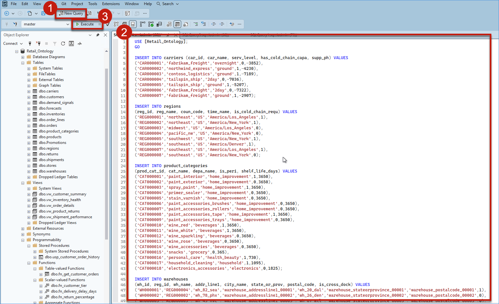

6. Confirm that the **Messages** tab shows multiple **"(X rows affected)"** messages and **"Query executed successfully"** at the bottom, indicating the data was inserted successfully.

    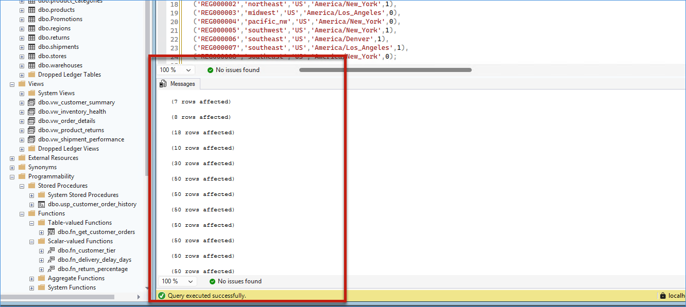

7. To validate the inserted data, expand **Tables** under **Retail_Ontology** in the Object Explorer, right-click on any table, and select **Select Top 1000 Rows**. You will see the data displayed in the results grid.

    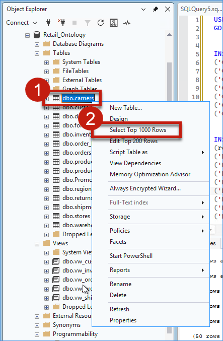

    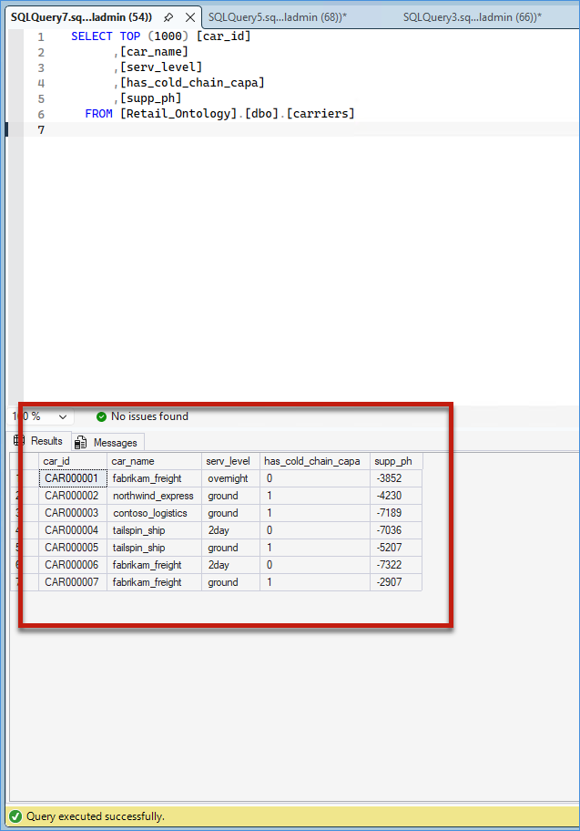

## What We Learned

- How to install and configure SQL Server and SQL Server Management Studio (SSMS)
- How to create a relational database for a retail business scenario
- How to populate and validate business data within SQL Server
- How on-premises systems continue to serve as critical data sources in many organizations
- How establishing a reliable source environment prepares organizations for cloud modernization initiatives

## Next Exercise

In the next exercise, Mark takes the next step in Zava's modernization journey by preparing the Azure SQL environment that will serve as the future destination for the organization's retail transaction data. He will review the provisioned Azure SQL resources, configure secure connectivity, and verify that the target database is ready to receive migrated data.
