# Exercise 1: Provision the Azure SQL Migration Foundation

Jessie, a Business Intelligence Analyst at Zava Retail, is preparing for a leadership review meeting. Leadership wants a complete picture of sales performance, customer behavior, and marketing campaign effectiveness. However, Jessie quickly discovers that critical retail transaction data is still stored in an on-premises SQL Server environment, while customer and campaign data already reside in the cloud.

Without a standard data foundation, unified business insights are difficult to generate and time-consuming.

To address this challenge, Mark, Zava's Database Administrator, begins preparing both the organization's on-premises SQL Server environment and the target Azure SQL environment for modernization. Before data can be migrated and unified, a reliable source system must be established and validated, and the target environment must be properly configured and ready to receive production data.

In this exercise, you will install and configure SQL Server and SQL Server Management Studio (SSMS), create a sample retail business database, populate it with operational data, review the pre-provisioned Azure SQL resources, configure firewall rules, and verify that both source and target environments are ready for the migration journey.

## ✅ Outcome

- SQL Server successfully installed and configured
- SQL Server Management Studio (SSMS) connected to the database environment
- Sample retail business database created
- Business data loaded and validated
- On-premises source system prepared for migration
- Azure SQL Logical Server and Azure SQL Database-Hyperscale reviewed and validated
- Firewall rules configured to enable secure connectivity
- Database connectivity verified through the Azure Portal Query Editor
- Target Azure SQL Database-Hyperscale confirmed ready for migration
- Cloud migration foundation established for the next phase of modernization


### Task 1.1: Configure SQL Server and SSMS

1. Click on the **Windows** button on the taskbar, search for **"SSMS"**, and click on **SSMS** to launch SQL Server Management Studio.

    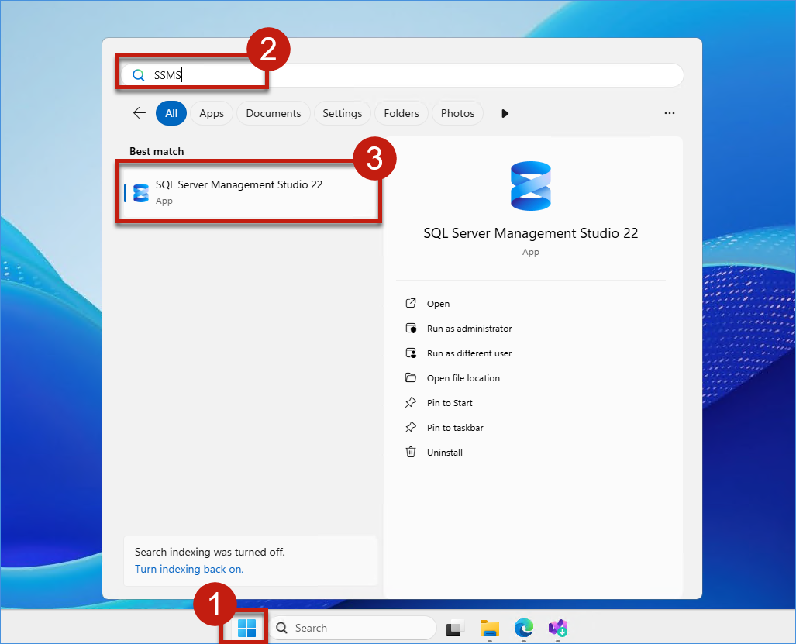

2. In the **Connect to Server** dialog, enter the following details:

    - In the **Server name** field, enter:

        ```text
        localhost
        ```

    - For **Authentication**, choose **Windows Authentication** from the dropdown.

    - Check the **"Trust server certificate"** checkbox.

    - Click **"Connect"**.

        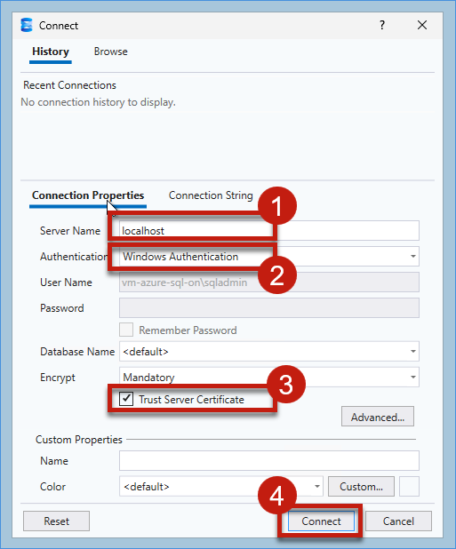

3. Once connected, the **Object Explorer** panel will display the server node. Right-click on **localhost (SQL Server 17.0.1...)** and click on **Properties**.

    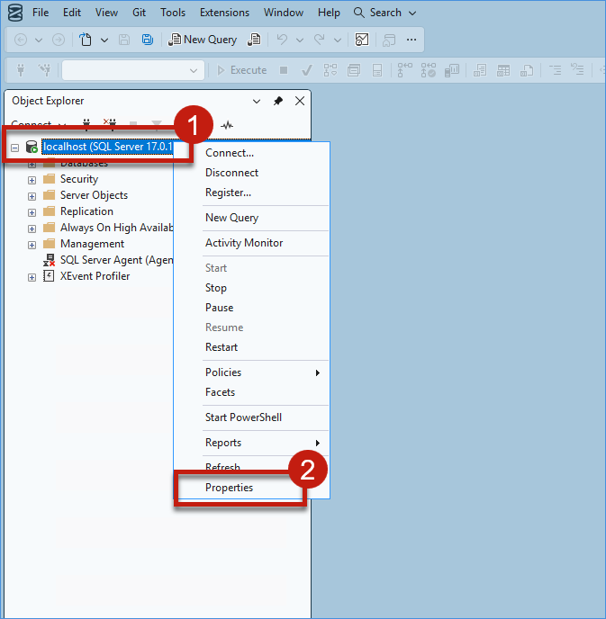

4. In the **Server Properties** dialog, click on **Security** in the left panel. Under **Server authentication**, select **SQL Server and Windows Authentication mode**, then click **OK**.

    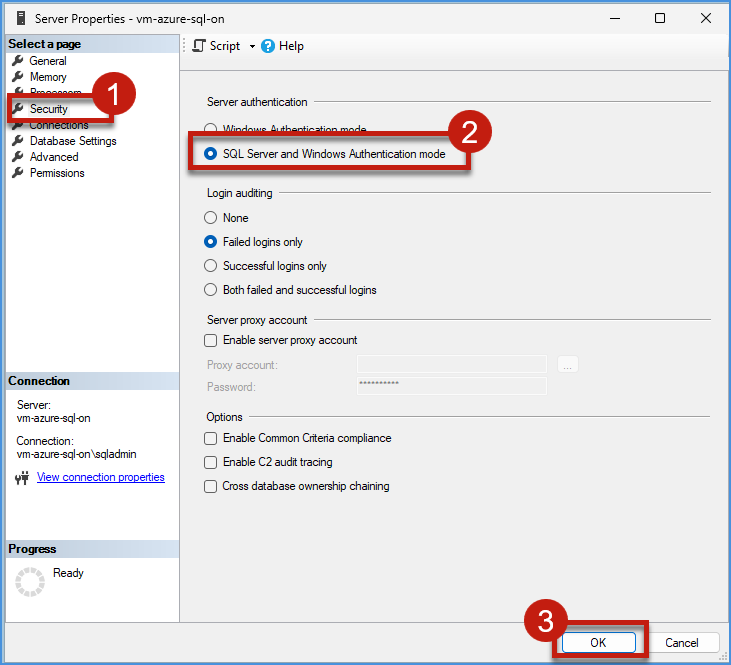

5. If you get a popup dialog, click **OK**.

    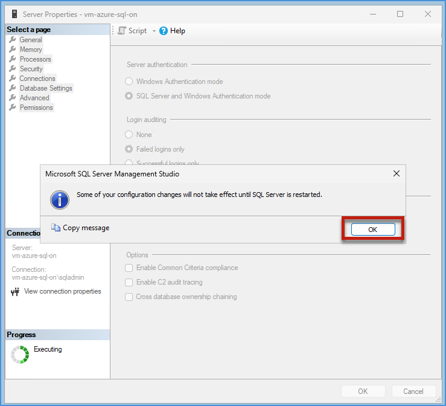

6. In the **Object Explorer**, right-click on **localhost (SQL Server 17.0.1000.7...)** again and click on **Restart**.

    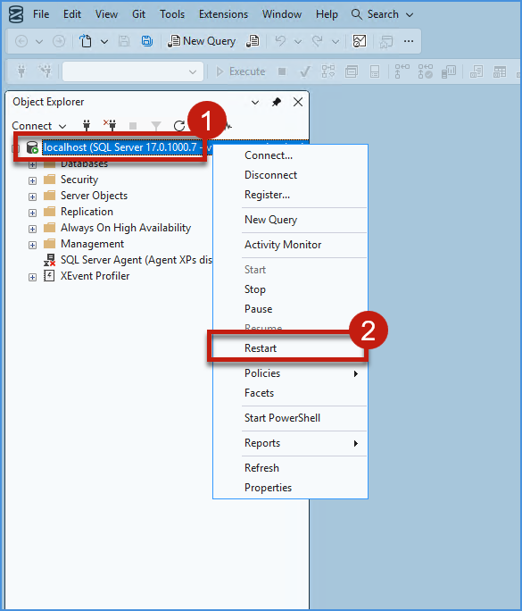

7. If you get a confirmation popup asking to restart the MSSQLSERVER service, click **Yes**.

    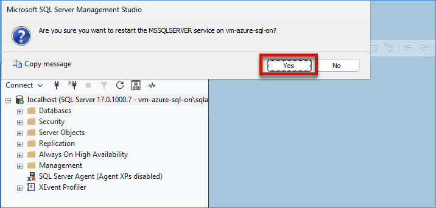


### Task 1.2: Access the Provided Azure SQL Server and Database​

1. Click on the **Microsoft Edge** browser icon on the taskbar, navigate to the Azure Portal by entering the following URL in the address bar, and then click on the **Search bar** at the top of the page.

    ```text
    portal.azure.com
    ```

    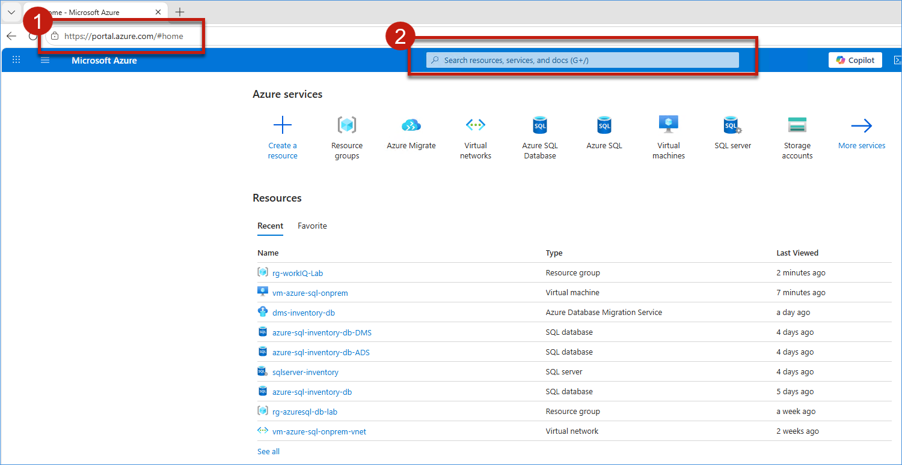

2. In the Search bar, type the following and click on **Resource Groups** from the search results.

    ```text
    Resource Groups
    ```

    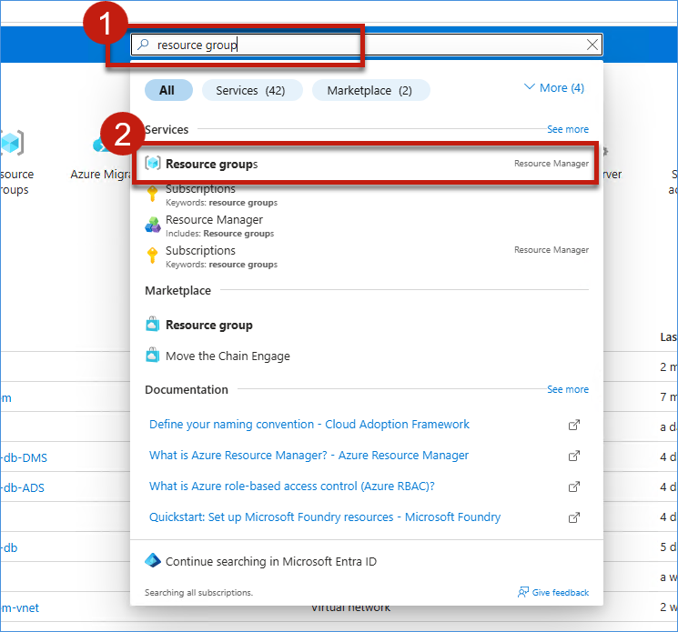

3. In the Resource Groups list, click on **rg-workIQ-Lab**.

    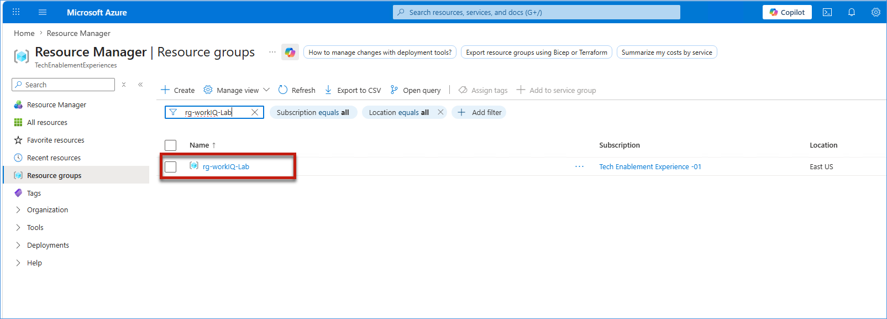

4. In the resource group, click on **sql-rgworkiqlab-f1-06151713336** (Type: SQL server) from the Resources list.

    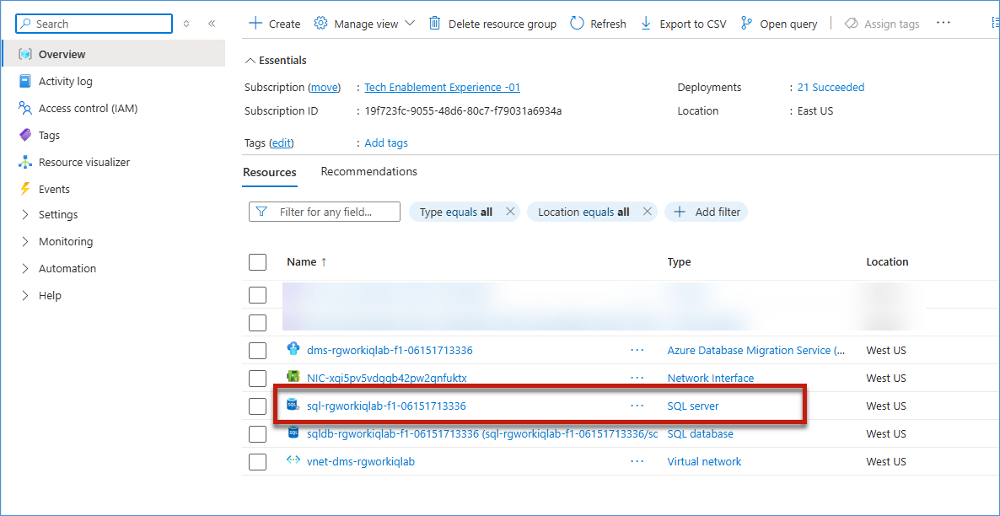


### Task 1.3: Configure and Verify Firewall Rules​


5. On the SQL server page, in the left-hand search bar, type the following and click on **Networking** under Security.

    ```text
    networking
    ```

    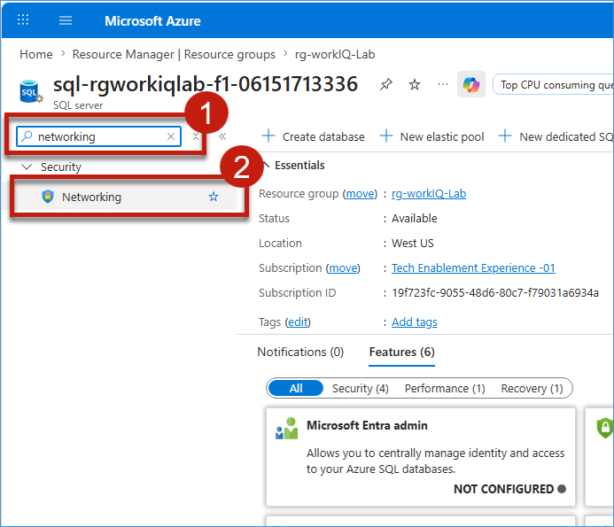

6. On the Networking page, under **Firewall rules**, click on **+ Add your client IPv4 address**. You will see your IP address added as a new firewall rule. Then click **Save**.

    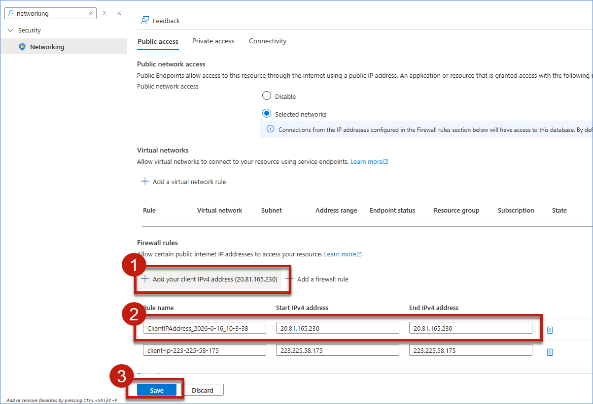

7. Wait for the notification popup confirming **"Successfully updated server firewall rules"** for server sql-rgworkiqlab-f1-06151713336.

    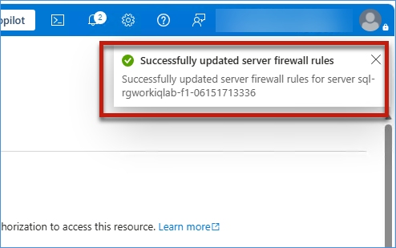

8. Now click on the **cross icon** to remove the network searched text from the search bar.

    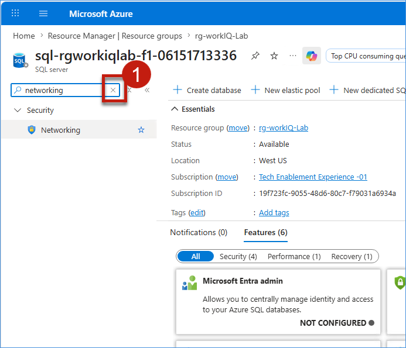

### Task 1.4: Test Azure SQL Database-Hyperscale Connection and Verify Empty State

9. In the left panel, expand **Settings** and click on **SQL databases**. Then click on **sqldb-rgworkiqlab-f1-06151713336** from the database list.

    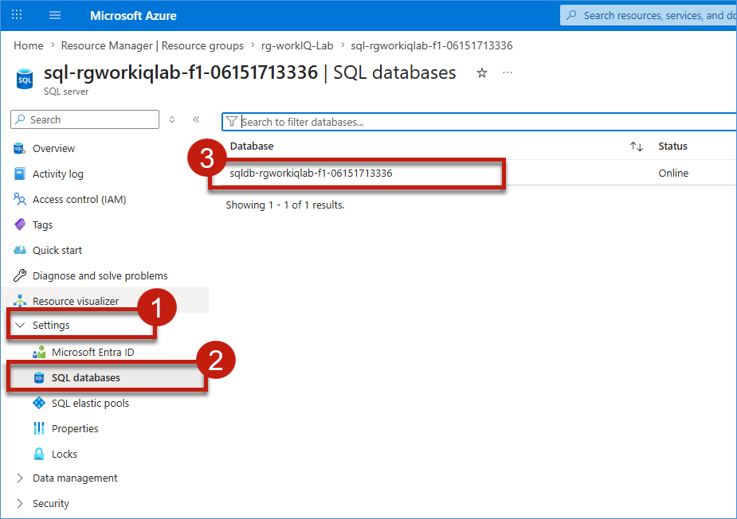

10. In the left panel, click on **Query editor (preview)**. In the Query editor login page, select **SQL Server authentication**, enter the following credentials (you can find these credentials in your lab environment details), and click **OK**.

    - **Login**:

        ```text
       sqladmin
        ```

    - **Password**: 

        ```text
        (Refer to your environment details for the password)
        ```


    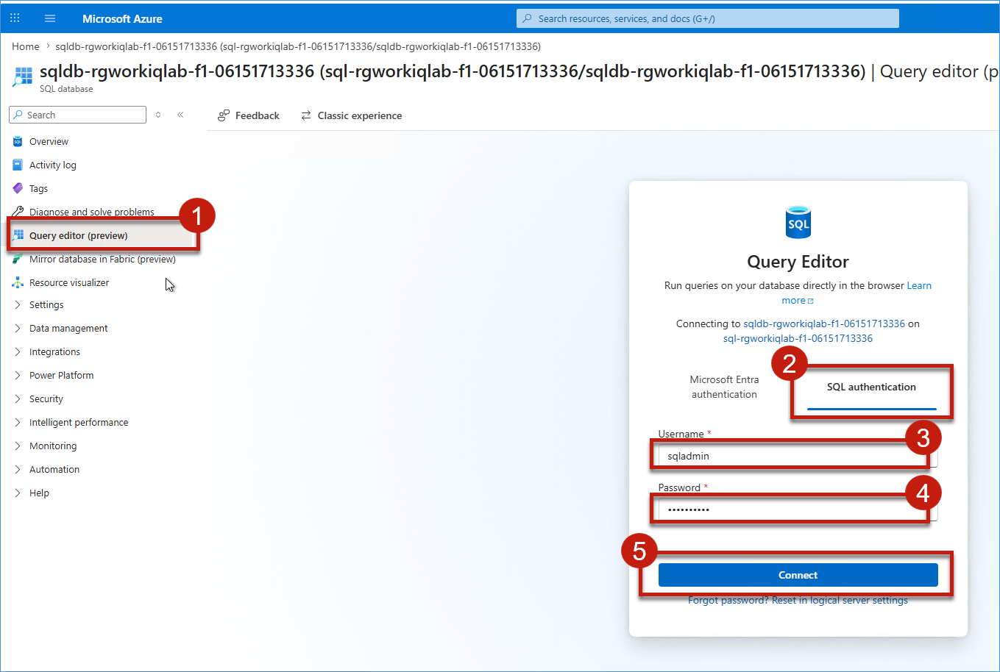

11. In the **Explorer** section on the left, expand **sqldb-rgworkiqlab-f1-0...** > **dbo** to verify the database structure. You can see **Tables**, **Views**, **Stored Procedures**, and **Functions** listed under the dbo schema, confirming the database is empty and ready for migration.

    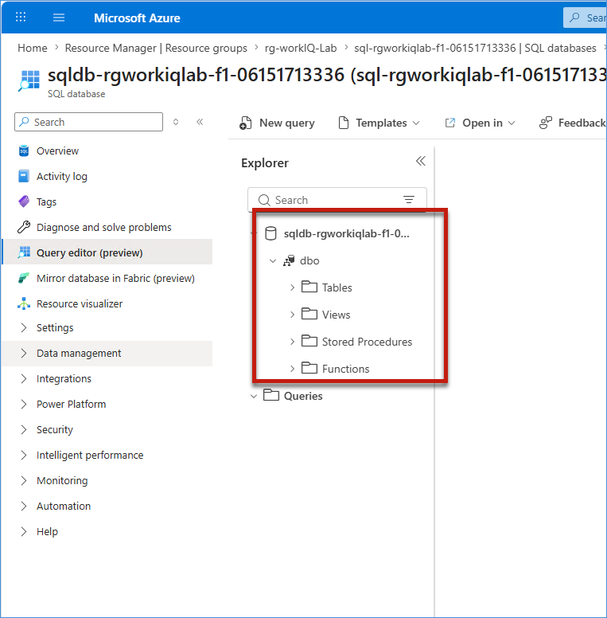


## What We Learned

- How to install and configure SQL Server and SQL Server Management Studio (SSMS)
- How to create a relational database for a retail business scenario
- How to populate and validate business data within SQL Server
- How on-premises systems continue to serve as critical data sources in many organizations
- How to review and validate Azure SQL migration resources
- How to configure firewall rules to enable secure database connectivity
- How to connect to Azure SQL Database-Hyperscale using the Azure Portal Query Editor
- How to verify that a target database is prepared for migration
- How proper environment preparation reduces migration risk and improves reliability

## Next Exercise

In the next exercise (Exercise 2), Mark will configure the Azure Database Migration Service, install and register the Self-Hosted Integration Runtime, and establish secure connectivity between the on-premises SQL Server environment and Azure SQL Database-Hyperscale. These steps will ensure that the migration infrastructure is in place and ready to support the upcoming migration process.