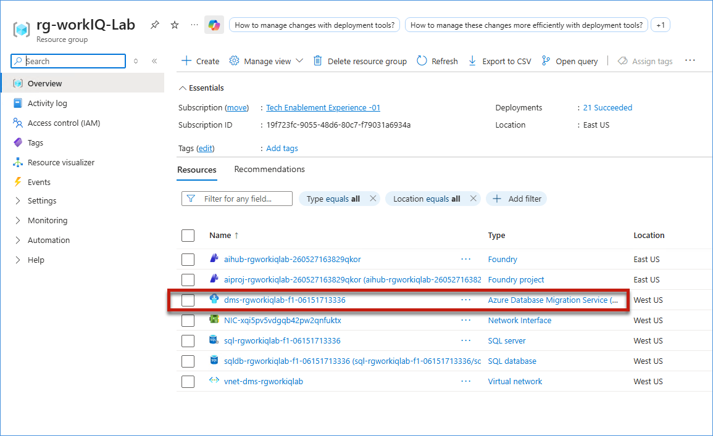
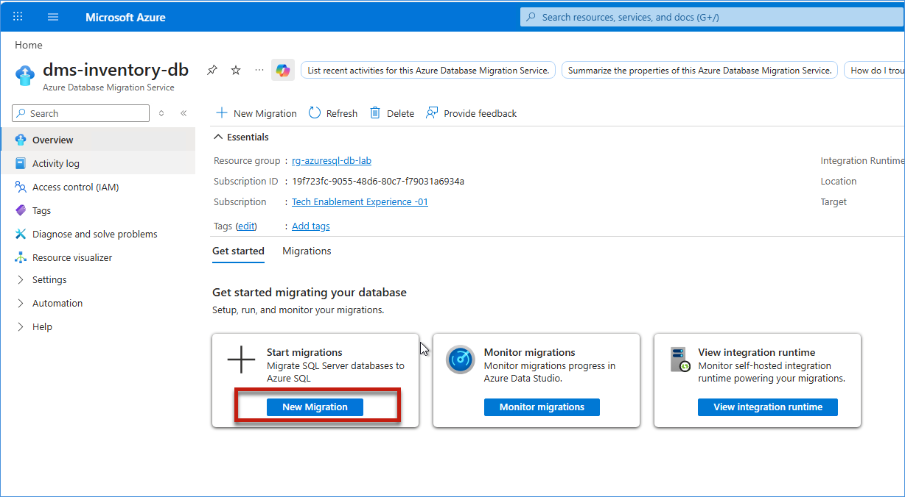
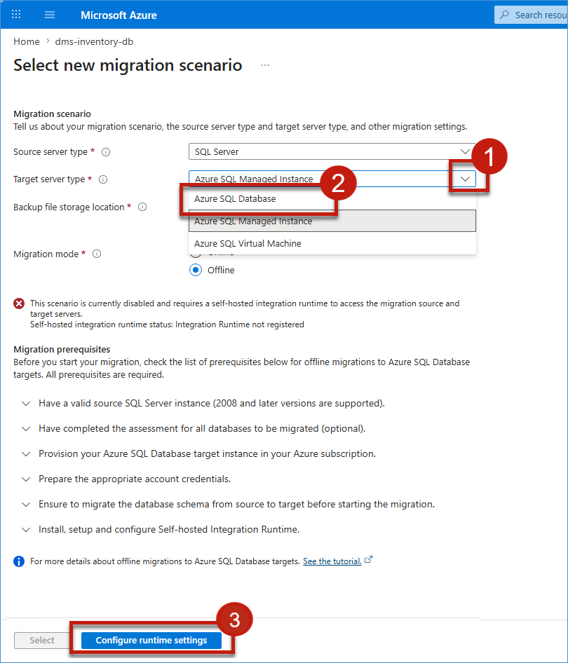
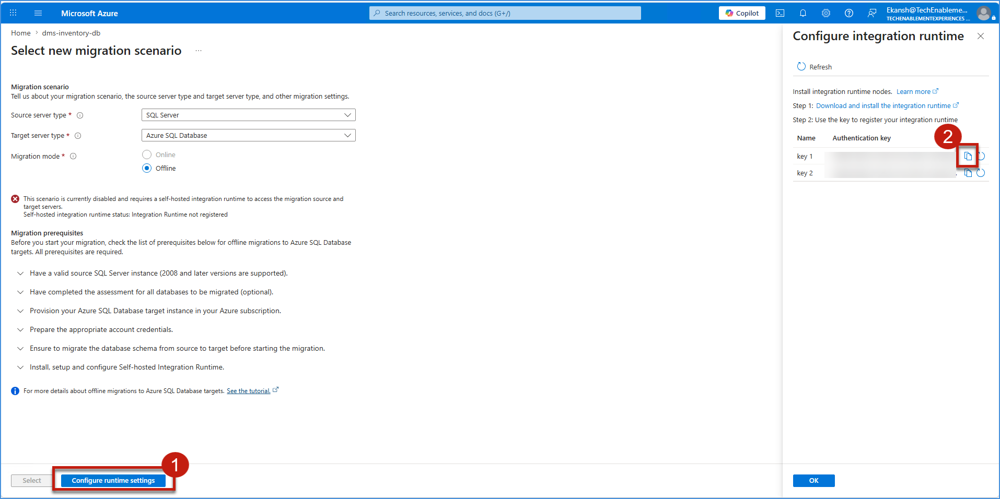
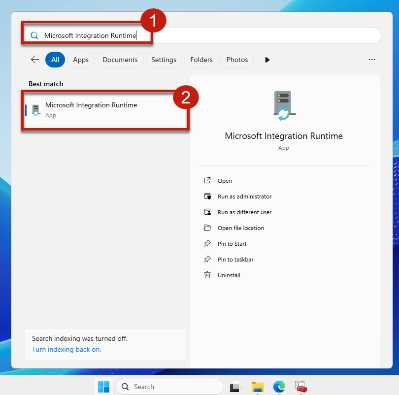
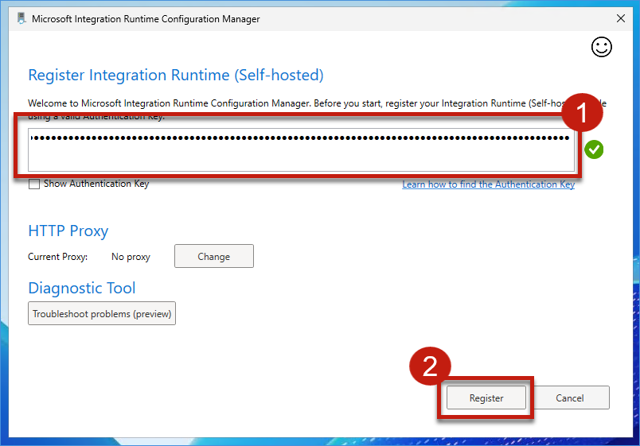
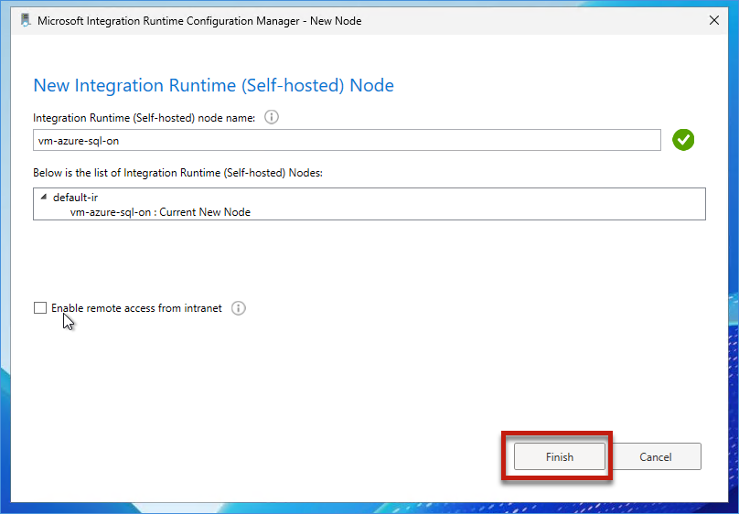
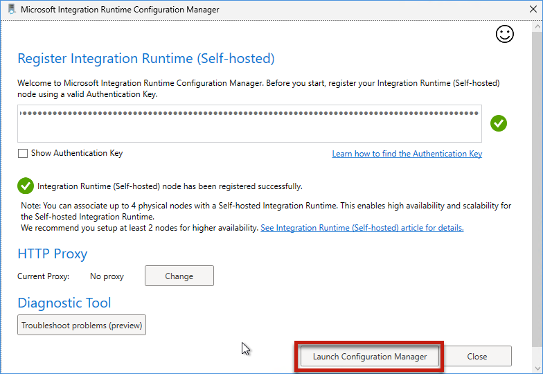
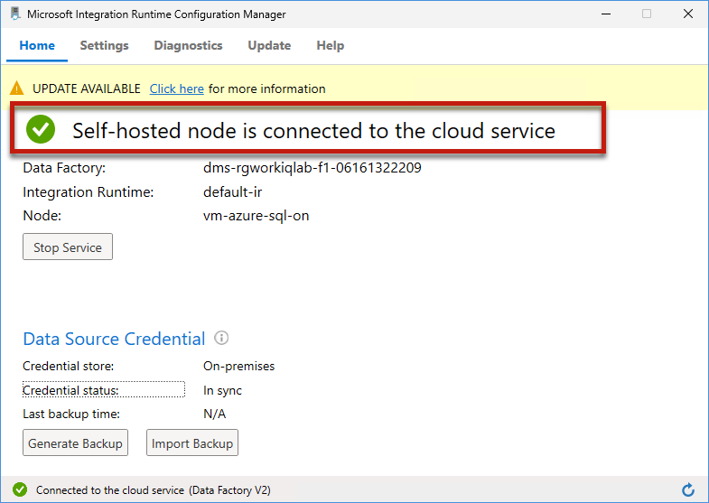
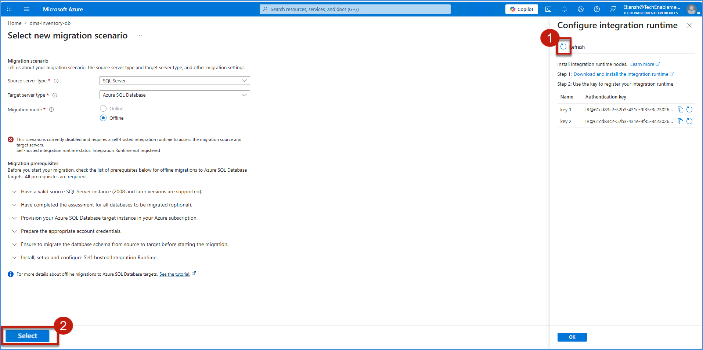

# Exercise 2: Configure Azure Database Migration Service

The source and target database are now ready for migration. Before moving schema objects and data, a secure connection must be established between the on-premises SQL Server environment and Azure SQL Database-Hyperscale. Azure Database Migration Service (DMS) provides the migration infrastructure required to enable this process.

In this exercise, you will review Azure Database Migration Service, install and register the Self-Hosted Integration Runtime, and validate connectivity via IR Authentication Key between the source and target systems. These steps ensure that the migration infrastructure is in place and ready to support the upcoming migration process.

## ✅ Outcome

- Azure Database Migration Service reviewed and validated
- Self-Hosted Integration Runtime successfully installed and registered
- Connectivity established between on-premises SQL Server and Azure SQL Database-Hyperscale
- Migration infrastructure configured and operational
- Foundation established for executing the database migration

### Task 2.1: Review the Azure Database Migration Service​
1. Click on the **Microsoft Edge** browser icon on the taskbar, navigate to the Azure Portal by entering the following URL in the address bar, and then click on the **Search bar** at the top of the page.

    ```text
    portal.azure.com
    ```

    

2. In the Search bar, type the following and click on **Resource Groups** from the search results.

    ```text
    Resource Groups
    ```

    

3. In the Resource Groups list, click on **rg-workIQ-Lab**.

    

4. In the resource group, click on **dms-rgworkiqlab-f1-06151713336** (Type: Azure Database Migration Service) from the Resources list.

    

5. On the Azure Database Migration Service page, under **Start migrations**, click on **New Migration**.

    

6. On the **Select new migration scenario** page, verify that **Source server type** is set to **SQL Server**. Click on the **Target server type** dropdown and select Azure SQL Database. 

    

7. Click on **Configure runtime settings** at the bottom of the page. In the **Configure integration runtime** panel on the right, click the **copy** icon next to **key 1** to copy the Authentication key.

    

### Task 2.2: Register the Self-Hosted Integration Runtimee

1. Click on the **Windows** button on the taskbar, search for **"Microsoft Integration Runtime"**, and click on **Microsoft Integration Runtime** to launch it.

    

2. In the **Register Integration Runtime (Self-hosted)** window, paste the copied Authentication key into the text field and click **Register**.

    

3. On the **New Integration Runtime (Self-hosted) Node** page, verify the node name is displayed (e.g., **vm-azure-sql-on**) and click **Finish**.

    

4. Once the registration is successful, you will see the message **"Integration Runtime (Self-hosted) node has been registered successfully."** Click on **Launch Configuration Manager**.

    

### Task 2.3: Verify Connectivity Through the Integration Runtime

1. The **Microsoft Integration Runtime Configuration Manager** opens. Verify that the status shows **"Self-hosted node is connected to the cloud service"** and the connection status at the bottom displays **"Connected to the cloud service (Data Factory V2)"**.

    

    > **Note:** It may take a few moments for the status to update to "Connected." During this time, it may briefly display "Inactive."

2. Go back to the Azure Portal. In the **Configure integration runtime** panel on the right, click **Refresh**. The error message indicating "Integration Runtime not registered" will disappear, confirming the Self-Hosted Integration Runtime is successfully configured. Then click **Select** at the bottom of the page.

    


## What We Learned

- How Azure Database Migration Service supports SQL Server migration scenarios
- How to install and configure a Self-Hosted Integration Runtime
- How the Integration Runtime securely connects on-premises and Azure environments
- How to validate migration readiness before moving business-critical data
- How proper connectivity and infrastructure preparation reduce migration risk

## Next Exercise

In the next exercise (Exercise 3), Mark will use the migration infrastructure configured here to migrate Zava's retail transaction database to Azure SQL Database-Hyperscale. He will validate schema compatibility, transfer data, and confirm that the migrated environment is ready to support modern analytics and reporting workloads.


