# Exercise 3: Execute the Database Migration

With the migration infrastructure in place, Zava is ready to modernize its retail data platform. The on-premises SQL Server environment contains years of valuable sales transaction data that remains isolated from the organization's cloud-based customer and campaign systems.

Using Azure Database Migration Service, the retail transaction database can now be migrated to Azure SQL Database-Hyperscale, bringing Zava one step closer to a unified data foundation that supports analytics, reporting, and future AI-driven initiatives.

In this exercise, you will create and configure a migration project, connect the source and target environments, migrate the On-Prem database, and validate that all schema objects and data have been successfully transferred.

## ✅  Outcome

- Azure Database Migration Service migration project successfully created
- Source and target database connections configured and validated
- OnPrem database migrated to Azure SQL Database-Hyperscale
- Migration results reviewed and verified

### Task 3.1: Configure the Source Database in Migration Wizard

1. In the Azure SQL Database-Hyperscale Offline Migration Wizard, under the **Source details** tab, after clicking **Select** in the previous step, set **Is your source SQL Server instance tracked in Azure?** to **No**. Then open the **Source Infrastructure Type** dropdown and select **Virtual Machine**.

	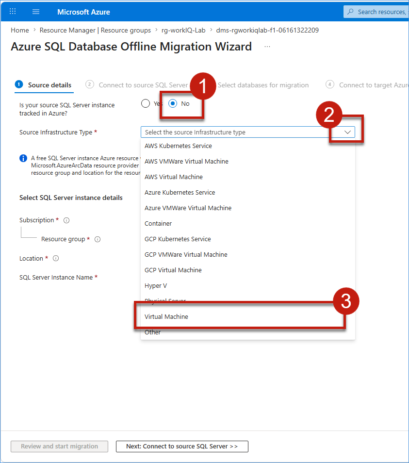

2. Under **Select SQL Server instance details**, choose **West US** for **Location**, enter **dms-sql-server-instance** for **SQL Server Instance Name**, and then click **Next: Connect to source SQL Server >>**.

	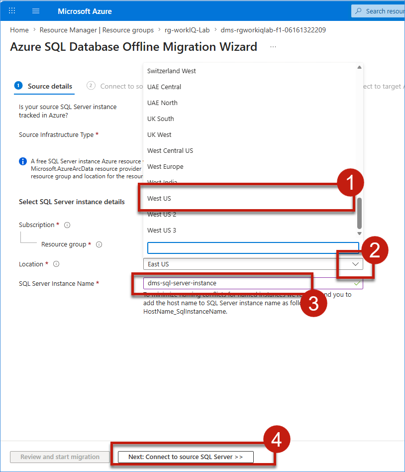

3. On the **Connect to source SQL Server** page, enter **localhost** for **Source server name**, set **Authentication type** to **SQL Authentication** from dropdown, enter **sqladmin** as **User name**, enter the SQL admin password as **<inject key="SQL Admin Password" enableCopy="false"/>** in **Password**, ensure **Encrypt connection** and **Trust server certificate** are selected, and then click **Next: Select databases for migration >>**.

	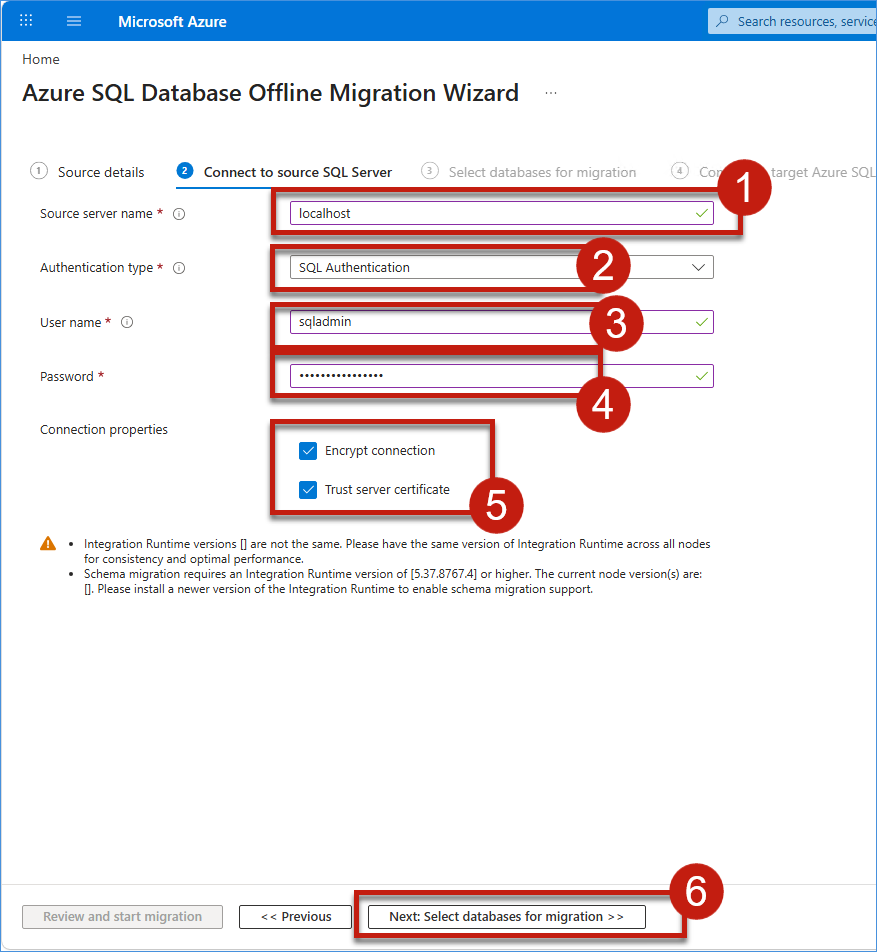

4. On the **Select databases for migration** page, select the checkbox for **Retail_Ontology**, verify it is selected, and then click **Next: Connect to target Azure SQL Database-Hyperscale >>.

	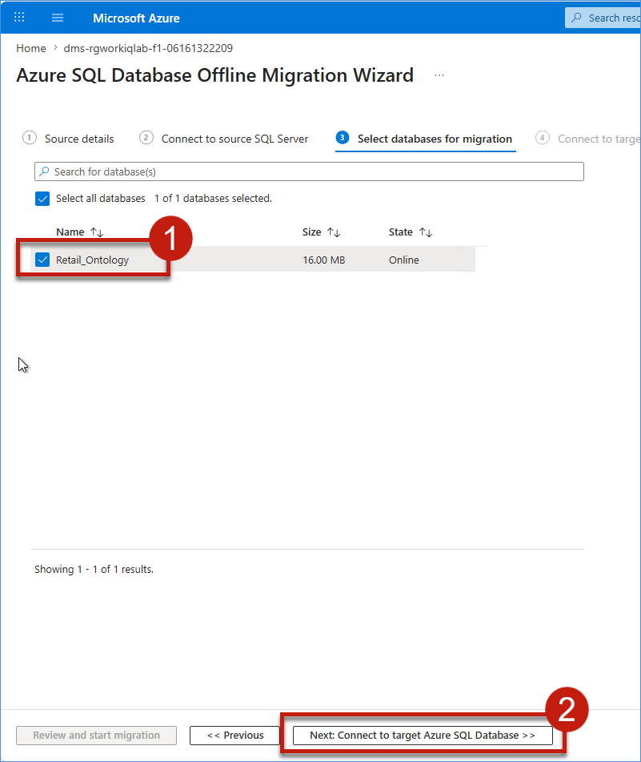

### Task 3.2: Configure the Target Database in Migration Wizard

6. On the **Map source and target databases** page, click the **Target database** dropdown and select **sqldb-rgworkiqlab-f1-06151713336**, verify that the source database **Retail_Ontology** is mapped to the target database, and then click **Next: Select database tables to migrate >>**.

	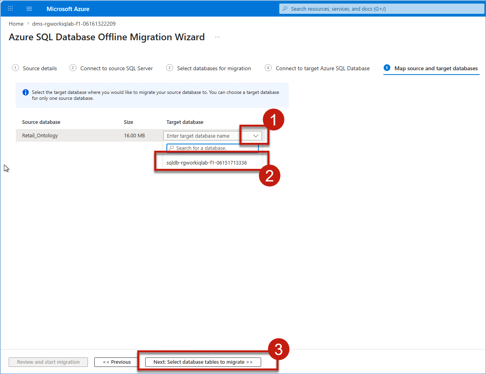

### Task 3.3: Select the Source Database and Run the Migration

7. On the **Select database tables to migrate** page, ensure **Migrate missing schema** is checked, verify that **Select all tables** is checked (15 tables selected), and then click **Next: Database migration summary >>**.

	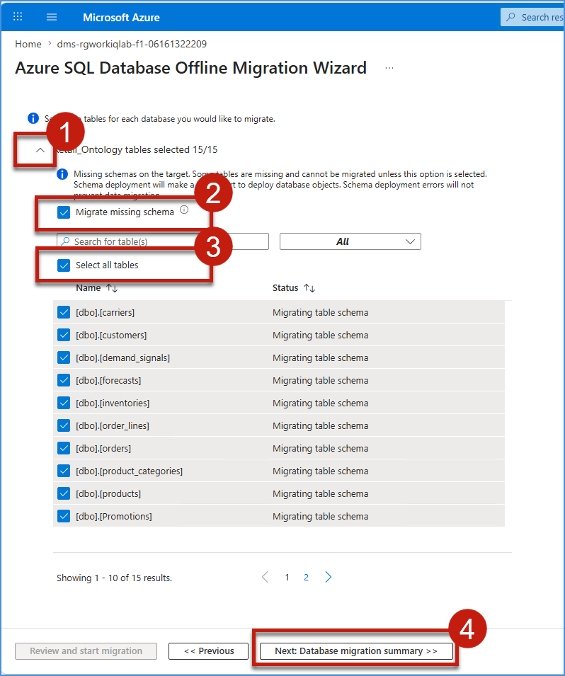

8. On the **Database migration summary** page, review the migration configuration (SQL Server Instance, Source databases, Azure SQL target, and Migration mode), verify all details are correct, and then click **Start migration**.

	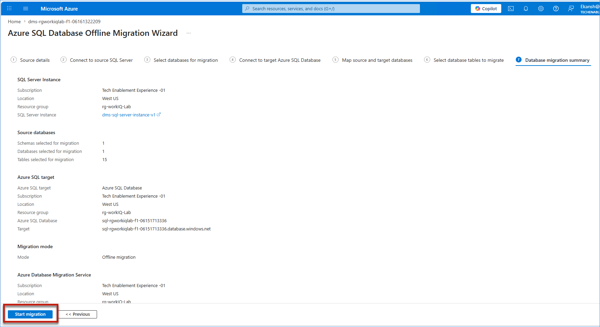

9. The **Migrations** page will display with the migration status initially showing **Creating**. The status will change to **In progress** as the migration begins. Wait until the migration completes successfully.

	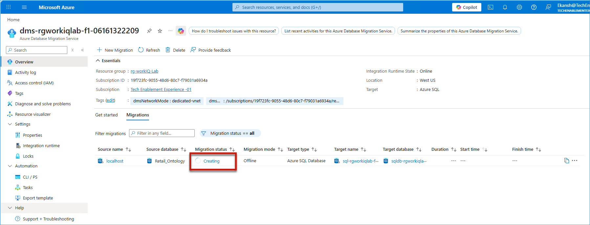

10. Verify that the migration status displays **Succeeded** in the Migrations table.

	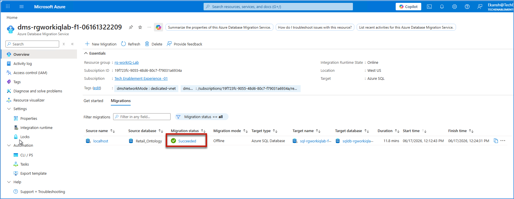

### Task 3.4: Review the Migration Results

11. Click on the **localhost** link under **Source name** in the Migrations table to review the migration details.

	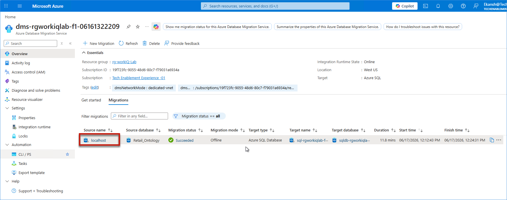

12. On the **Retail_Ontology** migration details page, review and verify the following: **Migration status** shows **Succeeded**, **Schema migration status** shows **Completed** with all the objects collected, **Script generation** is **100%**, **Script deployment** is **100%** with 0 deployment failures, and all tables in the list show **Succeeded** status. Then click **X** to close the details page.

	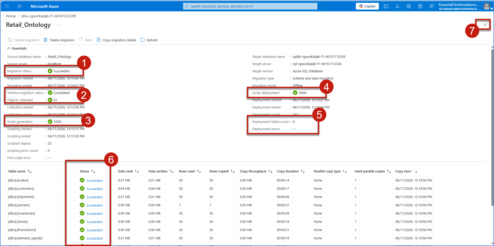

## What We Learned

- How to create and configure a migration project in Azure Database Migration Service
- How to connect source On-Prem SQL Server and targeted Azure SQL Database-Hyperscale migration endpoints
- How to monitor migration progress and validate successful completion

## Next Exercise

In the next exercise (Exercise 4), Mark will validate the migrated database and establish operational readiness by verifying data consistency and also validate all the schema objects, enabling monitoring and observability, and implementing backup, scaling, and disaster recovery capabilities for the Azure SQL Database-Hyperscale environment.

