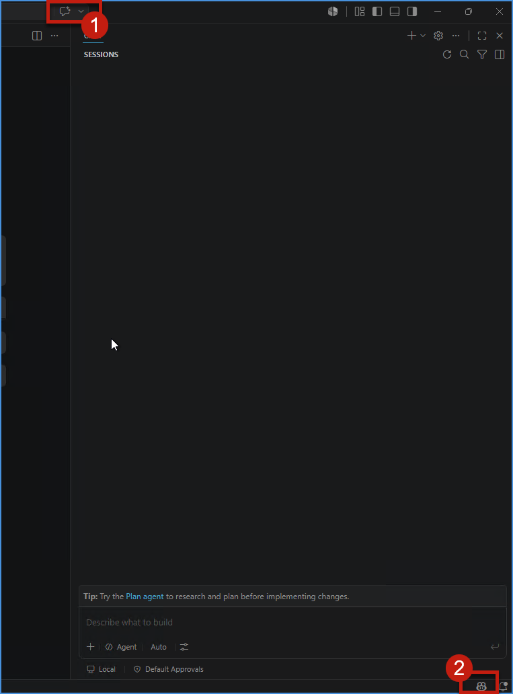
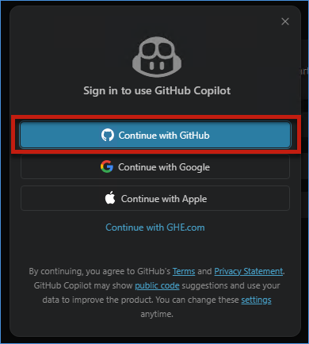
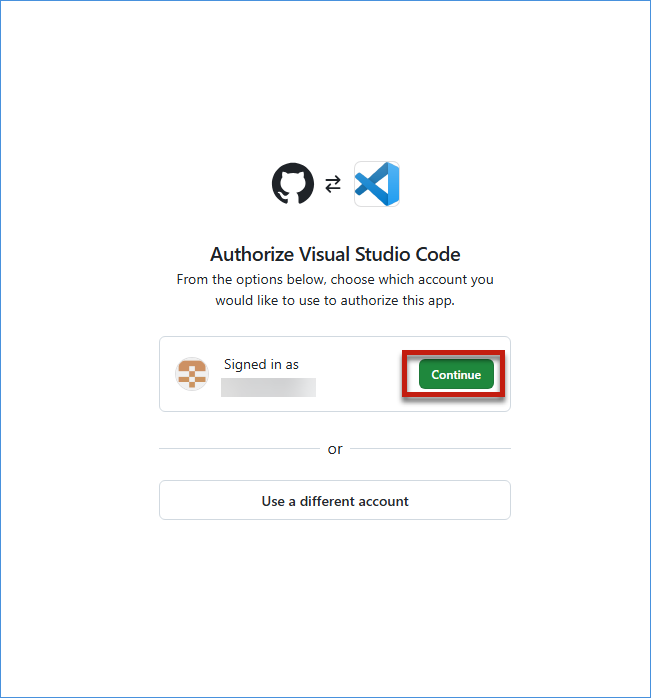
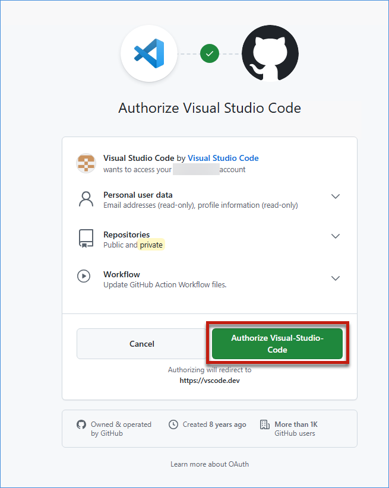
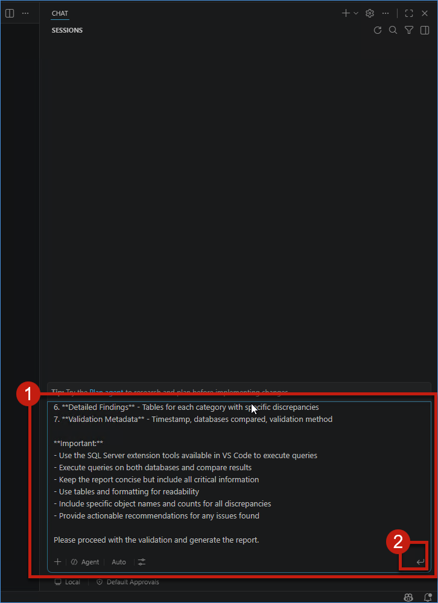
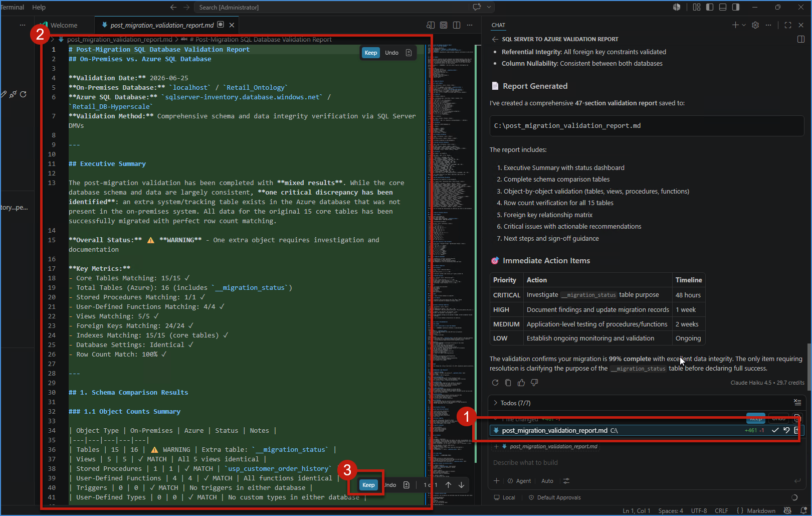
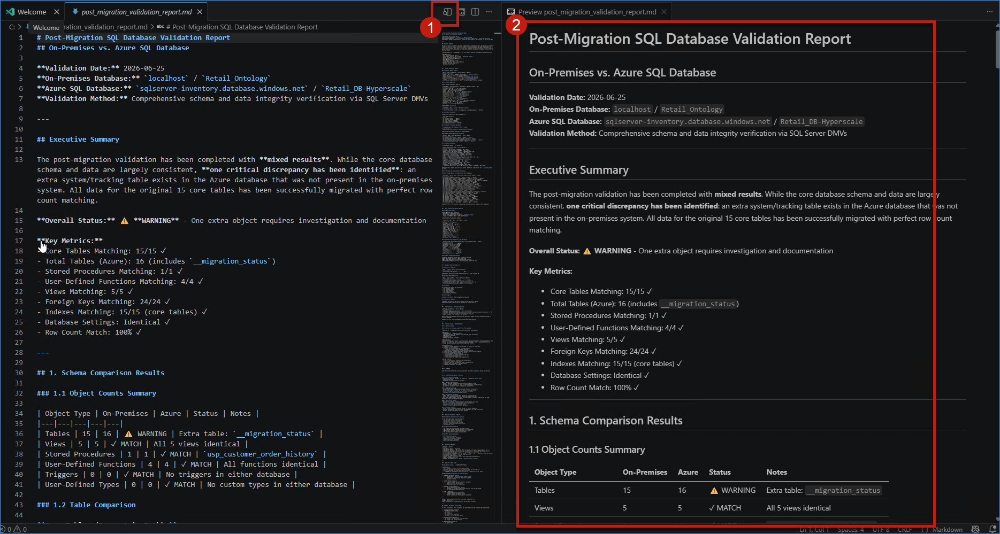

# Exercise 4: Validate the Migrated Azure SQL Database-Hyperscale

The migration to Azure SQL Database-Hyperscale is now complete, but a successful migration is about more than moving data. Before Zava can rely on the new platform for reporting, analytics, and decision-making, the migrated environment must be validated to ensure data accuracy and functionality.

Jessie, a Business Intelligence Analyst, is preparing for an upcoming leadership review and needs confidence that the migrated sales data is complete, accurate, and ready for business use. Together, Mark and Jessie validate the migrated database, confirm that all database objects were transferred successfully, and verify that the data can support future reporting and analytics workloads.

In this exercise, you will connect to the migrated Azure SQL Database-Hyperscale, verify migrated database objects, and validate that the data and database functionality have been successfully preserved during the migration process.

## ✅ Outcome

- Successfully connected to the migrated Azure SQL Database-Hyperscale
- Data consistency validated between source and target environments
- Views, stored procedures, functions, and triggers are tested successfully
- Migrated database confirmed ready for reporting and analytics

### Task 4.1: Connect to the Migrated Azure SQL Database-Hyperscale​
1. Click on the **Target database** link (**sqldb-rgworkiqlab-f1-06151713336**) in the Migrations table to view the migrated Azure SQL Database-Hyperscale.

	

2. In the left navigation menu, click on **Query editor (preview)**, select **SQL authentication**, enter **sqladmin** for the username, enter the SQL admin password, and then click **Connect**.

	


### Task 4.2: Verify Migrated Database Objects​

3. In the **Query editor Explorer**, expand the **dbo** schema and verify that the **Tables** folder contains all 15 migrated tables: **__migration_status**, **carriers**, **customers** etc.

	

4. Continue scrolling in the Explorer to verify the remaining database objects: **Views** , **Stored Procedures**, **Scalar Functions** , and **Table-Valued Functions**.

	


### Task 4.3: Validate Data and Database Functionality


5. In the Explorer, right-click on the **customers** table and select **Select top 1000 rows** from the context menu.

	

6. The query `SELECT TOP (1000) * FROM [dbo].[customers]` will be auto-populated in the editor. Click **Run** and verify that the results display customer data in the **Results** tab, confirming the data has been successfully migrated (50 rows returned).

	

### Task 4.4: (Optional) Validate Source vs Target Metrics via GitHub Copilot in VS Code

1. Click on the **Windows** icon in the taskbar, type **Visual Studio Code - Insiders** in Search, and click the **Visual Studio Code - Insiders** app from **Best match**.

	

2. In VS Code, click the **SQL Server** extension icon in the left activity bar, then click **+ Add Connection**. In the **Connection Dialog**, enter **localhost** as the server name, keep **Trust server certificate** checked, open **Authentication type**, and select **Windows Authentication**.

	

3. Click **Test connection**. After a few seconds, verify that a green **tick** appears, then click **Connect**.

	


4. In the **SQL SERVER** panel, expand the connected **localhost** server, expand **Databases**, and verify that **Retail_Ontology** is visible.

	

5. Click **+ Add Connection** to create another connection. In the **Connection Dialog**, enter the Azure SQL server name, keep **Trust server certificate** checked, set **Authentication type** to **SQL Login**, enter the SQL username and password, click **Test connection**, wait a few seconds for the green **tick**, and then click **Connect**.

	

6. In the **SQL SERVER** panel, expand the new Azure SQL connection, expand **Databases**, and verify that **Retail_DB-Hyperscale** is visible. Expand **Retail_DB-Hyperscale** to view all migrated database objects.

	

7. Click on the **GitHub Copilot chat** icon on the top right of VS Code, then click on the **GitHub Copilot** icon at the right bottom to log in using your GitHub account credentials.

	


8. A popup will be shown. Click on the **Continue with GitHub** button to proceed with authentication.

	

9. Sign in with your **GitHub account** and **password** to authenticate VS Code with GitHub Copilot.

10. A popup to approve VS Code link with GitHub will appear. Click on the **Continue** button to complete the authentication process.

	

11. A new popup will appear. Click on the **Authorize Visual-Studio-Code** button to authorize the connection.

	

12. VS Code will automatically come back to the screen. Paste the given prompt in the **Copilot chat** right panel and press **Enter**.

```sql
# Role
You are an expert Database Migration Validation Engineer specializing in post-migration validation for enterprise SQL Server to Azure SQL Database migrations.

# Context
I have completed a database migration from an on-premises SQL Server to Azure SQL Database-Hyperscale. Both database connections are already established in VS Code using the SQL Server extension.

**Source Database (On-Premises):**
- Server: `localhost`
- Database: `Retail_Ontology`

**Target Database (Azure SQL):**
- Server: `sqlserver-inventory.database.windows.net`
- Database: `Retail_DB-Hyperscale`

# Task
Perform a comprehensive post-migration validation by comparing the source and target databases. Execute SQL queries using the SQL Server extension in VS Code to gather all necessary information, then generate a complete validation report as a single markdown file named `Comparison_Report.md`.

# Validation Requirements

Execute queries on both databases and compare the following aspects:

## 1. Schema Validation
- Count and compare: tables, views, stored procedures, functions, triggers, user-defined types
- Identify missing or additional objects in either database
- Compare table structures: column names, data types, nullability, constraints, identity properties
- Verify indexes: clustered, non-clustered, primary keys, unique constraints
- Compare foreign key relationships and check constraints
- Compare database and column-level collation settings

## 2. Data Integrity Validation
- Compare row counts for all tables
- Identify tables with row count discrepancies
- For the 5 largest tables, perform data sampling validation
- Compare critical column statistics: MIN, MAX, COUNT, NULL counts
- Detect potential data truncation or conversion issues

## 3. Database Objects Validation
- List and compare all stored procedures (count and names)
- List and compare all user-defined functions (count and names)
- List and compare all triggers (count and names)
- List and compare all views (count and names)
- Verify database users, roles, and schema ownership

## 4. Configuration Comparison
- Compare database compatibility levels
- Compare database collation settings
- Compare any relevant database properties or settings

# Output Requirements

Generate a **single, complete markdown file** named `Comparison_Report.md` with the following structure:

```markdown
# Database Migration Validation Report

## Executive Summary
[Provide overall validation status: PASSED/FAILED/PASSED WITH WARNINGS, total objects compared, critical findings count]

## Validation Metadata
| Attribute | Value |
|-----------|-------|
| Validation Date | [timestamp] |
| Source Database | localhost.Retail_Ontology |
| Target Database | sqlserver-inventory.database.windows.net.Retail_DB-Hyperscale |
| Validation Method | Automated SQL-based comparison |
| Validator | GitHub Copilot Enterprise |

## Schema Comparison

### Database Objects Summary
| Object Type | Source Count | Target Count | Status |
|-------------|--------------|--------------|--------|
| Tables | [count] | [count] | [✅/⚠️/❌] |
| Views | [count] | [count] | [✅/⚠️/❌] |
| Stored Procedures | [count] | [count] | [✅/⚠️/❌] |
| Functions | [count] | [count] | [✅/⚠️/❌] |
| Triggers | [count] | [count] | [✅/⚠️/❌] |

### Missing or Extra Objects
[List any objects that exist in source but not in target, or vice versa]

### Table Structure Comparison
[Report on any schema differences in tables]

### Index Comparison
[Report on index differences]

## Data Integrity Validation

### Row Count Comparison
| Table Name | Source Rows | Target Rows | Difference | Status |
|------------|-------------|-------------|------------|--------|
| [table] | [count] | [count] | [diff] | [✅/❌] |

### Data Sampling Results
[Results from the 5 largest tables]

### Column Statistics Comparison
[Any discrepancies in data ranges or null counts]

## Database Objects Validation

### Stored Procedures
[List comparison results]

### Functions
[List comparison results]

### Triggers
[List comparison results]

### Views
[List comparison results]

## Configuration Comparison
| Configuration | Source | Target | Status |
|---------------|--------|--------|--------|
| Compatibility Level | [value] | [value] | [✅/❌] |
| Collation | [value] | [value] | [✅/❌] |

## Issues and Recommendations

### Critical Issues (❌)
[List any critical problems that must be addressed]

### Warnings (⚠️)
[List any warnings that should be reviewed]

### Informational (ℹ️)
[List any informational items for awareness]

## Validation Conclusion
[Final summary statement: database migration validated successfully, or issues requiring attention]
```

# Instructions for Execution

1. **Execute all necessary SQL queries** on both source and target databases using the SQL Server extension
2. **Collect and analyze all results** before generating the report
3. **Generate the complete `Comparison_Report.md` file** in a single response
4. **Use clear, professional formatting** following enterprise database validation standards
5. **Include actual data** from query results - no placeholders or dummy data
6. **Use status indicators**: ✅ (Pass), ⚠️ (Warning), ❌ (Fail), ℹ️ (Info)
7. **Provide specific object names and counts** for all discrepancies
8. **Keep the report concise** - include only relevant findings, exclude unnecessary details
9. **Do not ask follow-up questions** - generate the complete report now

# Constraints
- Generate the complete report in one response
- Use markdown tables for structured data
- Include only factual findings based on query results
- Do not include SQL query text in the report
- Focus on business-relevant findings, not technical noise
- Ensure the report is production-ready for enterprise stakeholders

**Begin validation and generate the complete `Comparison_Report.md` file now.**
```

	

13. GitHub Copilot will automatically generate a **Comparison report** of both the on-premises and Azure SQL Database.

	

14. Click the **Preview** button to preview the generated report **.md** file.

	

## What We Learned

- How to connect to and validate a migrated Azure SQL Database-Hyperscale via Query Editor
- How to verify migrated database objects and dependencies
- How to validate data integrity and functionality after migration
- How to test views, stored procedures, and functions in the target environment
- How post-migration validation helps ensure trust in business-critical data

---

## Conclusion

You have successfully validated the migrated Azure SQL Database-Hyperscale and confirmed that Zava's retail transaction data has been successfully modernized. By verifying database objects, validating data consistency, and testing database functionality, you ensured that the migrated environment is ready for business use. 


