# Exercise 4: Validate the Migrated Azure SQL Database-Hyperscale

The migration to Azure SQL Database-Hyperscale is now complete, but a successful migration is about more than moving data. Before Zava can rely on the new platform for reporting, analytics, and decision-making, the migrated environment must be validated to ensure data accuracy and functionality.

Jessie, a Business Intelligence Analyst, is preparing for an upcoming leadership review and needs confidence that the migrated sales data is complete, accurate, and ready for business use. Together, Mark and Jessie validate the migrated database, confirm that all database objects were transferred successfully, and verify that the data can support future reporting and analytics workloads.

In this exercise, you will connect to the migrated Azure SQL Database-Hyperscale, verify migrated database objects, and validate that the data and database functionality have been successfully preserved during the migration process.

## ✅ Outcome

- Successfully connected to the migrated Azure SQL Database-Hyperscale
- Data consistency validated between source and target environments
- Views, stored procedures, functions, and triggers are tested successfully
- Migrated database confirmed ready for reporting and analytics

### Task 4.1: Connect to the Migrated Azure SQL Database-Hyperscale​
1. Click on the **Target database** link (**sqldb-rgworkiqlab-f1-06151713336**) in the Migrations table to view the migrated Azure SQL Database-Hyperscale.

	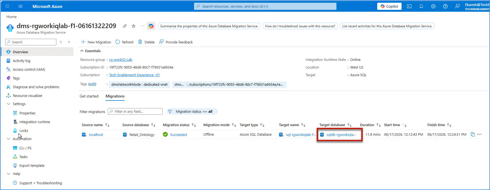

2. In the left navigation menu, click on **Query editor (preview)**, select **SQL authentication**, enter **sqladmin** for the username, enter the SQL admin password, and then click **Connect**.

	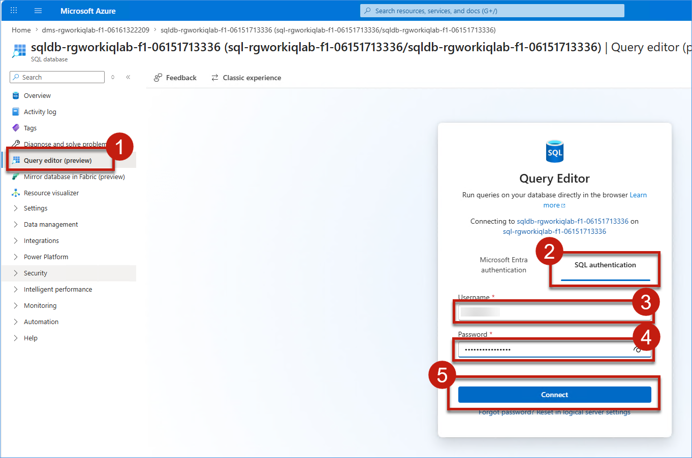

### Task 4.2: Verify Migrated Database Objects​

3. In the **Query editor Explorer**, expand the **dbo** schema and verify that the **Tables** folder contains all 15 migrated tables: **__migration_status**, **carriers**, **customers** etc.

	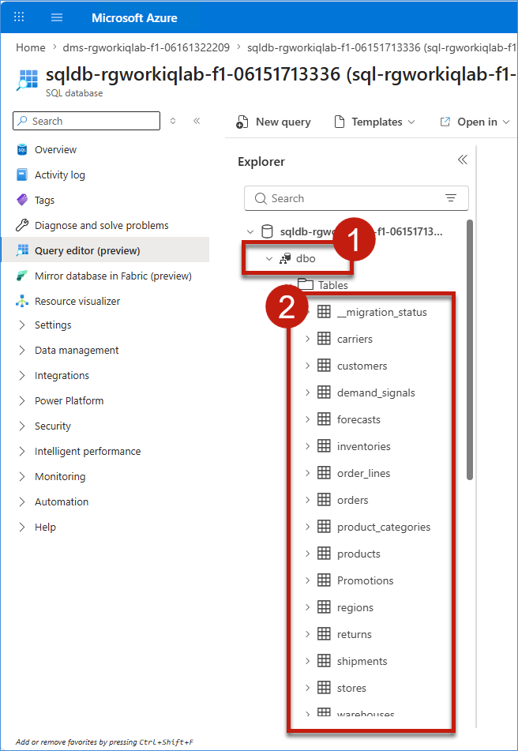

4. Continue scrolling in the Explorer to verify the remaining database objects: **Views** , **Stored Procedures**, **Scalar Functions** , and **Table-Valued Functions**.

	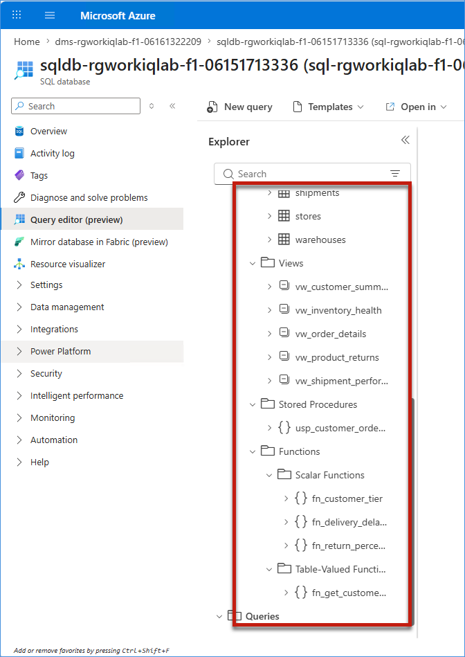

### Task 4.3: Validate Data and Database Functionality

5. In the Explorer, right-click on the **customers** table and select **Select top 1000 rows** from the context menu.

	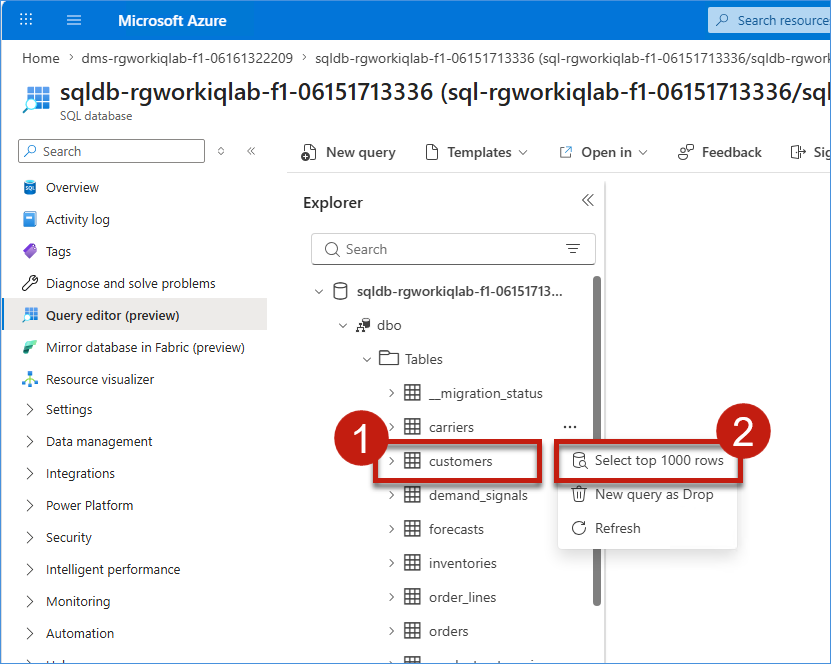

6. The query `SELECT TOP (1000) * FROM [dbo].[customers]` will be auto-populated in the editor. Click **Run** and verify that the results display customer data in the **Results** tab, confirming the data has been successfully migrated (50 rows returned).

	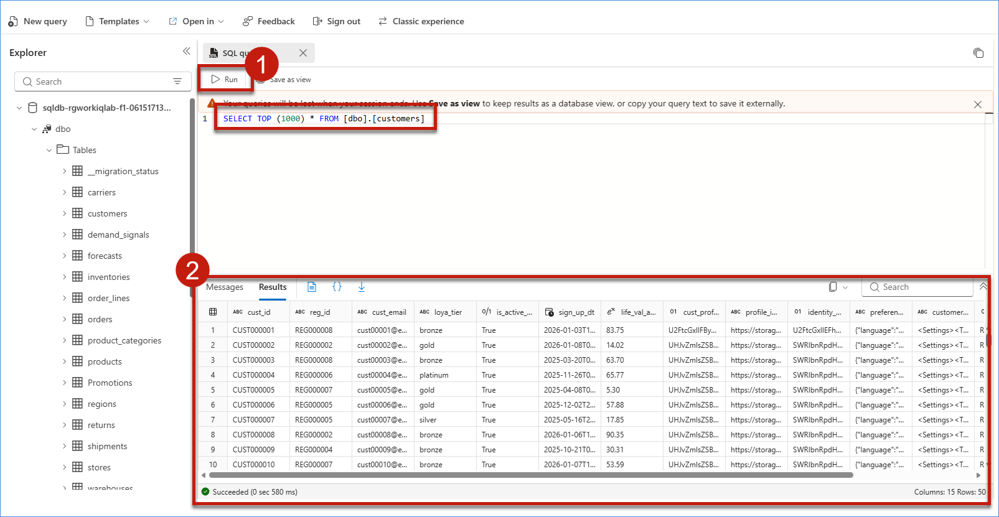

### Task 4.4: (Optional) Validate Source vs Target Metrics via GitHub Copilot in VS Code

1. Click on the **Windows** icon in the taskbar, type **Visual Studio Code - Insiders** in Search, and click the **Visual Studio Code - Insiders** app from **Best match**.

	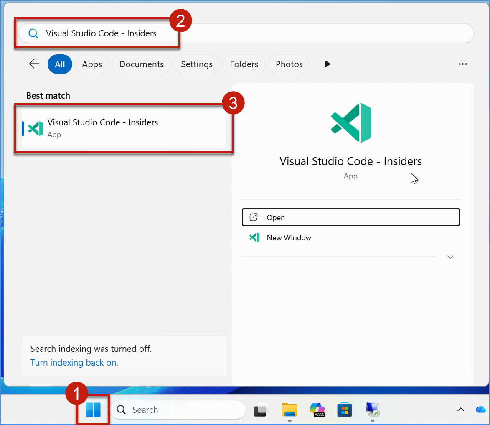

2. In VS Code, click the **SQL Server** extension icon in the left activity bar, then click **+ Add Connection**. In the **Connection Dialog**, enter **localhost** as the server name, keep **Trust server certificate** checked, open **Authentication type**, and select **Windows Authentication**.

	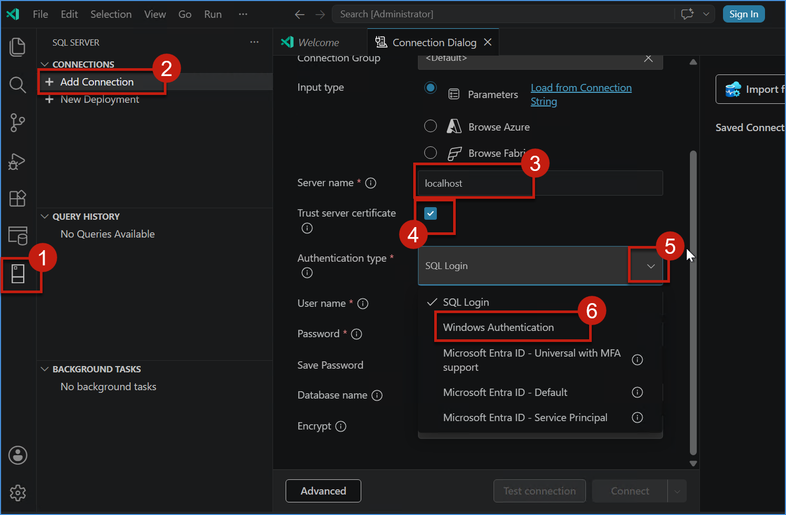

3. Click **Test connection**. After a few seconds, verify that a green **tick** appears, then click **Connect**.

	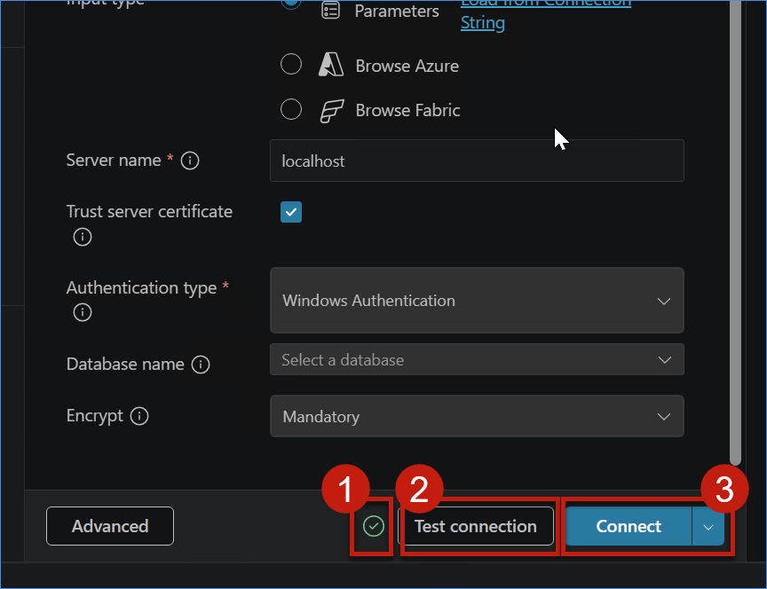

4. In the **SQL SERVER** panel, expand the connected **localhost** server, expand **Databases**, and verify that **Retail_Ontology** is visible.

	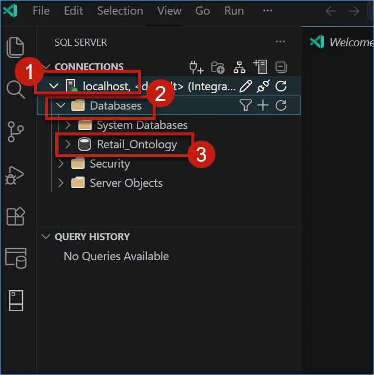

5. Click **+ Add Connection** to create another connection. In the **Connection Dialog**, enter the Azure SQL server name, keep **Trust server certificate** checked, set **Authentication type** to **SQL Login**, enter the SQL username and password, click **Test connection**, wait a few seconds for the green **tick**, and then click **Connect**.

	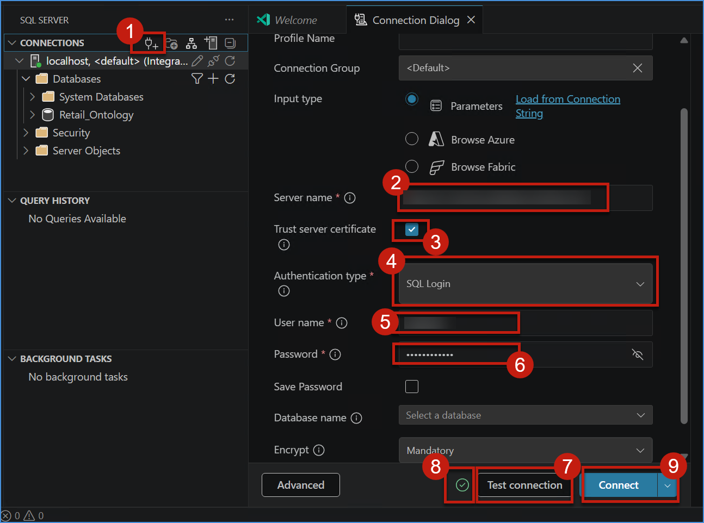

6. In the **SQL SERVER** panel, expand the new Azure SQL connection, expand **Databases**, and verify that **Retail_DB-Hyperscale** is visible. Expand **Retail_DB-Hyperscale** to view all migrated database objects.

	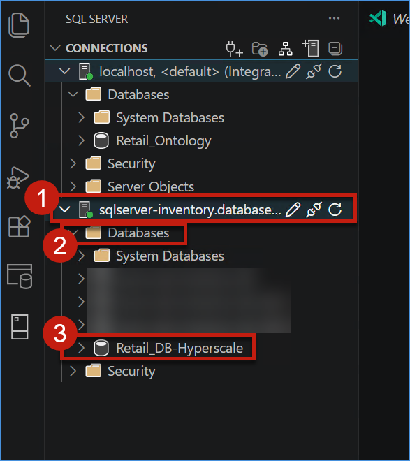

7. Click on the **GitHub Copilot chat** icon on the top right of VS Code, then click on the **GitHub Copilot** icon at the right bottom to log in using your GitHub account credentials.

8. A popup will be shown. Click on the **Continue with GitHub** button to proceed with authentication.

9. Sign in with your **GitHub account** and **password** to authenticate VS Code with GitHub Copilot.

10. A popup to approve VS Code link with GitHub will appear. Click on the **Continue** button to complete the authentication process.

11. Click the **Copilot** icon in the VS Code chat panel to activate GitHub Copilot. Verify **Auto** is selected, then click the **Settings** gear icon to open model configuration options.

## What We Learned

- How to connect to and validate a migrated Azure SQL Database-Hyperscale via Query Editor
- How to verify migrated database objects and dependencies
- How to validate data integrity and functionality after migration
- How to test views, stored procedures, and functions in the target environment
- How post-migration validation helps ensure trust in business-critical data

---

## Conclusion

You have successfully validated the migrated Azure SQL Database-Hyperscale and confirmed that Zava's retail transaction data has been successfully modernized. By verifying database objects, validating data consistency, and testing database functionality, you ensured that the migrated environment is ready for business use. 

